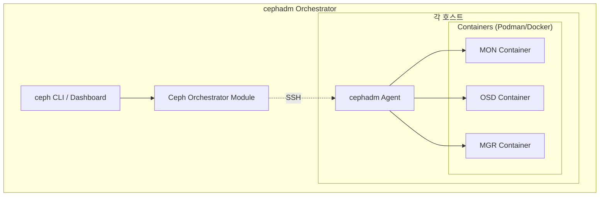
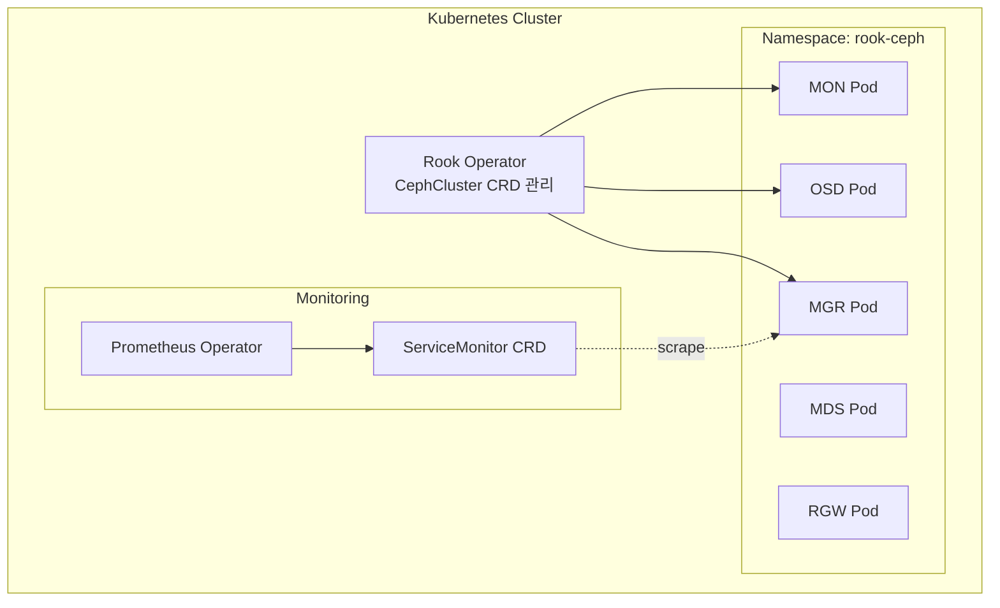
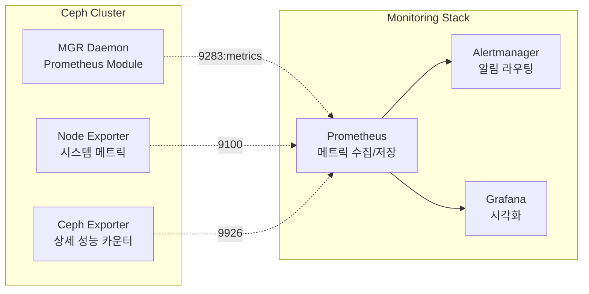
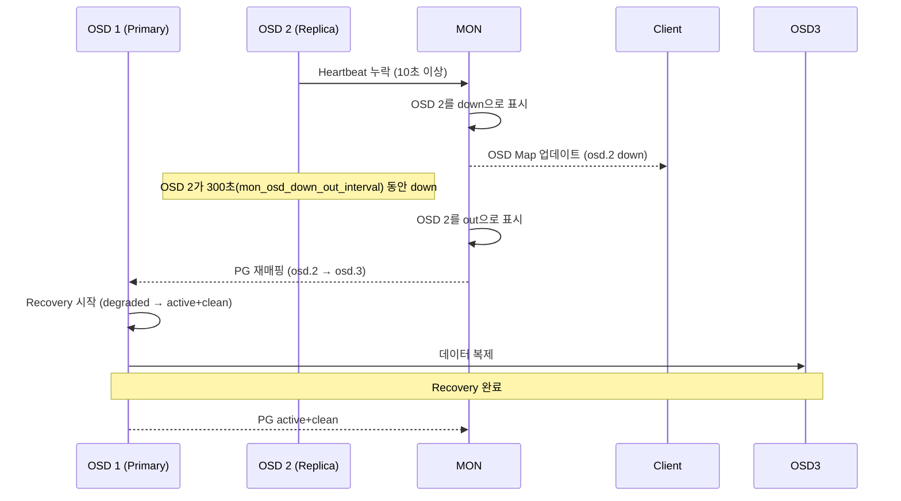

# Ch10. Ceph 운영 & 성능

## 📋 개요 및 학습 목표

### 개요

Ceph 클러스터를 **프로덕션 환경에서 안정적으로 운영**하기 위해서는 체계적인 모니터링, 성능 최적화, 장애 대응 능력이 필수입니다. 이 챕터에서는 **cephadm/Rook을 통한 클러스터 배포**, **Prometheus/Grafana 기반 모니터링 스택**, **FIO/rados bench를 활용한 성능 벤치마킹**, **BlueStore 튜닝**, **OSD 장애 시 복구 메커니즘**, **일반적인 트러블슈팅 시나리오**를 다룹니다.

2025년 현재, Ceph는 **cephadm orchestrator**를 기본 배포 도구로 사용하며, Kubernetes 환경에서는 **Rook operator**를 통해 Cloud Native 방식으로 관리됩니다. **mClock 스케줄러**를 통한 복구/백필 작업 스로틀링, **BlueStore 최적화**로 20% 성능 향상, **Prometheus 네이티브 메트릭** 지원 등 엔터프라이즈 운영에 최적화되어 있습니다.

### 학습 목표

이 챕터를 완료하면 다음을 할 수 있습니다:

1. **클러스터 배포**: cephadm/Rook을 사용한 프로덕션 클러스터 구축
2. **모니터링 구성**: Prometheus + Grafana + Alertmanager 스택 배포 및 운영
3. **성능 벤치마킹**: FIO, rados bench로 클러스터 성능 측정 및 분석
4. **성능 튜닝**: BlueStore, 네트워크, PG 수 최적화
5. **트러블슈팅**: PG 상태 이해, OSD 장애 복구, 일반적인 문제 해결

---

## 🔑 핵심 개념 및 이론

### 1. Ceph 배포 방법 (2025)

#### 1.1 cephadm (기본 배포 도구)

**cephadm**은 Ceph Octopus (15.x) 이후 **공식 기본 배포 도구**로, 모든 Ceph 데몬을 **컨테이너**로 실행합니다:



**특징**:

- **컨테이너 기반**: Podman(기본) 또는 Docker로 모든 데몬 실행
- **선언적 관리**: `ceph orch apply` 명령으로 desired state 정의
- **자동 업그레이드**: `ceph orch upgrade` 명령으로 rolling upgrade
- **SSH 기반**: cephadm이 SSH로 각 노드에 접속하여 컨테이너 관리

**장점**:

- 운영 체제 패키지 의존성 없음 (컨테이너에 모든 의존성 포함)
- 간단한 배포 및 업그레이드
- Bare-metal, VM 환경 모두 지원

#### 1.2 Rook (Kubernetes Operator)

**Rook**은 Kubernetes 환경에서 Ceph를 **네이티브 방식**으로 배포/관리하는 operator입니다:



**CephCluster CRD 예시**:

```yaml
apiVersion: ceph.rook.io/v1
kind: CephCluster
metadata:
  name: rook-ceph
  namespace: rook-ceph
spec:
  cephVersion:
    image: quay.io/ceph/ceph:v18.2.0  # Reef
  dataDirHostPath: /var/lib/rook
  mon:
    count: 3
    allowMultiplePerNode: false
  storage:
    useAllNodes: true
    useAllDevices: false
    deviceFilter: "^sd[b-d]"  # sdb, sdc, sdd만 사용
  dashboard:
    enabled: true
  monitoring:
    enabled: true  # Prometheus ServiceMonitor 자동 생성
```

**장점**:

- Kubernetes 네이티브 (kubectl로 관리)
- 자동 모니터링 통합 (Prometheus Operator)
- Persistent Volume 프로비저닝 (StorageClass, CSI)
- GitOps 친화적 (ArgoCD, Flux)

### 2. 모니터링 스택

#### 2.1 아키텍처

Ceph는 **Prometheus 네이티브 메트릭**을 제공합니다:



**주요 메트릭**:

| 메트릭 | 설명 | 예시 |
|--------|------|------|
| **ceph_health_status** | 클러스터 상태 (0=OK, 1=WARN, 2=ERR) | `ceph_health_status 0` |
| **ceph_osd_up** | OSD UP 상태 (0=down, 1=up) | `ceph_osd_up{osd="0"} 1` |
| **ceph_osd_in** | OSD IN 상태 (0=out, 1=in) | `ceph_osd_in{osd="0"} 1` |
| **ceph_pool_bytes_used** | Pool 사용량 (bytes) | `ceph_pool_bytes_used{pool="rbd"} 1073741824` |
| **ceph_pool_objects** | Pool 객체 수 | `ceph_pool_objects{pool="rbd"} 100` |
| **ceph_osd_op_r_latency_sum** | OSD 읽기 레이턴시 합계 (ms) | `ceph_osd_op_r_latency_sum{osd="0"} 1234.56` |
| **ceph_osd_op_r_latency_count** | OSD 읽기 작업 수 | `ceph_osd_op_r_latency_count{osd="0"} 1000` |
| **ceph_osd_op_w_latency_sum** | OSD 쓰기 레이턴시 합계 (ms) | `ceph_osd_op_w_latency_sum{osd="0"} 5678.90` |

#### 2.2 모니터링 스택 배포 (cephadm)

```bash
# Monitoring stack 활성화 (기본값: 활성화)
sudo ceph orch apply prometheus --placement="ceph1"
sudo ceph orch apply grafana --placement="ceph1"
sudo ceph orch apply alertmanager --placement="ceph1"
sudo ceph orch apply node-exporter --placement="*"  # 모든 노드

# Prometheus Module 활성화
sudo ceph mgr module enable prometheus

# Grafana 접속 정보
sudo ceph dashboard ac-user-show admin
# Grafana: https://ceph1:3000 (admin / <password>)
```

**Rook에서는 자동 배포**:

- `monitoring.enabled: true` 설정 시 ServiceMonitor 자동 생성
- Prometheus Operator가 메트릭 자동 수집

### 3. 성능 벤치마킹

#### 3.1 벤치마킹 도구

| 도구 | 용도 | 측정 대상 |
|------|------|----------|
| **rados bench** | RADOS 레이어 테스트 | Pool 성능 (객체 쓰기/읽기) |
| **FIO** | 블록 스토리지 테스트 | RBD 성능 (IOPS, 대역폭, 레이턴시) |
| **rbd bench** | RBD 이미지 테스트 | RBD 이미지 성능 |
| **COSBench/GOSBench** | 객체 스토리지 테스트 | RGW S3 API 성능 |

#### 3.2 rados bench 사용법

**순차 쓰기 테스트**:

```bash
# 10초 동안 4MB 객체 쓰기 (클러스터 부하 확인용)
sudo rados bench -p test-pool 10 write --no-cleanup

# 출력 예시:
# Total time run:         10.5 sec
# Total writes made:      250
# Write size:             4194304
# Object size:            4194304
# Bandwidth (MB/sec):     95.2
# Average IOPS:           23.8
# Average Latency(s):     0.42
```

**순차 읽기 테스트**:

```bash
# --no-cleanup으로 남겨진 객체 읽기
sudo rados bench -p test-pool 10 seq

# 출력 예시:
# Total time run:         5.2 sec
# Total reads made:       250
# Read size:              4194304
# Bandwidth (MB/sec):     192.3
# Average IOPS:           48.1
# Average Latency(s):     0.21
```

**랜덤 읽기 테스트**:

```bash
sudo rados bench -p test-pool 10 rand
```

#### 3.3 FIO 벤치마킹 (RBD)

**4K 랜덤 쓰기 (IOPS 측정)**:

```bash
fio --name=rbd-randwrite \
    --rw=randwrite \
    --direct=1 \
    --ioengine=libaio \
    --bs=4k \
    --iodepth=32 \
    --numjobs=4 \
    --size=5G \
    --runtime=60 \
    --group_reporting=1 \
    --filename=/dev/rbd0
```

**128K 순차 읽기 (대역폭 측정)**:

```bash
fio --name=rbd-seqread \
    --rw=read \
    --direct=1 \
    --ioengine=libaio \
    --bs=128k \
    --iodepth=64 \
    --numjobs=4 \
    --size=10G \
    --runtime=60 \
    --group_reporting=1 \
    --filename=/dev/rbd0
```

**블록 크기별 테스트**:

```bash
# 4k, 8k, 16k, 32k, 64k, 128k, 256k, 512k, 1m, 4m
for bs in 4k 8k 16k 32k 64k 128k 256k 512k 1m 4m; do
    fio --name=rbd-test-$bs --rw=randwrite --bs=$bs --iodepth=32 \
        --numjobs=4 --size=1G --runtime=30 --filename=/dev/rbd0
done
```

### 4. 성능 튜닝

#### 4.1 BlueStore 튜닝

**메모리 설정** (가장 중요):

```ini
# ceph.conf 또는 런타임 설정
[osd]
osd_memory_target = 8589934592  # 8GB (최소값, 16GB 권장)
```

**RocksDB 튜닝**:

```ini
[osd]
bluestore_rocksdb_options = "compression=kNoCompression,max_open_files=1024"
```

**데이터베이스/WAL 분리** (NVMe 사용 시):

```bash
# OSD 생성 시 DB/WAL 디바이스 지정
sudo ceph orch daemon add osd ceph1:\
    --data-devices=/dev/sdb \
    --db-devices=/dev/nvme0n1 \
    --wal-devices=/dev/nvme0n1
```

**효과**:

- 메타데이터를 NVMe에 배치 → **레이턴시 50% 감소**
- HDD 데이터 + NVMe 메타데이터 조합으로 비용 최적화

#### 4.2 네트워크 최적화

**10GbE 이상 권장**:

```bash
# Jumbo Frame 활성화 (MTU 9000)
sudo ip link set eth0 mtu 9000

# /etc/sysctl.conf
net.ipv4.tcp_rmem = 4096 87380 134217728
net.ipv4.tcp_wmem = 4096 65536 134217728
net.core.rmem_max = 134217728
net.core.wmem_max = 134217728
net.ipv4.tcp_congestion_control = bbr  # BBR congestion control
```

**Public/Cluster 네트워크 분리**:

```yaml
# ceph.conf
[global]
public_network = 192.168.1.0/24   # 클라이언트 트래픽
cluster_network = 10.0.0.0/24     # OSD 간 복제 트래픽
```

**효과**:

- 복제 트래픽과 클라이언트 트래픽 격리 → **네트워크 병목 제거**

#### 4.3 PG 수 최적화

**적절한 PG 수 계산** (Ch9 참조):

```
PG 수 = (Total_OSDs × mon_target_pg_per_osd) / pool_size

예시: 30 OSD, size=3, mon_target_pg_per_osd=200
PG 수 = (30 × 200) / 3 = 2000 → 2048 (2의 거듭제곱)
```

**PG 수 조정** (주의: 부하 발생):

```bash
# PG 수 증가
sudo ceph osd pool set my-pool pg_num 2048
sudo ceph osd pool set my-pool pgp_num 2048

# PG Autoscaler 활성화 (자동 조정)
sudo ceph osd pool set my-pool pg_autoscale_mode on
```

### 5. OSD 장애 복구 메커니즘

#### 5.1 OSD 장애 시 흐름



**주요 타이머**:

- **mon_osd_heartbeat_grace**: 10초 (OSD를 down으로 표시하는 시간)
- **mon_osd_down_out_interval**: 300초 (OSD를 out으로 표시하는 시간, 복구 시작)
- **osd_recovery_max_active**: 3 (OSD당 동시 복구 PG 수)

#### 5.2 mClock 스로틀링 (2025)

**mClock 스케줄러**는 복구/백필 작업을 **클라이언트 I/O보다 낮은 우선순위**로 처리합니다:

```bash
# Recovery 스로틀링 설정
sudo ceph config set osd osd_recovery_max_active 3
sudo ceph config set osd osd_recovery_max_single_start 1
sudo ceph config set osd osd_max_backfills 1

# mClock 프로파일 (high_client_ops: 클라이언트 우선)
sudo ceph config set osd osd_mclock_profile high_client_ops
```

**효과**:

- 복구 중에도 **클라이언트 I/O 성능 유지**
- 복구 시간은 길어지지만 서비스 영향 최소화

### 6. 트러블슈팅

#### 6.1 PG 상태 해석

| 상태 | 의미 | 조치 |
|------|------|------|
| **active+clean** | 정상 | 없음 |
| **peering** | OSD 간 동기화 중 | 대기 (수 분 이내 해결) |
| **degraded** | 복제본 부족 | OSD 복구 대기 |
| **recovering** | 복구 진행 중 | 진행 상황 모니터링 |
| **backfilling** | PG 데이터 이동 중 | 진행 상황 모니터링 |
| **backfill_toofull** | OSD 용량 부족으로 백필 불가 | OSD 추가 또는 데이터 삭제 |
| **incomplete** | PG 복구 불가 (데이터 손실) | **데이터 손실 가능**, 로그 확인 |
| **stale** | MON이 PG 상태를 받지 못함 | OSD 재시작 |

#### 6.2 일반적인 문제와 해결

**문제 1: OSD Full**

```bash
# 증상
$ sudo ceph health
HEALTH_ERR 1 full osd(s)

# 원인
$ sudo ceph osd df
ID  CLASS  WEIGHT   REWEIGHT  SIZE     RAW USE  DATA     OMAP  META   AVAIL    %USE
 0    ssd  1.00000   1.00000  100 GiB   96 GiB  90 GiB   0 B  6 GiB  4.0 GiB  96.00  # FULL!

# 해결
# 1. 임시: full ratio 증가 (비추천)
sudo ceph osd set-full-ratio 0.97

# 2. 근본적: OSD 추가 또는 데이터 삭제
sudo ceph orch daemon add osd ceph4:/dev/sdb
```

**문제 2: Slow Ops**

```bash
# 증상
$ sudo ceph health detail
HEALTH_WARN 10 slow ops, oldest one blocked for 30 sec

# 원인 확인
$ sudo ceph daemon osd.0 dump_historic_ops

# 일반적인 원인:
# - 디스크 성능 저하 (SMART 검사)
# - 네트워크 지연
# - CPU/메모리 부족

# 해결
# SMART 검사
sudo smartctl -a /dev/sdb

# OSD 프로세스 재시작
sudo systemctl restart ceph-osd@0
```

**문제 3: Clock Skew**

```bash
# 증상
HEALTH_WARN clock skew detected on mon.ceph2, mon.ceph3

# 원인: NTP 동기화 실패

# 해결
sudo systemctl restart chronyd  # 또는 ntpd
sudo chronyc sources
```

---

## 💻 실습 가이드 (Hands-on)

### Lab 1: Monitoring Stack 배포 (Prometheus + Grafana)

**목표**: cephadm으로 모니터링 스택 배포 및 Grafana 대시보드 확인

**단계**:

1. **Monitoring Stack 배포**:

```bash
# Prometheus 배포
sudo ceph orch apply prometheus --placement="ceph1"

# Grafana 배포
sudo ceph orch apply grafana --placement="ceph1"

# Alertmanager 배포
sudo ceph orch apply alertmanager --placement="ceph1"

# Node Exporter (모든 노드)
sudo ceph orch apply node-exporter --placement="*"

# 배포 확인
sudo ceph orch ls
```

2. **Prometheus Module 활성화**:

```bash
# Prometheus Module 활성화
sudo ceph mgr module enable prometheus

# 메트릭 엔드포인트 확인
curl http://ceph1:9283/metrics | grep ceph_health_status
```

3. **Grafana 접속**:

```bash
# Grafana 초기 비밀번호 확인
sudo ceph dashboard ac-user-show admin

# 브라우저로 접속: https://ceph1:3000
# 로그인: admin / <password>

# 대시보드 확인
# - Ceph Cluster
# - OSD Overview
# - Pool Overview
# - RBD Overview
```

4. **커스텀 쿼리**:

Prometheus에서 PromQL로 메트릭 조회:

```promql
# 클러스터 전체 IOPS
sum(rate(ceph_osd_op_r_latency_count[5m])) + sum(rate(ceph_osd_op_w_latency_count[5m]))

# OSD별 평균 쓰기 레이턴시 (ms)
rate(ceph_osd_op_w_latency_sum[5m]) / rate(ceph_osd_op_w_latency_count[5m])

# Pool 사용률 (%)
(ceph_pool_bytes_used / ceph_pool_max_avail) * 100
```

### Lab 2: 성능 벤치마킹 (FIO, rados bench)

**목표**: 클러스터 성능 측정 및 결과 분석

**단계**:

1. **rados bench 실행**:

```bash
# 테스트 Pool 생성
sudo ceph osd pool create bench-pool 128 replicated
sudo ceph osd pool application enable bench-pool rbd

# 캐시 클리어 (정확한 측정)
echo 3 | sudo tee /proc/sys/vm/drop_caches && sudo sync

# 순차 쓰기 테스트 (60초)
sudo rados bench -p bench-pool 60 write --no-cleanup

# 순차 읽기 테스트
sudo rados bench -p bench-pool 60 seq

# 랜덤 읽기 테스트
sudo rados bench -p bench-pool 60 rand

# 정리
sudo rados -p bench-pool cleanup
```

2. **RBD + FIO 테스트**:

```bash
# RBD 이미지 생성
sudo rbd create --size 50G bench-pool/fio-test

# RBD 맵핑
sudo rbd map bench-pool/fio-test
# /dev/rbd0

# 4K 랜덤 쓰기 (IOPS)
fio --name=4k-randwrite --ioengine=libaio --direct=1 \
    --rw=randwrite --bs=4k --iodepth=32 --numjobs=4 \
    --size=10G --runtime=60 --group_reporting=1 \
    --filename=/dev/rbd0

# 128K 순차 읽기 (대역폭)
fio --name=128k-seqread --ioengine=libaio --direct=1 \
    --rw=read --bs=128k --iodepth=64 --numjobs=4 \
    --size=10G --runtime=60 --group_reporting=1 \
    --filename=/dev/rbd0

# Mixed workload (70% read, 30% write)
fio --name=mixed-workload --ioengine=libaio --direct=1 \
    --rw=randrw --rwmixread=70 --bs=8k --iodepth=32 --numjobs=4 \
    --size=10G --runtime=60 --group_reporting=1 \
    --filename=/dev/rbd0
```

3. **결과 분석**:

FIO 출력 예시:
```
IOPS=12345, BW=48.2MiB/s (50.5MB/s)
lat (usec): min=100, max=5000, avg=1042.35, stdev=234.56
```

**해석**:

- **IOPS**: 초당 I/O 작업 수 (높을수록 좋음)
- **BW (Bandwidth)**: 대역폭 (MiB/s 또는 MB/s)
- **lat (Latency)**: 레이턴시 (낮을수록 좋음, avg/stdev 확인)

### Lab 3: BlueStore 튜닝

**목표**: BlueStore 파라미터 튜닝으로 성능 향상

**단계**:

1. **현재 설정 확인**:

```bash
# OSD 메모리 타겟 확인
sudo ceph config show osd.0 | grep osd_memory_target

# BlueStore 설정 확인
sudo ceph config show osd.0 | grep bluestore
```

2. **메모리 타겟 증가** (가장 큰 영향):

```bash
# 모든 OSD에 16GB 메모리 할당 (기본 4GB → 16GB)
sudo ceph config set osd osd_memory_target 17179869184

# OSD 재시작 (rolling restart)
for i in 0 1 2; do
    sudo systemctl restart ceph-osd@$i
    sleep 60  # 복구 대기
done
```

3. **벤치마크 비교**:

```bash
# 튜닝 전 벤치마크
fio --name=before-tuning --rw=randwrite --bs=4k --iodepth=32 \
    --runtime=60 --filename=/dev/rbd0 | tee before.txt

# 튜닝 후 벤치마크 (메모리 증가 후)
fio --name=after-tuning --rw=randwrite --bs=4k --iodepth=32 \
    --runtime=60 --filename=/dev/rbd0 | tee after.txt

# 결과 비교
grep "IOPS=" before.txt after.txt
```

4. **DB/WAL 분리** (NVMe 있는 경우):

```bash
# 새 OSD 생성 시 NVMe에 DB/WAL 배치
sudo ceph orch daemon add osd ceph1: \
    --data-devices=/dev/sdb \
    --db-devices=/dev/nvme0n1 \
    --wal-devices=/dev/nvme0n1

# 기존 OSD는 재생성 필요 (데이터 마이그레이션 필요)
```

### Lab 4: OSD 장애 시뮬레이션 & 복구

**목표**: OSD 장애 시 자동 복구 과정 관찰

**단계**:

1. **초기 상태 확인**:

```bash
# 클러스터 상태
sudo ceph -s

# PG 상태
sudo ceph pg stat
```

2. **OSD 장애 시뮬레이션**:

```bash
# OSD 2 중지
sudo systemctl stop ceph-osd@2

# 상태 변화 관찰 (10초 후 down, 300초 후 out)
watch -n 5 'sudo ceph osd tree'

# PG 상태 변화
watch -n 5 'sudo ceph pg stat'
# 출력: XX active+clean, YY active+degraded
```

3. **복구 진행 상황 모니터링**:

```bash
# Recovery 진행률
sudo ceph -w
# 출력 예시:
# recovery: 1024/3072 objects degraded (33.3%)
# 10 MiB/s, 1000 objects/s

# PG별 상태
sudo ceph pg dump | grep recovering
```

4. **OSD 복구**:

```bash
# OSD 재시작
sudo systemctl start ceph-osd@2

# 복구 완료 대기
sudo ceph -w
# 모든 PG가 active+clean이 될 때까지 대기

# 최종 상태 확인
sudo ceph -s
```

### Lab 5: 일반적인 문제 트러블슈팅

**목표**: 실제 문제 시나리오 해결 실습

**시나리오 1: PG Stuck in Peering**

```bash
# PG 상태 확인
sudo ceph pg dump pgs | grep peering

# PG 쿼리 (상세 정보)
sudo ceph pg 1.a query | jq '.state'

# 해결: OSD 재시작
sudo systemctl restart ceph-osd@<primary_osd>

# 여전히 해결 안 되면: MON 재시작
sudo systemctl restart ceph-mon@ceph1
```

**시나리오 2: Slow Ops**

```bash
# Slow ops 확인
sudo ceph health detail
# HEALTH_WARN 5 slow ops

# 원인 분석
sudo ceph daemon osd.0 dump_ops_in_flight
sudo ceph daemon osd.0 dump_historic_ops | jq '.ops[] | select(.duration > 30)'

# 디스크 성능 확인
sudo smartctl -a /dev/sdb | grep -i error
sudo iostat -x 1 10  # I/O 지연 확인

# 네트워크 확인
ping -c 10 ceph2
```

**시나리오 3: 용량 부족**

```bash
# 용량 확인
sudo ceph df

# 가장 많이 사용하는 Pool 확인
sudo ceph osd pool ls detail | grep size

# 해결 1: 불필요한 데이터 삭제
sudo rbd ls <pool>
sudo rbd rm <pool>/<image>

# 해결 2: OSD 추가
sudo ceph orch daemon add osd ceph4:/dev/sdb

# 해결 3: 임시로 full ratio 증가 (비추천)
sudo ceph osd set-full-ratio 0.97
```

---

## 📚 참고 자료

### 공식 문서

- **Monitoring Overview**: [https://docs.ceph.com/en/latest/monitoring/](https://docs.ceph.com/en/latest/monitoring/)
- **Monitoring Services (cephadm)**: [https://docs.ceph.com/en/latest/cephadm/services/monitoring/](https://docs.ceph.com/en/latest/cephadm/services/monitoring/)
- **Prometheus Module**: [https://docs.ceph.com/en/latest/mgr/prometheus/](https://docs.ceph.com/en/latest/mgr/prometheus/)
- **Monitoring OSDs and PGs**: [https://docs.ceph.com/en/reef/rados/operations/monitoring-osd-pg/](https://docs.ceph.com/en/reef/rados/operations/monitoring-osd-pg/)
- **Health Checks**: [https://docs.ceph.com/en/reef/rados/operations/health-checks/](https://docs.ceph.com/en/reef/rados/operations/health-checks/)
- **Troubleshooting PGs**: [https://docs.ceph.com/en/reef/rados/troubleshooting/troubleshooting-pg/](https://docs.ceph.com/en/reef/rados/troubleshooting/troubleshooting-pg/)
- **Troubleshooting OSDs**: [https://docs.ceph.com/en/latest/rados/troubleshooting/troubleshooting-osd/](https://docs.ceph.com/en/latest/rados/troubleshooting/troubleshooting-osd/)

### Rook 문서

- **Rook Ceph Monitoring**: [https://rook.io/docs/rook/latest/Storage-Configuration/Monitoring/ceph-monitoring/](https://rook.io/docs/rook/latest/Storage-Configuration/Monitoring/ceph-monitoring/)

### 벤치마킹 & 성능 튜닝

- **How to Benchmark Ceph Storage Performance**: [https://openmetal.io/resources/blog/how-to-benchmark-ceph-storage-performance/](https://openmetal.io/resources/blog/how-to-benchmark-ceph-storage-performance/)
- **Ceph Performance Benchmark and Optimization (croit)**: [https://www.croit.io/blog/ceph-performance-benchmark-and-optimization](https://www.croit.io/blog/ceph-performance-benchmark-and-optimization)
- **How to Tune Ceph for Block Storage Performance**: [https://openmetal.io/resources/blog/how-to-tune-ceph-for-block-storage-performance/](https://openmetal.io/resources/blog/how-to-tune-ceph-for-block-storage-performance/)
- **BlueStore Default vs. Tuned Performance**: [https://ceph.io/community/bluestore-default-vs-tuned-performance-comparison/](https://ceph.io/community/bluestore-default-vs-tuned-performance-comparison/)
- **Ceph All-Flash/NVMe Performance**: [https://croit.io/blog/ceph-performance-test-and-optimization](https://croit.io/blog/ceph-performance-test-and-optimization)
- **Tuning Ceph Performance (4sysops)**: [https://4sysops.com/archives/tuning-ceph-performance/](https://4sysops.com/archives/tuning-ceph-performance/)
- **Comprehensive Guide to Tuning Rook-Ceph**: [https://www.cloudraft.io/blog/rook-ceph-performance-tuning](https://www.cloudraft.io/blog/rook-ceph-performance-tuning)

### Red Hat & SUSE 문서

- **Red Hat Ceph Performance Benchmark (RHCS 5)**: [https://docs.redhat.com/en/documentation/red_hat_ceph_storage/5/html/administration_guide/ceph-performance-benchmarking](https://docs.redhat.com/en/documentation/red_hat_ceph_storage/5/html/administration_guide/ceph-performance-benchmarking)
- **Red Hat Troubleshooting Ceph OSDs**: [https://docs.redhat.com/en/documentation/red_hat_ceph_storage/6/html/troubleshooting_guide/troubleshooting-ceph-osds](https://docs.redhat.com/en/documentation/red_hat_ceph_storage/6/html/troubleshooting_guide/troubleshooting-ceph-osds)
- **SUSE Troubleshooting Ceph Health Status**: [https://documentation.suse.com/ses/7.1/html/ses-all/bp-troubleshooting-status.html](https://documentation.suse.com/ses/7.1/html/ses-all/bp-troubleshooting-status.html)

### 블로그 & 아티클

- **Monitoring Ceph with Prometheus (Sysdig)**: [https://www.sysdig.com/blog/monitoring-ceph-prometheus](https://www.sysdig.com/blog/monitoring-ceph-prometheus)
- **Ceph Stretch Clusters Part 3: Handling Failures (2025)**: [https://ceph.io/en/news/blog/2025/stretch-cluuuuuuuuusters-part3/](https://ceph.io/en/news/blog/2025/stretch-cluuuuuuuuusters-part3/)

### 도구

- **Ceph Benchmarking Tool (CBT)**: [https://github.com/ceph/cbt](https://github.com/ceph/cbt)
- **Benchmark Ceph Cluster (Ceph Wiki)**: [https://tracker.ceph.com/projects/ceph/wiki/Benchmark_Ceph_Cluster_Performance](https://tracker.ceph.com/projects/ceph/wiki/Benchmark_Ceph_Cluster_Performance)

### 학습 체크리스트

완료한 항목에 체크하세요:

- [ ] cephadm과 Rook의 차이를 이해하고 적절한 배포 방법을 선택할 수 있다
- [ ] Prometheus + Grafana 모니터링 스택을 배포하고 운영할 수 있다
- [ ] Prometheus 메트릭을 이해하고 PromQL 쿼리를 작성할 수 있다
- [ ] rados bench와 FIO로 클러스터 성능을 측정하고 결과를 분석할 수 있다
- [ ] BlueStore 메모리 타겟, DB/WAL 분리 등 성능 튜닝을 수행할 수 있다
- [ ] OSD 장애 시 자동 복구 메커니즘을 이해하고 복구 과정을 모니터링할 수 있다
- [ ] PG 상태(active, clean, degraded, recovering, backfilling)를 해석할 수 있다
- [ ] mClock 스로틀링을 통해 복구 작업이 클라이언트 I/O에 미치는 영향을 제어할 수 있다
- [ ] Slow ops, Clock skew, OSD full 등 일반적인 문제를 해결할 수 있다
- [ ] Ceph 클러스터의 용량 임계값(85%/90%/95%)을 이해하고 관리할 수 있다

---

**다음 챕터**: [Ch11. Block Storage (Cinder)](./Ch11.Block_Storage_Cinder.md)에서 OpenStack Cinder 아키텍처, Volume Driver, QoS, Multi-backend를 학습합니다.
