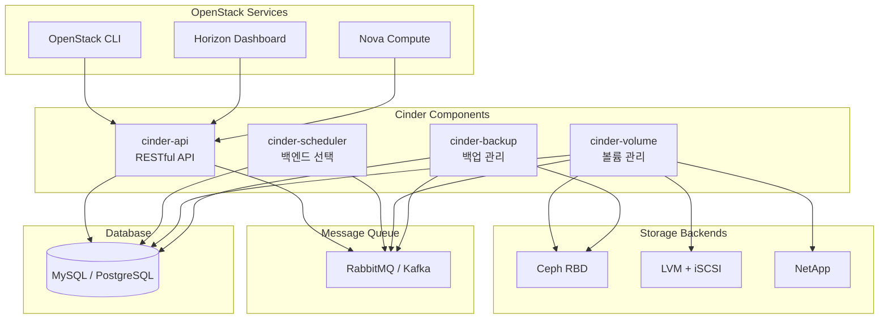
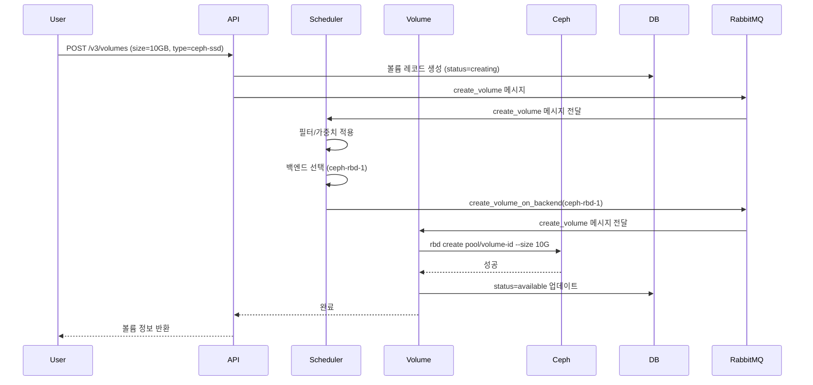

# Ch11. Block Storage (Cinder)

## 📋 개요 및 학습 목표

### 개요

**OpenStack Cinder**는 블록 스토리지 서비스로, 가상 머신(VM)에 연결할 수 있는 **영구 블록 디바이스(Persistent Block Device)**를 제공합니다. Cinder는 다양한 스토리지 백엔드(Ceph RBD, LVM, NetApp, EMC 등)를 추상화하여 **통합된 API**로 볼륨 관리를 제공하며, **QoS**, **스냅샷**, **백업**, **볼륨 마이그레이션**, **볼륨 암호화** 등 엔터프라이즈 기능을 지원합니다.

2025년 현재, Cinder는 **Kubernetes Operator 기반 배포**, **Active-Active HA** (Ceph RBD 백엔드), **IOPS/대역폭 QoS 제어** (Rocky 13.0.0+), **증분 백업**, **멀티 백엔드 관리**를 제공합니다. Ceph RBD와의 통합이 가장 일반적이며, **Copy-on-Write(CoW) 클론**, **씬 프로비저닝**, **스냅샷 지원**으로 효율적인 스토리지 활용이 가능합니다.

### 학습 목표

이 챕터를 완료하면 다음을 할 수 있습니다:

1. **Cinder 아키텍처 이해**: API, Scheduler, Volume, Backup 컴포넌트 역할 설명
2. **Volume Driver 설정**: Ceph RBD, LVM 백엔드 구성
3. **QoS 설정**: Volume Type과 QoS Spec으로 IOPS/대역폭 제어
4. **Multi-backend 구성**: 여러 스토리지 백엔드 동시 운영
5. **볼륨 운영**: 마이그레이션, 스냅샷, 백업/복원 수행

---

## 🔑 핵심 개념 및 이론

### 1. Cinder 아키텍처

#### 1.1 컴포넌트 구조



**컴포넌트 역할**:

| 컴포넌트 | 역할 | 배포 수 |
|----------|------|---------|
| **cinder-api** | RESTful API 제공, 요청 검증 | 여러 개 (HA) |
| **cinder-scheduler** | 볼륨 생성 요청 시 적절한 백엔드 선택 | 여러 개 (HA) |
| **cinder-volume** | 실제 볼륨 CRUD, 스냅샷, 클론 수행 | 백엔드당 1개 이상 (Active-Active 가능) |
| **cinder-backup** | 볼륨 백업/복원 (Swift, Ceph, NFS로) | 여러 개 (HA) |

#### 1.2 볼륨 생성 흐름



### 2. Storage Backend 설정

#### 2.1 Backend Isolation Model (2025)

Kubernetes 환경에서 Cinder Operator는 **Backend Isolation Model**을 구현합니다:

```yaml
apiVersion: cinder.openstack.org/v1beta1
kind: CinderVolume
metadata:
  name: cinder-volume-ceph
  namespace: openstack
spec:
  replicas: 3  # Active-Active (Ceph RBD만 지원)
  storageBackend:
    name: ceph-rbd
    type: rbd
    config:
      rbd_pool: volumes
      rbd_user: cinder
      rbd_secret_uuid: "abc-123-def"
      rbd_ceph_conf: /etc/ceph/ceph.conf
      rbd_flatten_volume_from_snapshot: false
      rbd_max_clone_depth: 5
      rbd_store_chunk_size: 4  # 4MB
```

**특징**:

- 각 백엔드가 독립적인 **StatefulSet**으로 배포
- 한 백엔드의 장애가 다른 백엔드에 영향 없음
- 백엔드별 독립적인 스케일링/업그레이드

#### 2.2 Ceph RBD Backend

**cinder.conf 설정**:

```ini
[DEFAULT]
enabled_backends = ceph-rbd-ssd, ceph-rbd-hdd

[ceph-rbd-ssd]
volume_driver = cinder.volume.drivers.rbd.RBDDriver
volume_backend_name = ceph-rbd-ssd
rbd_pool = volumes-ssd
rbd_ceph_conf = /etc/ceph/ceph.conf
rbd_user = cinder
rbd_secret_uuid = abc-123-def-456
rbd_flatten_volume_from_snapshot = false
rbd_max_clone_depth = 5
rbd_store_chunk_size = 4

[ceph-rbd-hdd]
volume_driver = cinder.volume.drivers.rbd.RBDDriver
volume_backend_name = ceph-rbd-hdd
rbd_pool = volumes-hdd
rbd_ceph_conf = /etc/ceph/ceph.conf
rbd_user = cinder
rbd_secret_uuid = abc-123-def-456
```

**주요 파라미터**:

- **rbd_pool**: Ceph Pool 이름 (volumes, volumes-ssd 등)
- **rbd_user**: Ceph 인증 사용자 (keyring 필요)
- **rbd_flatten_volume_from_snapshot**: false로 설정 시 CoW 클론 사용 (빠른 생성)
- **rbd_max_clone_depth**: CoW 클론 체인 최대 깊이 (5 권장)
- **rbd_store_chunk_size**: 객체 크기 (MB, 기본값 4MB)

**Ceph 인증 설정**:

```bash
# Ceph에서 Cinder용 사용자 생성
sudo ceph auth get-or-create client.cinder \
    mon 'allow r' \
    osd 'allow class-read object_prefix rbd_children, allow rwx pool=volumes, allow rwx pool=vms, allow rx pool=images' \
    -o /etc/ceph/ceph.client.cinder.keyring

# Nova Compute 노드에서도 필요 (VM attach를 위해)
sudo ceph auth get-or-create client.cinder-backup \
    mon 'allow r' \
    osd 'allow class-read object_prefix rbd_children, allow rwx pool=backups' \
    -o /etc/ceph/ceph.client.cinder-backup.keyring
```

#### 2.3 LVM Backend

**cinder.conf 설정**:

```ini
[lvm-backend]
volume_driver = cinder.volume.drivers.lvm.LVMVolumeDriver
volume_backend_name = lvm-backend
volume_group = cinder-volumes
target_protocol = iscsi
target_helper = lioadm
iscsi_ip_address = 192.168.1.10
```

**LVM 볼륨 그룹 생성**:

```bash
# 물리 볼륨 생성
sudo pvcreate /dev/sdb

# 볼륨 그룹 생성
sudo vgcreate cinder-volumes /dev/sdb

# 확인
sudo vgdisplay cinder-volumes
```

**특징**:

- **Local 스토리지**: 각 노드의 로컬 디스크 사용
- **iSCSI 노출**: LVM 볼륨을 iSCSI 타겟으로 노출
- **성능**: SSD 로컬 디스크 사용 시 높은 IOPS
- **단점**: 노드 간 마이그레이션 어려움 (데이터 복사 필요)

### 3. Volume Types & QoS

#### 3.1 Volume Type

**Volume Type**은 볼륨의 특성을 정의하는 템플릿입니다:

```bash
# Volume Type 생성
openstack volume type create \
    --description "Ceph SSD Storage" \
    --property volume_backend_name=ceph-rbd-ssd \
    ceph-ssd

openstack volume type create \
    --description "Ceph HDD Storage" \
    --property volume_backend_name=ceph-rbd-hdd \
    ceph-hdd

# Volume Type 목록
openstack volume type list
```

**Extra-specs** (백엔드별 세부 설정):

```bash
# Ceph RBD 스트라이핑 설정
openstack volume type set ceph-ssd \
    --property rbd_stripe_unit=4194304 \
    --property rbd_stripe_count=2

# LVM thin provisioning 활성화
openstack volume type set lvm-thin \
    --property lvm_type=thin
```

#### 3.2 QoS Specification

**QoS Spec**을 통해 **IOPS/대역폭 제한**을 설정합니다 (Rocky 13.0.0+):

```bash
# QoS Spec 생성 (IOPS 제한)
openstack volume qos create \
    --consumer front-end \
    --property read_iops_sec=1000 \
    --property write_iops_sec=800 \
    --property total_iops_sec=1500 \
    standard-qos

# QoS Spec 생성 (대역폭 제한)
openstack volume qos create \
    --consumer front-end \
    --property read_bytes_sec=104857600 \   # 100 MB/s
    --property write_bytes_sec=52428800 \   # 50 MB/s
    --property total_bytes_sec=157286400 \  # 150 MB/s
    bandwidth-qos

# Burst 지원 (일시적으로 높은 IOPS 허용)
openstack volume qos create \
    --consumer front-end \
    --property total_iops_sec=1000 \
    --property total_iops_sec_max=5000 \    # Burst IOPS
    --property total_iops_sec_max_length=60 \  # Burst 지속 시간 (초)
    burst-qos

# Volume Type에 QoS 연결
openstack volume qos associate standard-qos ceph-ssd
```

**QoS 파라미터**:

| 파라미터 | 설명 | 단위 |
|----------|------|------|
| **read_iops_sec** | 읽기 IOPS 제한 | ops/sec |
| **write_iops_sec** | 쓰기 IOPS 제한 | ops/sec |
| **total_iops_sec** | 전체 IOPS 제한 | ops/sec |
| **read_bytes_sec** | 읽기 대역폭 제한 | bytes/sec |
| **write_bytes_sec** | 쓰기 대역폭 제한 | bytes/sec |
| **total_bytes_sec** | 전체 대역폭 제한 | bytes/sec |
| **total_iops_sec_max** | Burst IOPS | ops/sec |
| **total_iops_sec_max_length** | Burst 지속 시간 | seconds |

**consumer 타입**:

- **front-end**: Hypervisor(Compute)에서 적용 (권장)
- **back-end**: 스토리지 백엔드에서 적용 (백엔드 지원 필요)

### 4. Active-Active HA

#### 4.1 Active-Active 구성 (Ceph RBD만 지원)

**cinder.conf**:

```ini
[DEFAULT]
enabled_backends = ceph-rbd-ssd
cluster_name = cinder-cluster-1  # 클러스터 이름 (etcd 네임스페이스)

[coordination]
backend_url = etcd3+http://etcd1:2379,etcd2:2379,etcd3:2379

[ceph-rbd-ssd]
volume_driver = cinder.volume.drivers.rbd.RBDDriver
volume_backend_name = ceph-rbd-ssd
# ... (기타 RBD 설정)
```

**특징**:

- **분산 락**: etcd를 사용하여 여러 cinder-volume 인스턴스가 동시에 실행
- **Ceph RBD 전용**: LVM, iSCSI 백엔드는 Active-Passive만 지원
- **성능**: 여러 볼륨 작업을 병렬 처리 가능

**제약 사항**:

- 모든 백엔드가 Active-Active를 지원해야 함 (혼합 불가)
- etcd 클러스터 필요 (3-5 노드 권장)

### 5. 볼륨 운영

#### 5.1 볼륨 마이그레이션

**마이그레이션 유형**:

1. **Storage-assisted Migration** (백엔드 지원): 백엔드가 직접 마이그레이션 (빠름, Ceph는 미지원)
2. **Host-assisted Migration**: Cinder가 데이터 복사 (느림, 모든 백엔드 지원)

**마이그레이션 명령**:

```bash
# 볼륨을 다른 백엔드로 마이그레이션
openstack volume migrate \
    --host ceph-rbd-hdd@ceph-rbd-hdd#ceph-rbd-hdd \
    <volume-id>

# 진행 상황 확인
openstack volume show <volume-id> | grep migration_status
```

**연결된 볼륨 마이그레이션**:

```bash
# VM에 연결된 볼륨도 마이그레이션 가능 (libvirt만 지원)
openstack server migrate --live <host> <server-id>
```

#### 5.2 스냅샷

**Ceph RBD 스냅샷** (CoW, 즉시 생성):

```bash
# 스냅샷 생성
openstack volume snapshot create \
    --volume <volume-id> \
    --name my-snapshot

# 스냅샷에서 볼륨 생성 (CoW 클론)
openstack volume create \
    --snapshot my-snapshot \
    --size 10 \
    my-cloned-volume

# Ceph에서 확인
sudo rbd ls volumes
sudo rbd snap ls volumes/volume-abc123
```

**CoW 클론 체인**:

```
볼륨 A
  ├─ 스냅샷 A-1
  │   └─ 볼륨 B (클론)
  │       ├─ 스냅샷 B-1
  │       │   └─ 볼륨 C (클론)
  │       └─ 스냅샷 B-2
  └─ 스냅샷 A-2
```

**rbd_max_clone_depth** 제한으로 체인 깊이 제어 → 깊이 초과 시 자동 flatten

#### 5.3 백업 & 복원

**백업 백엔드**: Swift, Ceph, NFS 지원

**cinder-backup.conf**:

```ini
[DEFAULT]
backup_driver = cinder.backup.drivers.ceph

[ceph]
backup_ceph_conf = /etc/ceph/ceph.conf
backup_ceph_user = cinder-backup
backup_ceph_pool = backups
backup_ceph_chunk_size = 134217728  # 128MB
backup_ceph_stripe_unit = 0
backup_ceph_stripe_count = 0
```

**백업/복원**:

```bash
# 전체 백업
openstack volume backup create --name backup-1 <volume-id>

# 증분 백업 (이전 백업 이후 변경사항만)
openstack volume backup create \
    --name backup-2 \
    --incremental \
    <volume-id>

# 복원
openstack volume backup restore <backup-id> <volume-id>
```

**백업 vs 스냅샷**:

| 특성 | 스냅샷 | 백업 |
|------|--------|------|
| **위치** | 동일 Pool (볼륨과 함께) | 별도 Repository (Swift, Ceph backups pool) |
| **목적** | 빠른 롤백, 클론 생성 | 장기 보관, 재해 복구 |
| **증분 지원** | ❌ | ✅ (NFS, Ceph, Swift) |
| **속도** | 빠름 (CoW) | 느림 (데이터 복사) |
| **용량** | 차이만 저장 (CoW) | 전체 또는 증분 저장 |

---

## 💻 실습 가이드 (Hands-on)

### Lab 1: Cinder 설치 (Ceph Backend)

**목표**: Ceph RBD 백엔드로 Cinder 구성

**환경**:

- OpenStack: DevStack 또는 Kolla-Ansible
- Ceph 클러스터 (Ch9, Ch10 참조)

**단계**:

1. **Ceph Pool 생성**:

```bash
# Volumes Pool 생성
sudo ceph osd pool create volumes 128 replicated
sudo ceph osd pool application enable volumes rbd

# Backups Pool 생성
sudo ceph osd pool create backups 64 replicated
sudo ceph osd pool application enable backups rbd

# Images Pool (Glance용, 선택)
sudo ceph osd pool create images 64 replicated
sudo ceph osd pool application enable images rbd
```

2. **Ceph 인증 설정**:

```bash
# Cinder 사용자 생성
sudo ceph auth get-or-create client.cinder \
    mon 'profile rbd' \
    osd 'profile rbd pool=volumes, profile rbd pool=vms' \
    mgr 'profile rbd pool=volumes, profile rbd pool=vms' \
    -o /etc/ceph/ceph.client.cinder.keyring

# Cinder-Backup 사용자 생성
sudo ceph auth get-or-create client.cinder-backup \
    mon 'profile rbd' \
    osd 'profile rbd pool=backups' \
    mgr 'profile rbd pool=backups' \
    -o /etc/ceph/ceph.client.cinder-backup.keyring

# Nova 사용자 생성 (VM attach용)
sudo ceph auth get-or-create client.nova \
    mon 'profile rbd' \
    osd 'profile rbd pool=volumes, profile rbd pool=vms' \
    mgr 'profile rbd pool=volumes, profile rbd pool=vms' \
    -o /etc/ceph/ceph.client.nova.keyring
```

3. **Cinder 설정** (`/etc/cinder/cinder.conf`):

```ini
[DEFAULT]
enabled_backends = ceph-rbd
glance_api_version = 2

[ceph-rbd]
volume_driver = cinder.volume.drivers.rbd.RBDDriver
volume_backend_name = ceph-rbd
rbd_pool = volumes
rbd_ceph_conf = /etc/ceph/ceph.conf
rbd_user = cinder
rbd_secret_uuid = <libvirt-secret-uuid>  # 아래에서 생성
rbd_flatten_volume_from_snapshot = false
rbd_max_clone_depth = 5
```

4. **Libvirt Secret 생성** (Nova Compute 노드):

```bash
# Secret UUID 생성
uuidgen
# 예시: 457eb676-33da-42ec-9a8c-9293d545c337

# Secret XML 파일 생성
cat > secret.xml <<EOF
<secret ephemeral='no' private='no'>
  <uuid>457eb676-33da-42ec-9a8c-9293d545c337</uuid>
  <usage type='ceph'>
    <name>client.cinder secret</name>
  </usage>
</secret>
EOF

# Libvirt에 Secret 등록
sudo virsh secret-define --file secret.xml

# Secret 값 설정 (Ceph key)
sudo virsh secret-set-value --secret 457eb676-33da-42ec-9a8c-9293d545c337 \
    --base64 $(sudo ceph auth get-key client.cinder)
```

5. **Cinder 서비스 재시작**:

```bash
sudo systemctl restart cinder-volume cinder-scheduler cinder-api
```

6. **확인**:

```bash
# 볼륨 생성
openstack volume create --size 1 test-volume

# Ceph에서 확인
sudo rbd ls volumes
sudo rbd info volumes/volume-<id>
```

### Lab 2: Volume Types & QoS 설정

**목표**: 성능 제한이 있는 Volume Type 생성

**단계**:

1. **Volume Type 생성**:

```bash
# Standard Tier (제한 없음)
openstack volume type create \
    --property volume_backend_name=ceph-rbd \
    standard

# Performance Tier (QoS 적용)
openstack volume type create \
    --property volume_backend_name=ceph-rbd \
    performance

# Economy Tier (낮은 QoS)
openstack volume type create \
    --property volume_backend_name=ceph-rbd \
    economy
```

2. **QoS Spec 생성**:

```bash
# High Performance QoS (10000 IOPS)
openstack volume qos create \
    --consumer front-end \
    --property total_iops_sec=10000 \
    --property total_bytes_sec=1073741824 \  # 1 GB/s
    high-performance

# Standard QoS (2000 IOPS)
openstack volume qos create \
    --consumer front-end \
    --property total_iops_sec=2000 \
    --property total_bytes_sec=209715200 \  # 200 MB/s
    standard-qos

# Economy QoS (500 IOPS)
openstack volume qos create \
    --consumer front-end \
    --property total_iops_sec=500 \
    --property total_bytes_sec=52428800 \  # 50 MB/s
    economy-qos
```

3. **QoS 연결**:

```bash
openstack volume qos associate high-performance performance
openstack volume qos associate standard-qos standard
openstack volume qos associate economy-qos economy
```

4. **테스트**:

```bash
# Economy 볼륨 생성
openstack volume create --size 10 --type economy test-economy

# VM에 연결
openstack server add volume <server-id> test-economy

# VM 내부에서 FIO 테스트
sudo fio --name=test --rw=randwrite --bs=4k --iodepth=32 \
    --numjobs=4 --size=1G --runtime=60 --filename=/dev/vdb

# 출력에서 IOPS 확인 (500 IOPS에 제한되어야 함)
```

### Lab 3: Multi-backend 구성

**목표**: SSD Pool과 HDD Pool을 별도 백엔드로 구성

**단계**:

1. **Ceph Pool 생성**:

```bash
# SSD Pool (CRUSH Rule로 SSD OSD만 사용)
sudo ceph osd pool create volumes-ssd 128 replicated
sudo ceph osd pool set volumes-ssd crush_rule ssd-rule  # Ch9 참조
sudo ceph osd pool application enable volumes-ssd rbd

# HDD Pool
sudo ceph osd pool create volumes-hdd 128 replicated
sudo ceph osd pool application enable volumes-hdd rbd
```

2. **cinder.conf 업데이트**:

```ini
[DEFAULT]
enabled_backends = ceph-ssd, ceph-hdd

[ceph-ssd]
volume_driver = cinder.volume.drivers.rbd.RBDDriver
volume_backend_name = ceph-ssd
rbd_pool = volumes-ssd
rbd_ceph_conf = /etc/ceph/ceph.conf
rbd_user = cinder

[ceph-hdd]
volume_driver = cinder.volume.drivers.rbd.RBDDriver
volume_backend_name = ceph-hdd
rbd_pool = volumes-hdd
rbd_ceph_conf = /etc/ceph/ceph.conf
rbd_user = cinder
```

3. **Volume Type 생성**:

```bash
openstack volume type create \
    --property volume_backend_name=ceph-ssd \
    ssd

openstack volume type create \
    --property volume_backend_name=ceph-hdd \
    hdd
```

4. **사용**:

```bash
# SSD 볼륨
openstack volume create --size 10 --type ssd my-ssd-volume

# HDD 볼륨
openstack volume create --size 100 --type hdd my-hdd-volume

# 백엔드 확인
openstack volume show my-ssd-volume | grep os-vol-host-attr
# os-vol-host-attr:host | ceph-controller@ceph-ssd#ceph-ssd
```

### Lab 4: 볼륨 마이그레이션

**목표**: HDD 백엔드에서 SSD 백엔드로 볼륨 마이그레이션

**단계**:

1. **초기 볼륨 생성**:

```bash
# HDD 볼륨 생성
openstack volume create --size 10 --type hdd migrate-test

# VM에 연결 (선택)
openstack server add volume test-vm migrate-test
```

2. **마이그레이션 실행**:

```bash
# 마이그레이션 (Host-assisted, 연결 해제 필요)
openstack server remove volume test-vm migrate-test

openstack volume migrate \
    --host ceph-controller@ceph-ssd#ceph-ssd \
    migrate-test

# 진행 상황 확인
watch -n 5 'openstack volume show migrate-test | grep migration_status'
```

3. **Ceph에서 확인**:

```bash
# HDD Pool (복사 진행 중)
sudo rbd ls volumes-hdd

# SSD Pool (복사 완료 후)
sudo rbd ls volumes-ssd
```

4. **완료 후**:

```bash
# Volume Type이 자동으로 변경되지 않으므로 수동 변경
openstack volume set --type ssd migrate-test

# VM에 다시 연결
openstack server add volume test-vm migrate-test
```

### Lab 5: 백업 & 복원

**목표**: Ceph 백엔드로 증분 백업 수행

**단계**:

1. **테스트 볼륨 생성 및 데이터 쓰기**:

```bash
# 볼륨 생성
openstack volume create --size 5 backup-test

# VM에 연결
openstack server add volume test-vm backup-test

# VM 내부에서 데이터 쓰기
ssh user@test-vm
sudo mkfs.ext4 /dev/vdb
sudo mount /dev/vdb /mnt
echo "Initial data" | sudo tee /mnt/file1.txt
sudo umount /mnt
exit
```

2. **전체 백업**:

```bash
# 백업 (VM에서 분리 필요)
openstack server remove volume test-vm backup-test

openstack volume backup create \
    --name backup-full-1 \
    backup-test

# 진행 상황
watch -n 5 'openstack volume backup show backup-full-1 | grep status'

# Ceph에서 확인
sudo rbd ls backups
```

3. **데이터 변경 및 증분 백업**:

```bash
# 다시 연결하여 데이터 추가
openstack server add volume test-vm backup-test

ssh user@test-vm
sudo mount /dev/vdb /mnt
echo "Updated data" | sudo tee /mnt/file2.txt
sudo umount /mnt
exit

# 증분 백업
openstack server remove volume test-vm backup-test

openstack volume backup create \
    --name backup-incremental-1 \
    --incremental \
    backup-test

# 백업 목록 (증분 백업은 parent를 가리킴)
openstack volume backup list
```

4. **복원**:

```bash
# 새 볼륨으로 복원
openstack volume create --size 5 restored-volume

openstack volume backup restore \
    backup-incremental-1 \
    restored-volume

# VM에 연결하여 확인
openstack server add volume test-vm restored-volume

ssh user@test-vm
sudo mount /dev/vdc /mnt
ls /mnt
cat /mnt/file1.txt  # Initial data
cat /mnt/file2.txt  # Updated data
```

---

## 📚 참고 자료

### 공식 문서

- **Cinder Documentation (2025.1)**: [https://docs.openstack.org/cinder/2025.1/](https://docs.openstack.org/cinder/2025.1/)
- **Ceph RBD Driver**: [https://docs.openstack.org/cinder/2025.1/configuration/block-storage/drivers/ceph-rbd-volume-driver.html](https://docs.openstack.org/cinder/2025.1/configuration/block-storage/drivers/ceph-rbd-volume-driver.html)
- **Basic Volume QoS**: [https://docs.openstack.org/cinder/latest/admin/basic-volume-qos.html](https://docs.openstack.org/cinder/latest/admin/basic-volume-qos.html)
- **High Availability**: [https://docs.openstack.org/cinder/latest/contributor/high_availability.html](https://docs.openstack.org/cinder/latest/contributor/high_availability.html)
- **Migrate Volumes**: [https://docs.openstack.org/cinder/latest/admin/volume-migration.html](https://docs.openstack.org/cinder/latest/admin/volume-migration.html)
- **Backup and Restore**: [https://docs.openstack.org/cinder/latest/admin/volume-backups.html](https://docs.openstack.org/cinder/latest/admin/volume-backups.html)

### Operator & Deployment

- **Cinder Operator Storage Backend Configuration**: [https://deepwiki.com/openstack-k8s-operators/cinder-operator/4.2.4-storage-backend-configuration](https://deepwiki.com/openstack-k8s-operators/cinder-operator/4.2.4-storage-backend-configuration)
- **Kolla-Ansible Cinder Guide**: [https://docs.openstack.org/kolla-ansible/2025.1/reference/storage/cinder-guide.html](https://docs.openstack.org/kolla-ansible/2025.1/reference/storage/cinder-guide.html)

### Red Hat 문서

- **Red Hat RHOSP 17.0 Storage Guide**: [https://docs.redhat.com/en/documentation/red_hat_openstack_platform/17.0/html/storage_guide/assembly_configuring-the-block-storage-service_osp-storage-guide](https://docs.redhat.com/en/documentation/red_hat_openstack_platform/17.0/html/storage_guide/assembly_configuring-the-block-storage-service_osp-storage-guide)
- **Red Hat RHOSP 16.0 Block Storage and Volumes**: [https://access.redhat.com/documentation/en-us/red_hat_openstack_platform/16.0/html/storage_guide/ch-cinder](https://access.redhat.com/documentation/en-us/red_hat_openstack_platform/16.0/html/storage_guide/ch-cinder)
- **Red Hat Block Storage Backup Guide**: [https://access.redhat.com/documentation/en-us/red_hat_openstack_platform/16.1/html/block_storage_backup_guide/using-cinder-backup](https://access.redhat.com/documentation/en-us/red_hat_openstack_platform/16.1/html/block_storage_backup_guide/using-cinder-backup)

### 아티클 & 블로그

- **NetApp Key Concepts**: [https://netapp.github.io/openstack-deploy-ops-guide/kilo/content/section_cinder-key-concepts.html](https://netapp.github.io/openstack-deploy-ops-guide/kilo/content/section_cinder-key-concepts.html)
- **NetApp Cinder Backup and Restore**: [https://netapp.github.io/blog/2015/03/12/cinder-backup-restore-overview/](https://netapp.github.io/blog/2015/03/12/cinder-backup-restore-overview/)

### 학습 체크리스트

완료한 항목에 체크하세요:

- [ ] Cinder 컴포넌트(API, Scheduler, Volume, Backup)의 역할을 이해하고 설명할 수 있다
- [ ] Ceph RBD 백엔드를 설정하고 볼륨을 생성할 수 있다
- [ ] Volume Type과 QoS Spec을 사용하여 IOPS/대역폭을 제어할 수 있다
- [ ] Multi-backend 구성으로 여러 스토리지 백엔드를 동시에 운영할 수 있다
- [ ] Active-Active HA의 개념과 제약사항(Ceph RBD 전용)을 이해했다
- [ ] CoW 스냅샷과 클론의 동작 원리를 이해했다
- [ ] 볼륨 마이그레이션을 수행하고 진행 상황을 모니터링할 수 있다
- [ ] 전체 백업과 증분 백업의 차이를 이해하고 수행할 수 있다
- [ ] 스냅샷과 백업의 차이점과 사용 시나리오를 설명할 수 있다
- [ ] Libvirt Secret을 설정하여 Nova가 Ceph RBD 볼륨을 attach할 수 있도록 구성할 수 있다

---

**다음 챕터**: [Ch12. Storage Lifecycle](./Ch12.Storage_Lifecycle.md)에서 Storage Tiering, Lifecycle 정책, 압축, 비용 최적화를 학습합니다.
