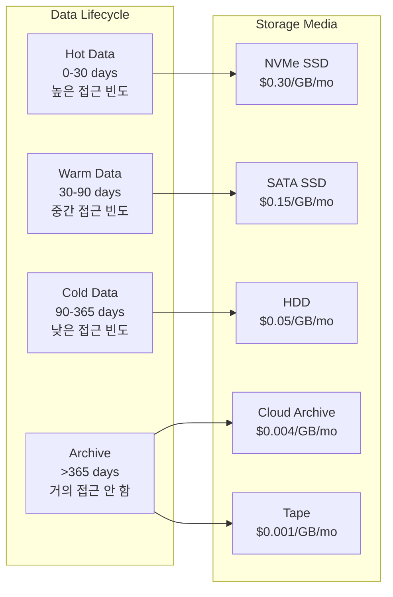
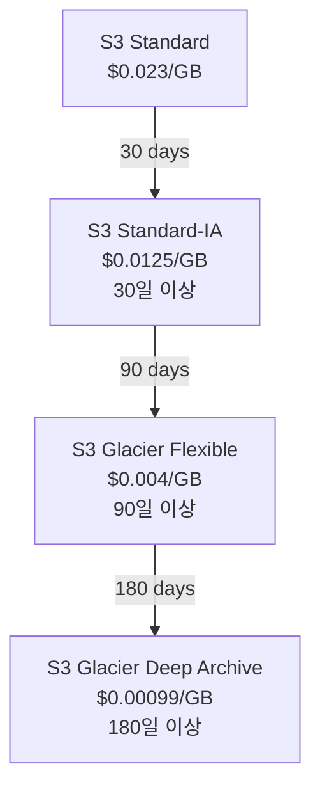
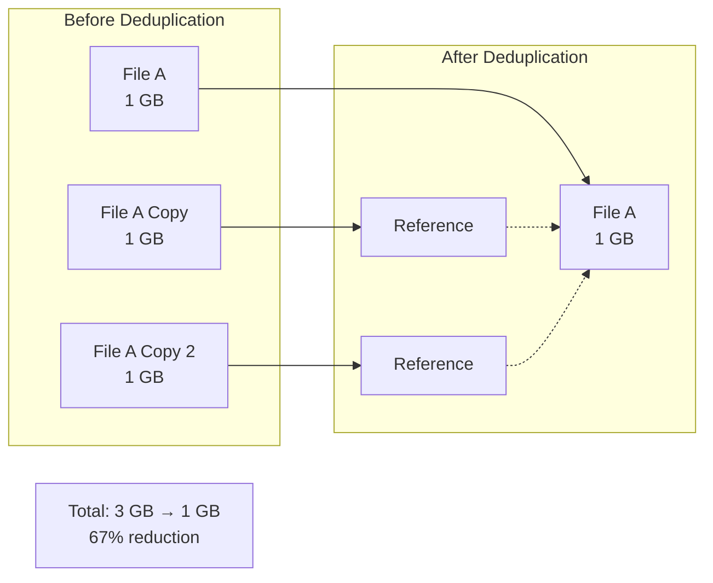

# Ch12. Storage Lifecycle & Cost Optimization

## 📋 개요 및 학습 목표

### 개요

**Storage Lifecycle Management**는 데이터의 생명주기에 따라 **자동으로 스토리지 티어를 변경**하여 **비용을 최적화**하는 핵심 전략입니다. 데이터는 시간이 지남에 따라 접근 빈도가 감소하며, **Hot Data** (자주 접근) → **Warm Data** (가끔 접근) → **Cold Data** (거의 접근 안 함) → **Archive** (장기 보관) 단계를 거칩니다. 각 단계에 적합한 스토리지 티어(SSD, HDD, Cloud Archive, Tape)를 사용하여 **30-60% 비용 절감**을 달성할 수 있습니다.

2025년 현재, **S3 Lifecycle Policy**, **MinIO Automated Tiering**, **Ceph RGW Storage Class**, **Azure Blob Lifecycle Management** 등 주요 플랫폼은 **정책 기반 자동화**를 제공합니다. **Deduplication**(최대 90% 용량 절감), **Compression**(최대 87% 절감), **Intelligent Tiering**(접근 패턴 자동 분석) 등 고급 기능으로 효율성을 극대화합니다.

### 학습 목표

이 챕터를 완료하면 다음을 할 수 있습니다:

1. **Storage Tier 이해**: Hot, Warm, Cold, Archive 티어의 특성 및 사용 시나리오 설명
2. **Lifecycle Policy 작성**: S3/MinIO/Ceph에서 자동 전환 및 만료 정책 설정
3. **비용 최적화**: Deduplication, Compression, Tiering으로 비용 절감
4. **모니터링**: 스토리지 사용량 및 비용 추적, 최적화 기회 식별
5. **Best Practices 적용**: 2025년 스토리지 최적화 모범 사례 구현

---

## 🔑 핵심 개념 및 이론

### 1. Storage Tiers

#### 1.1 Tier 분류



**Tier 특성**:

| Tier | 접근 빈도 | 스토리지 | 레이턴시 | 비용 (예시) | 사용 사례 |
|------|----------|----------|----------|-------------|----------|
| **Hot** | 매일 | NVMe SSD | < 1ms | $0.30/GB/mo | DB, 활성 VM 디스크 |
| **Warm** | 주 1-2회 | SATA SSD | < 5ms | $0.15/GB/mo | 최근 로그, 분석 데이터 |
| **Cold** | 월 1회 이하 | HDD | 10-50ms | $0.05/GB/mo | 백업, 오래된 로그 |
| **Archive** | 연 1회 이하 | S3 Glacier / Tape | 분-시간 | $0.001-0.004/GB/mo | 규정 준수, 장기 보관 |

#### 1.2 AWS S3 Storage Classes

**S3 Standard → S3 Standard-IA → S3 Glacier → S3 Glacier Deep Archive**:



**최소 저장 기간**:

- **S3 Standard-IA**: 30일 (30일 미만 삭제 시 전체 30일 비용 부과)
- **S3 Glacier Flexible**: 90일
- **S3 Glacier Deep Archive**: 180일

**검색 시간**:

- **S3 Standard-IA**: 즉시
- **S3 Glacier Flexible**: Expedited (1-5분), Standard (3-5시간), Bulk (5-12시간)
- **S3 Glacier Deep Archive**: Standard (12시간), Bulk (48시간)

### 2. Lifecycle Policies

#### 2.1 Lifecycle Rule 구조

```xml
<LifecycleConfiguration>
  <Rule>
    <ID>Move old logs to cold storage</ID>
    <Status>Enabled</Status>
    <Filter>
      <Prefix>logs/</Prefix>
    </Filter>

    <!-- Transition Actions -->
    <Transition>
      <Days>30</Days>
      <StorageClass>STANDARD_IA</StorageClass>
    </Transition>
    <Transition>
      <Days>90</Days>
      <StorageClass>GLACIER</StorageClass>
    </Transition>

    <!-- Expiration Action -->
    <Expiration>
      <Days>365</Days>
    </Expiration>

    <!-- Noncurrent Version Expiration -->
    <NoncurrentVersionExpiration>
      <NoncurrentDays>30</NoncurrentDays>
    </NoncurrentVersionExpiration>
  </Rule>
</LifecycleConfiguration>
```

**Rule 구성 요소**:

- **Filter**: Prefix 또는 Tag 기반 필터링
- **Transition**: 다른 스토리지 클래스로 이동
- **Expiration**: 객체 삭제
- **NoncurrentVersionExpiration**: 이전 버전 삭제 (버전 관리 활성화 시)

#### 2.2 MinIO Lifecycle (S3 호환)

MinIO는 **S3 Lifecycle 문법과 100% 호환**되며, 추가로 **Remote Tiering**을 지원합니다:

```json
{
  "Rules": [
    {
      "ID": "Transition to S3 after 30 days",
      "Status": "Enabled",
      "Filter": {
        "Prefix": "data/"
      },
      "Transitions": [
        {
          "Days": 30,
          "StorageClass": "S3TIER"
        }
      ]
    }
  ]
}
```

**MinIO Remote Tier 설정**:

```bash
# AWS S3를 Remote Tier로 등록
mc ilm tier add minio TIER-S3 \
    --endpoint https://s3.amazonaws.com \
    --access-key <AWS_ACCESS_KEY> \
    --secret-key <AWS_SECRET_KEY> \
    --bucket my-archive-bucket \
    --prefix archived/

# MinIO → AWS S3 tiering rule 추가
mc ilm add myminio/data --transition-days 30 --transition-tier TIER-S3
```

#### 2.3 Ceph RGW Storage Classes & Tiering

Ceph **Squid** 릴리스부터 **Storage Class 기반 Tiering**을 지원합니다:

```bash
# Storage Class 생성 (Cloud Tier)
radosgw-admin zonegroup placement add \
    --rgw-zonegroup default \
    --placement-id default-placement \
    --storage-class GLACIER \
    --data-pool default.rgw.buckets.glacier

# Lifecycle Policy 적용
aws s3api put-bucket-lifecycle-configuration \
    --bucket my-bucket \
    --lifecycle-configuration file://lifecycle.json \
    --endpoint-url http://ceph-rgw:7480
```

**Ceph Squid 2025 Enhancement**: **Policy-based Data Retrieval** (Tech Preview)

- Cloud/Tape 티어로 전환된 객체를 Ceph 클러스터로 직접 다시 가져오기 가능

### 3. Deduplication & Compression

#### 3.1 Deduplication

**Deduplication**은 **중복 데이터를 제거**하여 단일 인스턴스만 저장합니다:



**효과**:

- **백업**: 90% 용량 절감 (동일 VM 이미지 매일 백업 시)
- **VM 스토리지**: 50-70% 절감 (동일 OS 템플릿 사용)
- **문서**: 30-50% 절감

**구현 레벨**:

- **Block-level**: ZFS, Ceph BlueStore (일부)
- **File-level**: NFS dedup 플러그인
- **Application-level**: Backup software (Veeam, Commvault)

**사례** (2025):

- **Concerto Cloud Services**: 5.4 PB → 203 TB (96% 감소)
- **NTT-Netmagic**: 35% 용량 절감, £240,000/년 절약

#### 3.2 Compression

**Compression**은 데이터를 더 효율적으로 인코딩하여 크기를 줄입니다:

**알고리즘 비교**:

| 알고리즘 | 압축률 | CPU 사용량 | 속도 | 용도 |
|----------|--------|------------|------|------|
| **LZ4** | 낮음 (2-3x) | 낮음 | 매우 빠름 | 실시간 압축 (Ceph, MinIO) |
| **Zstd** | 중간 (3-5x) | 중간 | 빠름 | 범용 (Facebook 개발) |
| **Gzip** | 중간 (3-4x) | 중간 | 보통 | HTTP, 로그 |
| **Bzip2** | 높음 (4-6x) | 높음 | 느림 | 아카이브 |
| **LZMA/XZ** | 매우 높음 (6-10x) | 매우 높음 | 매우 느림 | 장기 아카이브 |

**Ceph RGW Compression**:

```bash
# Zone placement에 압축 활성화
radosgw-admin zone placement modify \
    --rgw-zone default \
    --placement-id default-placement \
    --compression lz4

# Storage Class별 압축 설정
radosgw-admin zonegroup placement add \
    --rgw-zonegroup default \
    --placement-id default-placement \
    --storage-class COMPRESSED \
    --compression zstd \
    --data-pool default.rgw.buckets.compressed
```

**MinIO Compression**:

MinIO는 서버 측 압축을 지원하지 않지만, **클라이언트 측 압축** 권장:

```go
// Go SDK에서 업로드 전 압축
import "compress/gzip"

file, _ := os.Open("data.txt")
var buf bytes.Buffer
gw := gzip.NewWriter(&buf)
io.Copy(gw, file)
gw.Close()

minioClient.PutObject(ctx, "bucket", "data.txt.gz", &buf, int64(buf.Len()), minio.PutObjectOptions{
    ContentType: "application/gzip",
})
```

### 4. Cost Optimization Strategies (2025)

#### 4.1 Intelligent Tiering

**AWS S3 Intelligent-Tiering**: 접근 패턴을 자동 분석하여 티어 이동

```
Frequent Access Tier (자동)
    ↓ 30일 미접근
Infrequent Access Tier (자동)
    ↓ 90일 미접근
Archive Instant Access Tier (옵션, 자동)
    ↓ 90일 미접근
Archive Access Tier (옵션, 자동)
    ↓ 180일 미접근
Deep Archive Access Tier (옵션, 자동)
```

**비용**: $0.0025/1000 객체 + 모니터링 $0.0025/1000 객체

**효과**: 예측 불가능한 워크로드에서 **30-60% 비용 절감** (수동 관리 없이)

#### 4.2 비용 절감 Best Practices

**1. Lifecycle 정책 적용**:

```bash
# 예시: 로그 파일 자동 정리
# - 30일 후 Infrequent Access
# - 90일 후 Glacier
# - 365일 후 삭제
```

**절감 효과**: 로그 스토리지 비용 **70-80% 감소**

**2. Versioning + Lifecycle**:

```bash
# 현재 버전: 유지
# 이전 버전: 30일 후 삭제
```

**절감 효과**: 버전 관리로 인한 추가 비용 **60% 감소**

**3. 압축 적용 (로그, 백업)**:

```bash
# 텍스트 로그: gzip (3-4x 압축)
# 백업: zstd (3-5x 압축)
```

**절감 효과**: 스토리지 비용 **66-75% 감소**

**4. Deduplication (백업)**:

```bash
# VM 백업 deduplication
```

**절감 효과**: 백업 스토리지 **80-90% 감소**

**5. 객체 크기 최적화**:

- **작은 파일 병합**: S3는 객체당 요금 부과 → 작은 파일 수천 개보다 큰 파일 하나가 저렴
- **Multipart Upload**: 대용량 파일은 멀티파트로 업로드하여 실패 시 재전송 최소화

#### 4.3 비용 모니터링

**메트릭 추적**:

- **Total Storage (GB)**: 전체 사용량
- **Storage by Tier**: Hot/Warm/Cold별 분포
- **Monthly Cost**: 월간 비용
- **Cost per GB**: GB당 비용 (효율성 지표)
- **Retrieval Cost**: Cold/Archive 티어에서 가져오기 비용

**Prometheus 메트릭 (예시)**:

```promql
# 전체 스토리지 사용량
sum(ceph_pool_bytes_used)

# Pool별 사용량
ceph_pool_bytes_used{pool="volumes-ssd"}
ceph_pool_bytes_used{pool="volumes-hdd"}

# 비용 추정 (가상 메트릭)
(ceph_pool_bytes_used{pool="volumes-ssd"} / 1024^3) * 0.30  # $0.30/GB/mo
```

---

## 💻 실습 가이드 (Hands-on)

### Lab 1: S3/MinIO Lifecycle Policy 설정

**목표**: MinIO에서 30일 후 객체 삭제 정책 설정

**단계**:

1. **MinIO 설정**:

```bash
# mc alias 설정
mc alias set myminio https://minio.example.com ACCESS_KEY SECRET_KEY

# 버킷 생성
mc mb myminio/lifecycle-test
```

2. **Lifecycle Policy JSON 작성** (`lifecycle.json`):

```json
{
  "Rules": [
    {
      "ID": "Delete old objects",
      "Status": "Enabled",
      "Filter": {
        "Prefix": "temp/"
      },
      "Expiration": {
        "Days": 30
      }
    },
    {
      "ID": "Transition to S3 Glacier",
      "Status": "Enabled",
      "Filter": {
        "Prefix": "archive/"
      },
      "Transitions": [
        {
          "Days": 90,
          "StorageClass": "GLACIER"
        }
      ],
      "Expiration": {
        "Days": 365
      }
    }
  ]
}
```

3. **Policy 적용**:

```bash
# mc ilm 명령어 사용
mc ilm import myminio/lifecycle-test < lifecycle.json

# 확인
mc ilm ls myminio/lifecycle-test
```

4. **테스트**:

```bash
# 테스트 객체 업로드
echo "test" | mc pipe myminio/lifecycle-test/temp/test.txt

# 객체 확인
mc ls myminio/lifecycle-test/temp/

# 30일 후 자동 삭제 (실제 환경에서는 대기 필요)
# 테스트를 위해 Days를 1로 설정하여 확인 가능
```

### Lab 2: Ceph RGW Storage Class & Lifecycle

**목표**: Ceph RGW에서 Storage Class 생성 및 Lifecycle 정책 적용

**단계**:

1. **Storage Class 생성**:

```bash
# STANDARD_IA Storage Class용 Pool 생성
sudo ceph osd pool create default.rgw.buckets.ia 64 replicated
sudo ceph osd pool application enable default.rgw.buckets.ia rgw

# Storage Class 등록
sudo radosgw-admin zonegroup placement add \
    --rgw-zonegroup default \
    --placement-id default-placement \
    --storage-class STANDARD_IA \
    --data-pool default.rgw.buckets.ia

# ZoneGroup 커밋
sudo radosgw-admin period update --commit

# RGW 재시작
sudo systemctl restart ceph-radosgw@rgw.`hostname -s`
```

2. **Lifecycle Policy 작성** (`rgw-lifecycle.json`):

```json
{
  "Rules": [
    {
      "ID": "Move to IA after 30 days",
      "Status": "Enabled",
      "Filter": {
        "Prefix": ""
      },
      "Transitions": [
        {
          "Days": 30,
          "StorageClass": "STANDARD_IA"
        }
      ]
    }
  ]
}
```

3. **Policy 적용** (AWS CLI 사용):

```bash
# Bucket 생성
aws s3 mb s3://lifecycle-bucket --endpoint-url http://ceph-rgw:7480

# Lifecycle Policy 적용
aws s3api put-bucket-lifecycle-configuration \
    --bucket lifecycle-bucket \
    --lifecycle-configuration file://rgw-lifecycle.json \
    --endpoint-url http://ceph-rgw:7480

# 확인
aws s3api get-bucket-lifecycle-configuration \
    --bucket lifecycle-bucket \
    --endpoint-url http://ceph-rgw:7480
```

4. **객체 Storage Class 확인**:

```bash
# 객체 업로드
aws s3 cp test.txt s3://lifecycle-bucket/ --endpoint-url http://ceph-rgw:7480

# 객체 정보 확인
aws s3api head-object \
    --bucket lifecycle-bucket \
    --key test.txt \
    --endpoint-url http://ceph-rgw:7480 | jq '.StorageClass'

# 30일 후 (테스트 환경에서는 수동으로 처리 프로세스 트리거)
sudo radosgw-admin lc process
```

### Lab 3: Ceph RGW Compression 설정

**목표**: Storage Class에 압축 활성화

**단계**:

1. **압축 활성화된 Storage Class 생성**:

```bash
# Compressed Pool 생성
sudo ceph osd pool create default.rgw.buckets.compressed 64 replicated
sudo ceph osd pool application enable default.rgw.buckets.compressed rgw

# Storage Class 등록 (lz4 compression)
sudo radosgw-admin zonegroup placement add \
    --rgw-zonegroup default \
    --placement-id default-placement \
    --storage-class COMPRESSED \
    --compression lz4 \
    --data-pool default.rgw.buckets.compressed

# 커밋
sudo radosgw-admin period update --commit
sudo systemctl restart ceph-radosgw@rgw.`hostname -s`
```

2. **객체 업로드 (압축된 Storage Class로)**:

```bash
# 테스트 파일 생성 (압축 가능한 텍스트)
dd if=/dev/zero of=test-compress.txt bs=1M count=10

# COMPRESSED Storage Class로 업로드
aws s3 cp test-compress.txt s3://my-bucket/ \
    --storage-class COMPRESSED \
    --endpoint-url http://ceph-rgw:7480

# 객체 정보 확인
aws s3api head-object \
    --bucket my-bucket \
    --key test-compress.txt \
    --endpoint-url http://ceph-rgw:7480
```

3. **Ceph에서 실제 압축 확인**:

```bash
# 객체 크기 확인 (압축 전)
ls -lh test-compress.txt
# 10M

# Ceph Pool에서 실제 사용량 확인
sudo ceph df detail | grep compressed
# POOL                                 STORED      OBJECTS     USED        %USED
# default.rgw.buckets.compressed       2.5 MiB     1           7.5 MiB     0.00

# 압축률 확인: 10MB → 2.5MB (75% 절감)
```

### Lab 4: 비용 분석 및 최적화

**목표**: Prometheus + Grafana로 스토리지 비용 추적 및 최적화 기회 식별

**단계**:

1. **메트릭 수집 스크립트** (`storage-cost-exporter.py`):

```python
#!/usr/bin/env python3
import subprocess
import json
from prometheus_client import start_http_server, Gauge
import time

# Prometheus Gauges
storage_bytes = Gauge('storage_bytes', 'Storage usage in bytes', ['pool', 'tier'])
storage_cost_usd = Gauge('storage_cost_usd', 'Estimated monthly cost in USD', ['pool', 'tier'])

# 티어별 비용 (USD/GB/month)
TIER_COSTS = {
    'ssd': 0.15,
    'hdd': 0.05,
    'archive': 0.004,
}

def collect_ceph_metrics():
    # ceph df 실행
    result = subprocess.run(['ceph', 'df', '-f', 'json'], capture_output=True, text=True)
    data = json.loads(result.stdout)

    for pool in data['pools']:
        pool_name = pool['name']
        bytes_used = pool['stats']['bytes_used']

        # Pool 이름에서 tier 추출
        if 'ssd' in pool_name:
            tier = 'ssd'
        elif 'hdd' in pool_name or 'volumes' in pool_name:
            tier = 'hdd'
        elif 'archive' in pool_name:
            tier = 'archive'
        else:
            tier = 'hdd'  # default

        # 메트릭 업데이트
        storage_bytes.labels(pool=pool_name, tier=tier).set(bytes_used)

        # 비용 계산 (bytes → GB)
        gb_used = bytes_used / (1024 ** 3)
        cost = gb_used * TIER_COSTS[tier]
        storage_cost_usd.labels(pool=pool_name, tier=tier).set(cost)

if __name__ == '__main__':
    start_http_server(9999)
    while True:
        collect_ceph_metrics()
        time.sleep(60)  # 1분마다 수집
```

2. **Prometheus 스크랩 설정** (`prometheus.yml`):

```yaml
scrape_configs:
  - job_name: 'storage-cost'
    static_configs:
      - targets: ['localhost:9999']
```

3. **Grafana 대시보드 쿼리**:

```promql
# 전체 월간 비용
sum(storage_cost_usd)

# Tier별 비용
sum by (tier) (storage_cost_usd)

# GB당 비용 (효율성)
sum(storage_cost_usd) / (sum(storage_bytes) / 1024^3)

# 최적화 가능 용량 (30일 미접근 데이터를 HDD로 이동 시)
(storage_bytes{tier="ssd"} * 0.3) * (0.15 - 0.05) / (1024^3)
# 30%가 30일 미접근 데이터라고 가정, SSD→HDD 이동 시 절감액
```

4. **분석 및 최적화**:

```bash
# 스토리지 사용량 요약
sudo ceph df

# Pool별 비용 분석
# - SSD Pool이 전체 비용의 70%를 차지하는지?
# - HDD Pool로 이동 가능한 데이터는?

# Lifecycle Policy 적용 (Lab 1, 2 참조)
# - SSD → HDD: 30일 후
# - HDD → Archive: 90일 후
```

### Lab 5: 자동화된 데이터 마이그레이션

**목표**: Go 스크립트로 S3 객체의 접근 시간을 분석하여 자동 마이그레이션

**코드** (`auto-tiering.go`):

```go
package main

import (
    "context"
    "fmt"
    "log"
    "os"
    "time"

    "github.com/minio/minio-go/v7"
    "github.com/minio/minio-go/v7/pkg/credentials"
)

func main() {
    minioClient, err := minio.New(os.Getenv("MINIO_ENDPOINT"), &minio.Options{
        Creds:  credentials.NewStaticV4(os.Getenv("MINIO_ACCESS_KEY"), os.Getenv("MINIO_SECRET_KEY"), ""),
        Secure: true,
    })
    if err != nil {
        log.Fatal(err)
    }

    ctx := context.Background()
    bucketName := "my-bucket"

    // 모든 객체 조회
    objectCh := minioClient.ListObjects(ctx, bucketName, minio.ListObjectsOptions{
        Recursive: true,
    })

    now := time.Now()
    transitionThreshold := 30 * 24 * time.Hour  // 30일

    for object := range objectCh {
        if object.Err != nil {
            log.Println(object.Err)
            continue
        }

        // LastModified 기준으로 오래된 객체 확인
        age := now.Sub(object.LastModified)

        if age > transitionThreshold {
            fmt.Printf("객체 %s는 %d일 전에 수정됨, Storage Class 변경 필요\n",
                object.Key, int(age.Hours()/24))

            // MinIO에서는 Storage Class를 직접 변경할 수 없으므로
            // Lifecycle Policy를 권장
            // 또는 객체를 다운로드 후 다른 티어로 재업로드

            // 예시: 객체 복사 (같은 버킷, 다른 Storage Class)
            // 실제로는 mc ilm 사용 권장
            /*
            src := minio.CopySrcOptions{
                Bucket: bucketName,
                Object: object.Key,
            }
            dst := minio.CopyDestOptions{
                Bucket:       bucketName,
                Object:       object.Key,
                StorageClass: "GLACIER",
            }
            _, err := minioClient.CopyObject(ctx, dst, src)
            if err != nil {
                log.Println(err)
            }
            */
        }
    }

    fmt.Println("\n권장 사항: mc ilm을 사용하여 Lifecycle Policy 설정")
    fmt.Println("mc ilm add myminio/my-bucket --transition-days 30 --transition-tier GLACIER")
}
```

**실행**:

```bash
export MINIO_ENDPOINT="minio.example.com:9000"
export MINIO_ACCESS_KEY="minioadmin"
export MINIO_SECRET_KEY="minioadmin"

go run auto-tiering.go
```

**출력 예시**:

```
객체 old-data/file1.txt는 45일 전에 수정됨, Storage Class 변경 필요
객체 old-data/file2.txt는 60일 전에 수정됨, Storage Class 변경 필요

권장 사항: mc ilm을 사용하여 Lifecycle Policy 설정
mc ilm add myminio/my-bucket --transition-days 30 --transition-tier GLACIER
```

---

## 📚 참고 자료

### 공식 문서

- **MinIO Data Lifecycle Management**: [https://min.io/product/automated-data-tiering-lifecycle-management](https://min.io/product/automated-data-tiering-lifecycle-management)
- **MinIO Object Lifecycle Management**: [https://docs.min.io/enterprise/aistor-object-store/administration/object-lifecycle-management/](https://docs.min.io/enterprise/aistor-object-store/administration/object-lifecycle-management/)
- **MinIO Automatic Object Expiration**: [https://min.io/docs/minio/linux/administration/object-management/create-lifecycle-management-expiration-rule.html](https://min.io/docs/minio/linux/administration/object-management/create-lifecycle-management-expiration-rule.html)
- **MinIO Transition to S3**: [https://min.io/docs/minio/windows/administration/object-management/transition-objects-to-s3.html](https://min.io/docs/minio/windows/administration/object-management/transition-objects-to-s3.html)

### AWS S3 문서

- **AWS S3 Lifecycle Examples**: [https://docs.aws.amazon.com/AmazonS3/latest/userguide/lifecycle-configuration-examples.html](https://docs.aws.amazon.com/AmazonS3/latest/userguide/lifecycle-configuration-examples.html)
- **AWS S3 Lifecycle Management**: [https://docs.aws.amazon.com/AmazonS3/latest/userguide/object-lifecycle-mgmt.html](https://docs.aws.amazon.com/AmazonS3/latest/userguide/object-lifecycle-mgmt.html)

### Azure 문서

- **Azure Blob Lifecycle Management**: [https://learn.microsoft.com/en-us/azure/storage/blobs/lifecycle-management-overview](https://learn.microsoft.com/en-us/azure/storage/blobs/lifecycle-management-overview)

### Ceph 문서

- **Red Hat Ceph RGW Administration**: [https://docs.redhat.com/en/documentation/red_hat_ceph_storage/5/html/object_gateway_guide/administration](https://docs.redhat.com/en/documentation/red_hat_ceph_storage/5/html/object_gateway_guide/administration)
- **Ceph RGW Tiering Enhancements Part 1 (2025)**: [https://ceph.io/en/news/blog/2025/rgw-tiering-enhancements-part1/](https://ceph.io/en/news/blog/2025/rgw-tiering-enhancements-part1/)
- **Ceph RGW Tiering Enhancements Part 2 (2025)**: [https://ceph.io/en/news/blog/2025/rgw-tiering-enhancements-part2/](https://ceph.io/en/news/blog/2025/rgw-tiering-enhancements-part2/)
- **45Drives Intelligent Tiering with Ceph S3**: [https://knowledgebase.45drives.com/kb/kb450472-intelligent-tiering-with-lifecycle-management-on-ceph-s3/](https://knowledgebase.45drives.com/kb/kb450472-intelligent-tiering-with-lifecycle-management-on-ceph-s3/)
- **Implementing Ceph as S3 Object Store (PDF)**: [https://resinfo.org/IMG/pdf/gtceph-20240523-ceph-implementing-s3.pdf](https://resinfo.org/IMG/pdf/gtceph-20240523-ceph-implementing-s3.pdf)

### 산업 자료

- **Elasticsearch Data Tiers**: [https://www.elastic.co/docs/manage-data/lifecycle/data-tiers](https://www.elastic.co/docs/manage-data/lifecycle/data-tiers)
- **Aerospike Tiered Storage Guide**: [https://aerospike.com/blog/tiered-storage-guide/](https://aerospike.com/blog/tiered-storage-guide/)
- **DataCore Auto Tiering**: [https://www.datacore.com/products/sansymphony/auto-tiering/](https://www.datacore.com/products/sansymphony/auto-tiering/)
- **Wasabi Cloud Tiering**: [https://wasabi.com/learn/what-is-cloud-tiering](https://wasabi.com/learn/what-is-cloud-tiering)
- **Supermicro Cold Data Storage**: [https://www.supermicro.com/en/glossary/cold-data-storage](https://www.supermicro.com/en/glossary/cold-data-storage)
- **Platform3 Storage Tiering Benefits**: [https://platform3solutions.com/blog/storage-tiering-and-its-benefits-for-applications/](https://platform3solutions.com/blog/storage-tiering-and-its-benefits-for-applications/)
- **Open-E Caching vs Auto-tiering**: [https://www.open-e.com/blog/caching-vs-auto-tiering-two-ways-to-accelerate-data-storage/](https://www.open-e.com/blog/caching-vs-auto-tiering-two-ways-to-accelerate-data-storage/)

### 비용 최적화 가이드

- **Deduplication and Compression Case Studies**: [https://hokstadconsulting.com/blog/deduplication-and-compression-cost-saving-case-studies](https://hokstadconsulting.com/blog/deduplication-and-compression-cost-saving-case-studies)
- **DigitalOcean Data Storage Strategies**: [https://www.digitalocean.com/resources/articles/data-storage-management-strategies](https://www.digitalocean.com/resources/articles/data-storage-management-strategies)
- **Cloud Cost Optimization 2025 (Bacancy)**: [https://www.bacancytechnology.com/blog/cloud-storage-cost-optimization](https://www.bacancytechnology.com/blog/cloud-storage-cost-optimization)
- **Cloud Cost Optimization 2025 (Group107)**: [https://group107.com/blog/cloud-cost-optimization-strategies/](https://group107.com/blog/cloud-cost-optimization-strategies/)
- **Cloud Cost Optimization 2025 (Scalr)**: [https://scalr.com/learning-center/cloud-cost-optimization-best-practices-for-2025-a-comprehensive-guide/](https://scalr.com/learning-center/cloud-cost-optimization-best-practices-for-2025-a-comprehensive-guide/)
- **Relief From Data Storage Costs**: [https://cloudtweaks.com/2025/02/relief-from-data-storage-costs/](https://cloudtweaks.com/2025/02/relief-from-data-storage-costs/)

### 학술 자료

- **Cloud Storage Tier Optimization (Springer)**: [https://link.springer.com/article/10.1007/s00607-024-01281-2](https://link.springer.com/article/10.1007/s00607-024-01281-2)
- **ACM Cost Optimization Survey**: [https://dl.acm.org/doi/10.1145/3582883](https://dl.acm.org/doi/10.1145/3582883)

### 학습 체크리스트

완료한 항목에 체크하세요:

- [ ] Hot, Warm, Cold, Archive 티어의 특성과 비용 차이를 이해했다
- [ ] S3/MinIO/Ceph에서 Lifecycle Policy를 작성하고 적용할 수 있다
- [ ] Transition과 Expiration 액션의 차이를 이해했다
- [ ] Deduplication과 Compression의 효과 및 적용 시나리오를 설명할 수 있다
- [ ] 압축 알고리즘(LZ4, Zstd, Gzip)의 트레이드오프를 이해했다
- [ ] Ceph RGW에서 Storage Class를 생성하고 압축을 활성화할 수 있다
- [ ] AWS S3 Intelligent-Tiering의 동작 원리를 이해했다
- [ ] 스토리지 비용 모니터링 메트릭을 설정하고 분석할 수 있다
- [ ] 30-60% 비용 절감을 위한 구체적인 최적화 전략을 수립할 수 있다
- [ ] 실제 사례(Concerto Cloud, NTT-Netmagic)에서 얻은 교훈을 적용할 수 있다

---

**이 챕터로 IAM/Storage 서비스 스터디 가이드를 완료했습니다!** 12개 챕터를 통해 IAM(Keystone, OAuth/OIDC, RBAC/ABAC, OPA, Vault, Service Mesh)과 Storage(Swift, S3/MinIO, Ceph, Cinder, Lifecycle) 기술 스택을 마스터했습니다. 🎉

**다음 단계**:
- 각 챕터의 실습 가이드를 직접 수행하여 실무 경험 쌓기
- KakaoCloud IAM/Storage 서비스 아키텍처 설계 및 구현 프로젝트 진행
- 학습 체크리스트를 모두 완료하여 역량 검증
