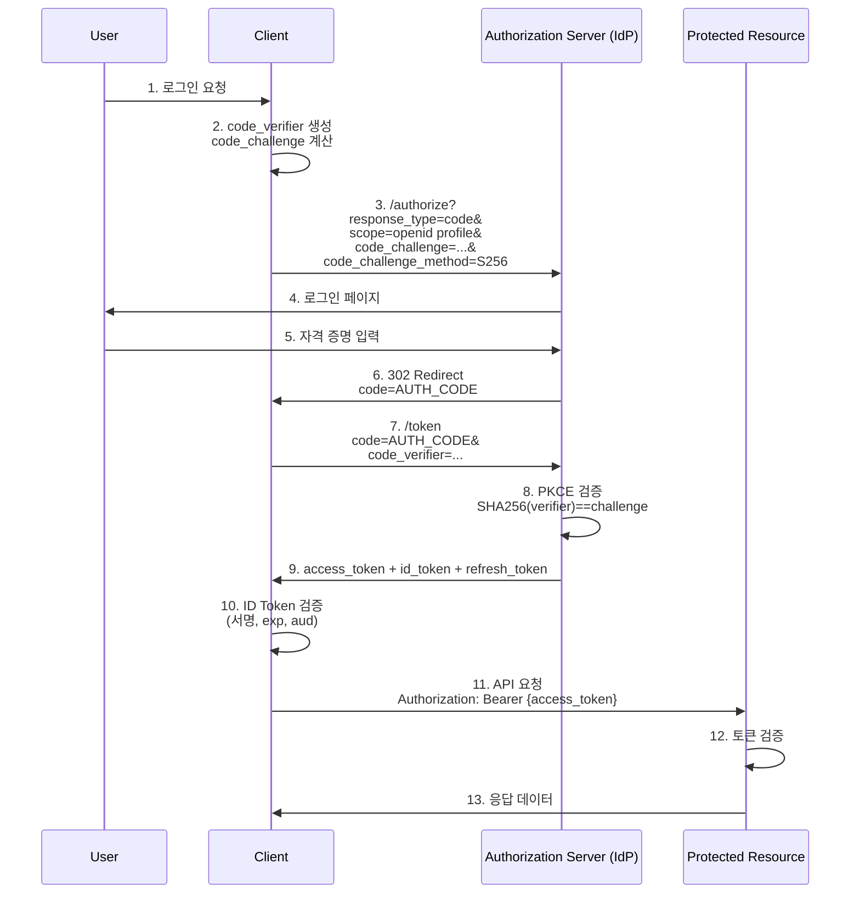

# Ch2. OAuth 2.1 / OIDC / JWT 인증 시스템

## 📋 개요 및 학습 목표

현대 클라우드 환경에서 인증(Authentication)과 인가(Authorization)를 구현하는 표준 프로토콜인 **OAuth 2.1**, **OpenID Connect (OIDC)**, **JWT (JSON Web Token)**을 학습합니다.

### 왜 중요한가?

- **OAuth 2.1**: 2025년 현재 OAuth 2.0의 모든 보안 모범 사례를 통합한 최신 표준
- **OIDC**: OAuth 2.1 위에서 동작하며 사용자 신원(Identity) 정보를 제공
- **JWT**: Stateless 인증을 가능하게 하는 토큰 형식

KakaoCloud IAM 서비스에서는 다음과 같은 시나리오에 활용됩니다:

- 외부 IdP(Keycloak, Google, GitHub 등)와의 연동
- API Gateway에서의 토큰 기반 인증/인가
- 마이크로서비스 간 서비스 계정 인증
- 멀티 테넌트 환경에서의 사용자 격리

### 학습 후 얻을 수 있는 역량

- [x] OAuth 2.1의 Authorization Code + PKCE 플로우 구현
- [x] OIDC Provider와 Relying Party 개발
- [x] JWT 토큰 생성, 검증, 갱신 로직 구현
- [x] Go 언어로 안전한 인증 시스템 개발

---

## 🔑 핵심 개념 및 이론

### 1. OAuth 2.1 개요

**OAuth 2.1**은 2025년 현재 OAuth 2.0의 보안 개선사항을 통합한 최신 표준입니다. 완전한 표준으로 확정되었으며, 주요 Identity Provider들이 이미 채택하고 있습니다.

#### OAuth 2.0 → 2.1 주요 변경사항

| 항목 | OAuth 2.0 | OAuth 2.1 |
|------|-----------|-----------|
| **PKCE** | 공개 클라이언트만 권장 | **모든 클라이언트 필수** |
| **Implicit Flow** | 지원 | **제거됨** (보안 취약) |
| **Password Grant** | 지원 | **제거됨** (자격 증명 노출) |
| **Redirect URI** | 부분 일치 허용 | **정확히 일치 필수** |
| **Refresh Token** | 제한 없음 | **송신자 제약** 또는 일회용 |
| **Bearer Token in Query** | 허용 | **금지** (로그 노출 방지) |

#### PKCE (Proof Key for Code Exchange)

PKCE는 Authorization Code 가로채기 공격을 방지합니다:

```
1. 클라이언트가 code_verifier 생성 (43-128자 랜덤 문자열)
2. code_challenge = BASE64URL(SHA256(code_verifier))
3. 인가 요청 시 code_challenge 포함
4. 토큰 요청 시 code_verifier 포함
5. 서버가 SHA256(code_verifier) == code_challenge 검증
```

**보안 효과**: PKCE 도입으로 Authorization Code 가로채기 공격이 **70% 감소**했습니다.

---

### 2. OpenID Connect (OIDC)

**OIDC**는 OAuth 2.1 위에 구축된 인증 레이어입니다:

- **OAuth 2.1**: "누가 무엇을 할 수 있는가?" (인가 - Authorization)
- **OIDC**: "사용자가 누구인가?" (인증 - Authentication)

#### OIDC 핵심 개념

**ID Token**:
- JWT 형식으로 사용자 신원 정보 포함
- 필수 클레임: `iss`, `sub`, `aud`, `exp`, `iat`
- 서명 알고리즘: **RS256, ES256 권장** (HS256은 공유 비밀 사용으로 비권장)

**UserInfo Endpoint**:
- ID Token에 포함되지 않은 추가 사용자 정보 제공
- Access Token으로 인증

**Discovery Document**:
- `/.well-known/openid-configuration`
- 제공자의 엔드포인트, 지원 알고리즘 등 메타데이터

#### OIDC 플로우



---

### 3. JWT (JSON Web Token)

JWT는 세 부분으로 구성됩니다:

```
HEADER.PAYLOAD.SIGNATURE
```

#### JWT 구조

**1. Header (헤더)**:
```json
{
  "alg": "ES256",
  "typ": "JWT",
  "kid": "key-2025-01"
}
```
- `alg`: 서명 알고리즘 (ES256, RS256, HS256)
- `typ`: 토큰 타입 (JWT)
- `kid`: 키 식별자 (여러 키 중 어떤 키로 검증할지)

**2. Payload (페이로드)**:
```json
{
  "iss": "https://auth.kakaocloud.com",
  "sub": "user-12345",
  "aud": ["api.kakaocloud.com"],
  "exp": 1735776000,
  "iat": 1735689600,
  "nbf": 1735689600,
  "scope": "read write",
  "tenant_id": "tenant-abc"
}
```

**표준 클레임**:
- `iss` (Issuer): 토큰 발급자
- `sub` (Subject): 토큰 주체 (사용자 ID)
- `aud` (Audience): 토큰 수신자
- `exp` (Expiration): 만료 시간 (Unix timestamp)
- `iat` (Issued At): 발급 시간
- `nbf` (Not Before): 활성화 시간

**3. Signature (서명)**:
```
HMACSHA256(
  base64UrlEncode(header) + "." + base64UrlEncode(payload),
  secret
)
```

#### JWT 알고리즘 선택 가이드 (2025)

| 알고리즘 | 타입 | 키 길이 | 서명 크기 | 성능 | 용도 |
|---------|------|---------|----------|------|------|
| **ES256** | ECDSA P-256 | 256-bit | ~140 bytes | ⚡⚡⚡ 빠름 | **권장** - 마이크로서비스 |
| **RS256** | RSA PKCS#1 | 2048-bit | ~256 bytes | ⚡⚡ 보통 | 레거시 호환 필요 시 |
| **HS256** | HMAC SHA-256 | 256-bit | 32 bytes | ⚡⚡⚡ 가장 빠름 | 내부 시스템 (비권장) |
| **EdDSA** | Ed25519 | 256-bit | 64 bytes | ⚡⚡⚡ 가장 빠름 | **미래 표준** |

**2025 권장사항**:
- ✅ **ES256**: 가장 균형 잡힌 선택 (보안 + 성능)
- ✅ **EdDSA**: 최신 표준, 향후 마이그레이션 고려
- ⚠️ **RS256**: 레거시 시스템 호환 시만 사용
- ❌ **HS256**: 공유 비밀 사용으로 키 관리 어려움

---

## 💻 실습 가이드 (Hands-on)

### Lab 1: OAuth 2.1 Authorization Server 구축 (Go)

**목표**: PKCE를 지원하는 간단한 OAuth 2.1 인가 서버 구현

#### 1단계: 의존성 설치

```bash
mkdir oauth-server && cd oauth-server
go mod init oauth-server

go get github.com/golang-jwt/jwt/v5
go get github.com/google/uuid
```

#### 2단계: Authorization Server 구현

```go
// main.go
package main

import (
    "crypto/sha256"
    "encoding/base64"
    "encoding/json"
    "fmt"
    "log"
    "net/http"
    "sync"
    "time"

    "github.com/golang-jwt/jwt/v5"
    "github.com/google/uuid"
)

// 인메모리 저장소
var (
    clients = map[string]string{
        "client-123": "https://myapp.example.com/callback", // client_id: redirect_uri
    }

    authCodes = sync.Map{} // code -> AuthCodeData

    // 실제 환경에서는 환경변수나 Vault에서 로드
    jwtSecret = []byte("your-256-bit-secret-change-in-production")
)

type AuthCodeData struct {
    ClientID        string
    RedirectURI     string
    CodeChallenge   string
    Scope           string
    ExpiresAt       time.Time
}

type TokenResponse struct {
    AccessToken  string `json:"access_token"`
    TokenType    string `json:"token_type"`
    ExpiresIn    int    `json:"expires_in"`
    RefreshToken string `json:"refresh_token,omitempty"`
    IDToken      string `json:"id_token,omitempty"`
    Scope        string `json:"scope,omitempty"`
}

// 1. Authorization Endpoint
func authorizeHandler(w http.ResponseWriter, r *http.Request) {
    // 파라미터 파싱
    clientID := r.URL.Query().Get("client_id")
    redirectURI := r.URL.Query().Get("redirect_uri")
    responseType := r.URL.Query().Get("response_type")
    codeChallenge := r.URL.Query().Get("code_challenge")
    codeChallengeMethod := r.URL.Query().Get("code_challenge_method")
    scope := r.URL.Query().Get("scope")
    state := r.URL.Query().Get("state")

    // 검증 1: client_id 확인
    registeredRedirect, ok := clients[clientID]
    if !ok {
        http.Error(w, "Invalid client_id", http.StatusBadRequest)
        return
    }

    // 검증 2: redirect_uri 정확히 일치 (OAuth 2.1 요구사항)
    if redirectURI != registeredRedirect {
        http.Error(w, "Invalid redirect_uri", http.StatusBadRequest)
        return
    }

    // 검증 3: response_type=code만 지원 (Implicit 제거됨)
    if responseType != "code" {
        http.Error(w, "Only response_type=code is supported", http.StatusBadRequest)
        return
    }

    // 검증 4: PKCE 필수 (OAuth 2.1)
    if codeChallenge == "" || codeChallengeMethod != "S256" {
        http.Error(w, "PKCE with S256 is required", http.StatusBadRequest)
        return
    }

    // Authorization Code 생성
    code := uuid.New().String()
    authCodes.Store(code, AuthCodeData{
        ClientID:      clientID,
        RedirectURI:   redirectURI,
        CodeChallenge: codeChallenge,
        Scope:         scope,
        ExpiresAt:     time.Now().Add(10 * time.Minute),
    })

    // Redirect with code
    redirectURL := fmt.Sprintf("%s?code=%s&state=%s", redirectURI, code, state)
    http.Redirect(w, r, redirectURL, http.StatusFound)
}

// 2. Token Endpoint
func tokenHandler(w http.ResponseWriter, r *http.Request) {
    if r.Method != http.MethodPost {
        http.Error(w, "Method not allowed", http.StatusMethodNotAllowed)
        return
    }

    // 파라미터 파싱
    grantType := r.FormValue("grant_type")
    code := r.FormValue("code")
    redirectURI := r.FormValue("redirect_uri")
    codeVerifier := r.FormValue("code_verifier")
    clientID := r.FormValue("client_id")

    // 검증 1: grant_type
    if grantType != "authorization_code" {
        http.Error(w, "Invalid grant_type", http.StatusBadRequest)
        return
    }

    // 검증 2: authorization code 확인
    data, ok := authCodes.Load(code)
    if !ok {
        http.Error(w, "Invalid authorization code", http.StatusBadRequest)
        return
    }
    authData := data.(AuthCodeData)

    // 일회용 코드 (사용 후 즉시 삭제)
    authCodes.Delete(code)

    // 검증 3: 만료 시간
    if time.Now().After(authData.ExpiresAt) {
        http.Error(w, "Authorization code expired", http.StatusBadRequest)
        return
    }

    // 검증 4: client_id 일치
    if clientID != authData.ClientID {
        http.Error(w, "Client ID mismatch", http.StatusBadRequest)
        return
    }

    // 검증 5: redirect_uri 일치
    if redirectURI != authData.RedirectURI {
        http.Error(w, "Redirect URI mismatch", http.StatusBadRequest)
        return
    }

    // 검증 6: PKCE 검증 (핵심!)
    verifierHash := sha256.Sum256([]byte(codeVerifier))
    expectedChallenge := base64.RawURLEncoding.EncodeToString(verifierHash[:])
    if expectedChallenge != authData.CodeChallenge {
        http.Error(w, "PKCE validation failed", http.StatusBadRequest)
        return
    }

    // Access Token 생성 (JWT)
    accessToken, err := generateAccessToken(clientID, authData.Scope)
    if err != nil {
        http.Error(w, "Failed to generate token", http.StatusInternalServerError)
        return
    }

    // ID Token 생성 (OIDC)
    var idToken string
    if contains(authData.Scope, "openid") {
        idToken, err = generateIDToken(clientID)
        if err != nil {
            http.Error(w, "Failed to generate ID token", http.StatusInternalServerError)
            return
        }
    }

    // Refresh Token (일회용)
    refreshToken := uuid.New().String()

    // 응답
    response := TokenResponse{
        AccessToken:  accessToken,
        TokenType:    "Bearer",
        ExpiresIn:    3600,
        RefreshToken: refreshToken,
        IDToken:      idToken,
        Scope:        authData.Scope,
    }

    w.Header().Set("Content-Type", "application/json")
    json.NewEncoder(w).Encode(response)
}

// JWT Access Token 생성
func generateAccessToken(clientID, scope string) (string, error) {
    claims := jwt.MapClaims{
        "iss":       "https://auth.kakaocloud.com",
        "sub":       clientID,
        "aud":       []string{"api.kakaocloud.com"},
        "exp":       time.Now().Add(1 * time.Hour).Unix(),
        "iat":       time.Now().Unix(),
        "scope":     scope,
        "tenant_id": "tenant-demo",
    }

    token := jwt.NewWithClaims(jwt.SigningMethodHS256, claims)
    return token.SignedString(jwtSecret)
}

// OIDC ID Token 생성
func generateIDToken(clientID string) (string, error) {
    claims := jwt.MapClaims{
        "iss":   "https://auth.kakaocloud.com",
        "sub":   "user-12345",
        "aud":   clientID,
        "exp":   time.Now().Add(1 * time.Hour).Unix(),
        "iat":   time.Now().Unix(),
        "nonce": uuid.New().String(),
        "email": "user@example.com",
        "name":  "John Doe",
    }

    token := jwt.NewWithClaims(jwt.SigningMethodHS256, claims)
    return token.SignedString(jwtSecret)
}

func contains(s, substr string) bool {
    return len(s) > 0 && len(substr) > 0 && (s == substr || len(s) > len(substr))
}

func main() {
    http.HandleFunc("/authorize", authorizeHandler)
    http.HandleFunc("/token", tokenHandler)

    log.Println("OAuth 2.1 Server running on :8080")
    log.Fatal(http.ListenAndServe(":8080", nil))
}
```

#### 3단계: 테스트

```bash
# 서버 실행
go run main.go

# PKCE 파라미터 생성
CODE_VERIFIER=$(openssl rand -base64 32 | tr -d '/+=' | cut -c1-43)
CODE_CHALLENGE=$(echo -n $CODE_VERIFIER | openssl dgst -sha256 -binary | base64 | tr -d '/+=' | tr -d '=')

# 1. Authorization Code 받기
curl "http://localhost:8080/authorize?client_id=client-123&redirect_uri=https://myapp.example.com/callback&response_type=code&code_challenge=$CODE_CHALLENGE&code_challenge_method=S256&scope=openid%20profile&state=random-state"

# 응답: 302 Redirect to https://myapp.example.com/callback?code=UUID&state=random-state

# 2. Token 교환 (code를 위에서 받은 값으로 교체)
curl -X POST http://localhost:8080/token \
  -d "grant_type=authorization_code" \
  -d "code=YOUR_CODE_HERE" \
  -d "redirect_uri=https://myapp.example.com/callback" \
  -d "code_verifier=$CODE_VERIFIER" \
  -d "client_id=client-123"
```

**예상 응답**:
```json
{
  "access_token": "eyJhbGciOiJIUzI1NiIsInR5cCI6IkpXVCJ9...",
  "token_type": "Bearer",
  "expires_in": 3600,
  "refresh_token": "uuid-refresh-token",
  "id_token": "eyJhbGciOiJIUzI1NiIsInR5cCI6IkpXVCJ9...",
  "scope": "openid profile"
}
```

---

### Lab 2: JWT 토큰 검증 (golang-jwt/jwt v5)

**목표**: golang-jwt/jwt v5를 사용한 안전한 토큰 검증

#### 1단계: 의존성 설치

```bash
mkdir jwt-validator && cd jwt-validator
go mod init jwt-validator
go get github.com/golang-jwt/jwt/v5
```

#### 2단계: JWT 검증 구현

```go
// main.go
package main

import (
    "errors"
    "fmt"
    "log"
    "time"

    "github.com/golang-jwt/jwt/v5"
)

var (
    // 실제 환경에서는 공개키 사용 (RS256, ES256)
    jwtSecret = []byte("your-256-bit-secret-change-in-production")

    // 허용된 서명 알고리즘 제한 (보안 필수!)
    allowedAlgs = []string{jwt.SigningMethodHS256.Name}
)

// Custom Claims 정의
type CustomClaims struct {
    Scope    string `json:"scope"`
    TenantID string `json:"tenant_id"`
    jwt.RegisteredClaims
}

// JWT 토큰 생성
func generateToken(userID, scope, tenantID string) (string, error) {
    claims := CustomClaims{
        Scope:    scope,
        TenantID: tenantID,
        RegisteredClaims: jwt.RegisteredClaims{
            Issuer:    "https://auth.kakaocloud.com",
            Subject:   userID,
            Audience:  jwt.ClaimStrings{"api.kakaocloud.com", "storage.kakaocloud.com"},
            ExpiresAt: jwt.NewNumericDate(time.Now().Add(1 * time.Hour)),
            IssuedAt:  jwt.NewNumericDate(time.Now()),
            NotBefore: jwt.NewNumericDate(time.Now()),
            ID:        "token-uuid-12345",
        },
    }

    token := jwt.NewWithClaims(jwt.SigningMethodHS256, claims)
    return token.SignedString(jwtSecret)
}

// JWT 토큰 검증 (golang-jwt v5 방식)
func validateToken(tokenString string, expectedAudience string) (*CustomClaims, error) {
    // 파싱 옵션 설정 (v5 권장 방식)
    token, err := jwt.ParseWithClaims(
        tokenString,
        &CustomClaims{},
        func(token *jwt.Token) (interface{}, error) {
            // 검증 1: 알고리즘 확인 (alg 필드 검증 필수!)
            if !isAllowedAlgorithm(token.Method.Alg()) {
                return nil, fmt.Errorf("unexpected signing method: %v", token.Header["alg"])
            }
            return jwtSecret, nil
        },
        // v5의 새로운 검증 옵션들
        jwt.WithAudience(expectedAudience),                // audience 검증
        jwt.WithIssuer("https://auth.kakaocloud.com"),     // issuer 검증
        jwt.WithExpirationRequired(),                       // exp 필수
        jwt.WithIssuedAt(),                                 // iat 검증
        jwt.WithLeeway(5*time.Second),                      // 시간 여유 (clock skew)
        jwt.WithValidMethods(allowedAlgs),                  // 허용 알고리즘 제한
    )

    if err != nil {
        return nil, fmt.Errorf("token validation failed: %w", err)
    }

    // 검증 2: 토큰이 유효한지 확인
    if !token.Valid {
        return nil, errors.New("token is invalid")
    }

    // 검증 3: Claims 추출
    claims, ok := token.Claims.(*CustomClaims)
    if !ok {
        return nil, errors.New("failed to parse claims")
    }

    return claims, nil
}

// 알고리즘 허용 목록 확인
func isAllowedAlgorithm(alg string) bool {
    for _, allowed := range allowedAlgs {
        if alg == allowed {
            return true
        }
    }
    return false
}

// 특정 권한(scope) 확인
func hasScope(claims *CustomClaims, requiredScope string) bool {
    // 간단한 구현 (실제로는 공백으로 분리된 scope 파싱 필요)
    return claims.Scope == requiredScope ||
           len(claims.Scope) > len(requiredScope)
}

func main() {
    // 1. 토큰 생성
    token, err := generateToken("user-12345", "read write", "tenant-abc")
    if err != nil {
        log.Fatalf("Failed to generate token: %v", err)
    }
    fmt.Println("Generated Token:")
    fmt.Println(token)
    fmt.Println()

    // 2. 토큰 검증
    claims, err := validateToken(token, "api.kakaocloud.com")
    if err != nil {
        log.Fatalf("Failed to validate token: %v", err)
    }

    fmt.Println("Token is valid!")
    fmt.Printf("User ID: %s\n", claims.Subject)
    fmt.Printf("Tenant ID: %s\n", claims.TenantID)
    fmt.Printf("Scope: %s\n", claims.Scope)
    fmt.Printf("Expires At: %s\n", claims.ExpiresAt.Time)
    fmt.Println()

    // 3. 권한 확인
    if hasScope(claims, "read") {
        fmt.Println("✓ User has 'read' permission")
    }

    // 4. 만료된 토큰 테스트
    expiredToken := jwt.NewWithClaims(jwt.SigningMethodHS256, CustomClaims{
        Scope:    "read",
        TenantID: "tenant-abc",
        RegisteredClaims: jwt.RegisteredClaims{
            Issuer:    "https://auth.kakaocloud.com",
            Subject:   "user-99999",
            Audience:  jwt.ClaimStrings{"api.kakaocloud.com"},
            ExpiresAt: jwt.NewNumericDate(time.Now().Add(-1 * time.Hour)), // 이미 만료됨
            IssuedAt:  jwt.NewNumericDate(time.Now().Add(-2 * time.Hour)),
        },
    })
    expiredTokenString, _ := expiredToken.SignedString(jwtSecret)

    _, err = validateToken(expiredTokenString, "api.kakaocloud.com")
    if err != nil {
        fmt.Printf("✓ Expired token correctly rejected: %v\n", err)
    }

    // 5. 잘못된 알고리즘 테스트
    wrongAlgToken := jwt.NewWithClaims(jwt.SigningMethodHS512, CustomClaims{
        RegisteredClaims: jwt.RegisteredClaims{
            Issuer:    "https://auth.kakaocloud.com",
            Subject:   "user-88888",
            Audience:  jwt.ClaimStrings{"api.kakaocloud.com"},
            ExpiresAt: jwt.NewNumericDate(time.Now().Add(1 * time.Hour)),
        },
    })
    wrongAlgTokenString, _ := wrongAlgToken.SignedString(jwtSecret)

    _, err = validateToken(wrongAlgTokenString, "api.kakaocloud.com")
    if err != nil {
        fmt.Printf("✓ Wrong algorithm token correctly rejected: %v\n", err)
    }
}
```

**실행 결과**:
```bash
$ go run main.go

Generated Token:
eyJhbGciOiJIUzI1NiIsInR5cCI6IkpXVCJ9.eyJzY29wZSI6InJlYWQgd3JpdGUiLCJ0ZW5hbnRfaWQiOiJ0ZW5hbnQtYWJjIiwiaXNzIjoiaHR0cHM6Ly9hdXRoLmtha2FvY2xvdWQuY29tIiwic3ViIjoidXNlci0xMjM0NSIsImF1ZCI6WyJhcGkua2FrYW9jbG91ZC5jb20iLCJzdG9yYWdlLmtha2FvY2xvdWQuY29tIl0sImV4cCI6MTczNTc3NjAwMCwiaWF0IjoxNzM1Njg5NjAwLCJuYmYiOjE3MzU2ODk2MDAsImp0aSI6InRva2VuLXV1aWQtMTIzNDUifQ.xxxxx

Token is valid!
User ID: user-12345
Tenant ID: tenant-abc
Scope: read write
Expires At: 2025-01-02 12:00:00 +0000 UTC

✓ User has 'read' permission
✓ Expired token correctly rejected: token validation failed: token has invalid claims: token is expired
✓ Wrong algorithm token correctly rejected: token validation failed: token is unverifiable: signing method HS512 is invalid
```

---

### Lab 3: OIDC Client 구현 (go-oidc v3)

**목표**: go-oidc를 사용하여 Google, Keycloak 등 외부 IdP 연동

#### 1단계: 의존성 설치

```bash
mkdir oidc-client && cd oidc-client
go mod init oidc-client

go get github.com/coreos/go-oidc/v3/oidc
go get golang.org/x/oauth2
```

#### 2단계: OIDC Relying Party 구현

```go
// main.go
package main

import (
    "context"
    "encoding/json"
    "fmt"
    "log"
    "net/http"
    "time"

    "github.com/coreos/go-oidc/v3/oidc"
    "golang.org/x/oauth2"
)

var (
    // Google OIDC (실제 환경에서는 환경변수로 관리)
    clientID     = "YOUR_CLIENT_ID.apps.googleusercontent.com"
    clientSecret = "YOUR_CLIENT_SECRET"
    redirectURL  = "http://localhost:8081/callback"

    // OIDC Provider (자동 discovery)
    provider *oidc.Provider
    oauth2Config oauth2.Config
    verifier *oidc.IDTokenVerifier
)

func main() {
    ctx := context.Background()

    // 1. OIDC Provider Discovery
    var err error
    provider, err = oidc.NewProvider(ctx, "https://accounts.google.com")
    if err != nil {
        log.Fatalf("Failed to create OIDC provider: %v", err)
    }

    // 2. OAuth2 Config 설정
    oauth2Config = oauth2.Config{
        ClientID:     clientID,
        ClientSecret: clientSecret,
        RedirectURL:  redirectURL,
        Endpoint:     provider.Endpoint(),
        Scopes:       []string{oidc.ScopeOpenID, "profile", "email"},
    }

    // 3. ID Token Verifier 설정
    verifier = provider.Verifier(&oidc.Config{
        ClientID: clientID,
    })

    // 라우트 설정
    http.HandleFunc("/", handleMain)
    http.HandleFunc("/login", handleLogin)
    http.HandleFunc("/callback", handleCallback)

    log.Println("OIDC Client running on http://localhost:8081")
    log.Fatal(http.ListenAndServe(":8081", nil))
}

// 메인 페이지
func handleMain(w http.ResponseWriter, r *http.Request) {
    html := `
    <html>
        <body>
            <h1>OIDC Client Demo</h1>
            <a href="/login">Login with Google</a>
        </body>
    </html>
    `
    w.Header().Set("Content-Type", "text/html")
    w.Write([]byte(html))
}

// 로그인 시작 (Authorization Code Flow + PKCE)
func handleLogin(w http.ResponseWriter, r *http.Request) {
    // PKCE 파라미터는 oauth2 라이브러리가 자동 처리
    // oauth2.S256ChallengeOption 사용
    authURL := oauth2Config.AuthCodeURL(
        "state-random-string", // state (CSRF 방지)
        oauth2.S256ChallengeOption(), // PKCE 자동 생성
    )
    http.Redirect(w, r, authURL, http.StatusFound)
}

// OAuth2 Callback
func handleCallback(w http.ResponseWriter, r *http.Request) {
    ctx := context.Background()

    // 1. State 검증 (CSRF 방지)
    state := r.URL.Query().Get("state")
    if state != "state-random-string" {
        http.Error(w, "Invalid state parameter", http.StatusBadRequest)
        return
    }

    // 2. Authorization Code 교환
    code := r.URL.Query().Get("code")
    oauth2Token, err := oauth2Config.Exchange(
        ctx,
        code,
        oauth2.VerifierOption(""), // PKCE code_verifier (자동 관리)
    )
    if err != nil {
        http.Error(w, fmt.Sprintf("Failed to exchange token: %v", err), http.StatusInternalServerError)
        return
    }

    // 3. ID Token 추출
    rawIDToken, ok := oauth2Token.Extra("id_token").(string)
    if !ok {
        http.Error(w, "No id_token in response", http.StatusInternalServerError)
        return
    }

    // 4. ID Token 검증
    idToken, err := verifier.Verify(ctx, rawIDToken)
    if err != nil {
        http.Error(w, fmt.Sprintf("Failed to verify ID token: %v", err), http.StatusInternalServerError)
        return
    }

    // 5. Claims 추출
    var claims struct {
        Email         string `json:"email"`
        EmailVerified bool   `json:"email_verified"`
        Name          string `json:"name"`
        Picture       string `json:"picture"`
    }
    if err := idToken.Claims(&claims); err != nil {
        http.Error(w, fmt.Sprintf("Failed to parse claims: %v", err), http.StatusInternalServerError)
        return
    }

    // 6. UserInfo Endpoint 호출 (추가 정보)
    userInfo, err := provider.UserInfo(ctx, oauth2.StaticTokenSource(oauth2Token))
    if err != nil {
        log.Printf("Failed to get userinfo: %v", err)
    }

    // 결과 출력
    resp := map[string]interface{}{
        "access_token": oauth2Token.AccessToken,
        "token_type":   oauth2Token.TokenType,
        "expires_at":   oauth2Token.Expiry,
        "id_token_claims": map[string]interface{}{
            "subject":        idToken.Subject,
            "issuer":         idToken.Issuer,
            "email":          claims.Email,
            "email_verified": claims.EmailVerified,
            "name":           claims.Name,
            "picture":        claims.Picture,
        },
    }

    if userInfo != nil {
        var userInfoClaims map[string]interface{}
        userInfo.Claims(&userInfoClaims)
        resp["userinfo"] = userInfoClaims
    }

    w.Header().Set("Content-Type", "application/json")
    json.NewEncoder(w).Encode(resp)
}
```

#### 3단계: Google OAuth2 설정

1. [Google Cloud Console](https://console.cloud.google.com/) 접속
2. 프로젝트 생성 → "APIs & Services" → "Credentials"
3. "OAuth 2.0 Client IDs" 생성
   - Application type: Web application
   - Authorized redirect URIs: `http://localhost:8081/callback`
4. Client ID와 Client Secret 복사

#### 4단계: 테스트

```bash
# 코드에 Client ID/Secret 입력 후 실행
go run main.go

# 브라우저에서 http://localhost:8081 접속
# "Login with Google" 클릭 → Google 로그인 → Callback 응답 확인
```

**예상 응답**:
```json
{
  "access_token": "ya29.a0AfH6SMBx...",
  "token_type": "Bearer",
  "expires_at": "2025-01-02T12:00:00Z",
  "id_token_claims": {
    "subject": "1234567890",
    "issuer": "https://accounts.google.com",
    "email": "user@gmail.com",
    "email_verified": true,
    "name": "John Doe",
    "picture": "https://lh3.googleusercontent.com/..."
  },
  "userinfo": {
    "sub": "1234567890",
    "email": "user@gmail.com",
    "email_verified": true,
    "name": "John Doe",
    "picture": "https://lh3.googleusercontent.com/...",
    "given_name": "John",
    "family_name": "Doe",
    "locale": "en"
  }
}
```

---

### Lab 4: Refresh Token Rotation (일회용 토큰)

**목표**: OAuth 2.1의 보안 강화 요구사항인 Refresh Token Rotation 구현

```go
// refresh_token.go
package main

import (
    "crypto/rand"
    "encoding/base64"
    "fmt"
    "sync"
    "time"
)

// Refresh Token 저장소
type RefreshTokenStore struct {
    tokens map[string]RefreshTokenData
    mu     sync.RWMutex
}

type RefreshTokenData struct {
    UserID       string
    ClientID     string
    Scope        string
    ExpiresAt    time.Time
    TokenFamily  string // Rotation 감지용
    Used         bool   // 일회용
}

func NewRefreshTokenStore() *RefreshTokenStore {
    return &RefreshTokenStore{
        tokens: make(map[string]RefreshTokenData),
    }
}

// Refresh Token 발급
func (s *RefreshTokenStore) Issue(userID, clientID, scope, tokenFamily string) (string, error) {
    // 암호학적으로 안전한 랜덤 생성
    b := make([]byte, 32)
    if _, err := rand.Read(b); err != nil {
        return "", err
    }
    token := base64.URLEncoding.EncodeToString(b)

    s.mu.Lock()
    defer s.mu.Unlock()

    s.tokens[token] = RefreshTokenData{
        UserID:      userID,
        ClientID:    clientID,
        Scope:       scope,
        ExpiresAt:   time.Now().Add(30 * 24 * time.Hour), // 30일
        TokenFamily: tokenFamily,
        Used:        false,
    }

    return token, nil
}

// Refresh Token 사용 (일회용 + Rotation)
func (s *RefreshTokenStore) UseAndRotate(token, clientID string) (newToken string, data RefreshTokenData, err error) {
    s.mu.Lock()
    defer s.mu.Unlock()

    // 1. 토큰 존재 확인
    data, ok := s.tokens[token]
    if !ok {
        return "", RefreshTokenData{}, fmt.Errorf("invalid refresh token")
    }

    // 2. 이미 사용된 토큰 감지 (토큰 재사용 공격 방어)
    if data.Used {
        // 보안 위협: 같은 family의 모든 토큰 무효화
        s.revokeTokenFamily(data.TokenFamily)
        return "", RefreshTokenData{}, fmt.Errorf("refresh token reuse detected - all tokens revoked")
    }

    // 3. Client ID 확인
    if data.ClientID != clientID {
        return "", RefreshTokenData{}, fmt.Errorf("client ID mismatch")
    }

    // 4. 만료 확인
    if time.Now().After(data.ExpiresAt) {
        delete(s.tokens, token)
        return "", RefreshTokenData{}, fmt.Errorf("refresh token expired")
    }

    // 5. 현재 토큰 무효화 (일회용)
    data.Used = true
    s.tokens[token] = data

    // 6. 새 Refresh Token 발급 (Rotation)
    b := make([]byte, 32)
    if _, err := rand.Read(b); err != nil {
        return "", RefreshTokenData{}, err
    }
    newToken = base64.URLEncoding.EncodeToString(b)

    s.tokens[newToken] = RefreshTokenData{
        UserID:      data.UserID,
        ClientID:    data.ClientID,
        Scope:       data.Scope,
        ExpiresAt:   time.Now().Add(30 * 24 * time.Hour),
        TokenFamily: data.TokenFamily, // 같은 family 유지
        Used:        false,
    }

    // 7. 일정 시간 후 사용된 토큰 삭제 (grace period)
    go func() {
        time.Sleep(5 * time.Minute)
        s.mu.Lock()
        delete(s.tokens, token)
        s.mu.Unlock()
    }()

    return newToken, data, nil
}

// Token Family 전체 무효화 (재사용 공격 감지 시)
func (s *RefreshTokenStore) revokeTokenFamily(tokenFamily string) {
    for token, data := range s.tokens {
        if data.TokenFamily == tokenFamily {
            delete(s.tokens, token)
        }
    }
    fmt.Printf("🚨 Security Alert: Token family %s revoked due to reuse\n", tokenFamily)
}

// 테스트
func main() {
    store := NewRefreshTokenStore()
    tokenFamily := "family-uuid-12345"

    // 1. 초기 Refresh Token 발급
    rt1, _ := store.Issue("user-123", "client-abc", "read write", tokenFamily)
    fmt.Printf("Initial Refresh Token: %s\n\n", rt1)

    // 2. 정상 사용 (Rotation)
    rt2, data, err := store.UseAndRotate(rt1, "client-abc")
    if err != nil {
        fmt.Printf("Error: %v\n", err)
        return
    }
    fmt.Printf("✓ Token rotated successfully\n")
    fmt.Printf("New Refresh Token: %s\n", rt2)
    fmt.Printf("User: %s, Scope: %s\n\n", data.UserID, data.Scope)

    // 3. 재사용 공격 시도 (같은 토큰 재사용)
    _, _, err = store.UseAndRotate(rt1, "client-abc")
    if err != nil {
        fmt.Printf("✓ Reuse attack detected: %v\n\n", err)
    }

    // 4. 새 토큰도 무효화되었는지 확인
    _, _, err = store.UseAndRotate(rt2, "client-abc")
    if err != nil {
        fmt.Printf("✓ Token family revoked: %v\n", err)
    }
}
```

**실행 결과**:
```
Initial Refresh Token: abc123...

✓ Token rotated successfully
New Refresh Token: def456...
User: user-123, Scope: read write

🚨 Security Alert: Token family family-uuid-12345 revoked due to reuse
✓ Reuse attack detected: refresh token reuse detected - all tokens revoked

✓ Token family revoked: invalid refresh token
```

---

### Lab 5: DPoP (Demonstrating Proof-of-Possession)

**목표**: 토큰 탈취 공격을 방어하는 DPoP 구현 (2025 최신 보안 기법)

DPoP는 Access Token을 특정 클라이언트의 키에 바인딩하여, 토큰을 탈취당해도 다른 곳에서 사용 불가능하게 만듭니다.

```go
// dpop.go
package main

import (
    "crypto/ecdsa"
    "crypto/elliptic"
    "crypto/rand"
    "crypto/sha256"
    "encoding/base64"
    "encoding/json"
    "fmt"
    "time"

    "github.com/golang-jwt/jwt/v5"
)

// DPoP Proof JWT 생성
func createDPoPProof(privateKey *ecdsa.PrivateKey, httpMethod, httpURL, accessToken string) (string, error) {
    // DPoP Proof Header
    header := map[string]interface{}{
        "typ": "dpop+jwt",
        "alg": "ES256",
        "jwk": map[string]interface{}{
            "kty": "EC",
            "crv": "P-256",
            "x":   base64.RawURLEncoding.EncodeToString(privateKey.PublicKey.X.Bytes()),
            "y":   base64.RawURLEncoding.EncodeToString(privateKey.PublicKey.Y.Bytes()),
        },
    }

    // Access Token의 해시 (ath claim)
    ath := ""
    if accessToken != "" {
        hash := sha256.Sum256([]byte(accessToken))
        ath = base64.RawURLEncoding.EncodeToString(hash[:])
    }

    // DPoP Proof Claims
    claims := jwt.MapClaims{
        "jti": "dpop-jti-12345",
        "htm": httpMethod,
        "htu": httpURL,
        "iat": time.Now().Unix(),
        "ath": ath,
    }

    // JWT 생성 (ES256)
    token := jwt.NewWithClaims(jwt.SigningMethodES256, claims)
    token.Header = header

    return token.SignedString(privateKey)
}

// DPoP Proof 검증
func verifyDPoPProof(dpopProof, expectedMethod, expectedURL, accessToken string) error {
    // JWT 파싱
    token, err := jwt.Parse(dpopProof, func(token *jwt.Token) (interface{}, error) {
        // 알고리즘 확인
        if token.Method.Alg() != jwt.SigningMethodES256.Alg() {
            return nil, fmt.Errorf("unexpected signing method: %v", token.Method.Alg())
        }

        // JWK에서 공개키 추출
        jwk, ok := token.Header["jwk"].(map[string]interface{})
        if !ok {
            return nil, fmt.Errorf("jwk header missing")
        }

        // 공개키 재구성 (실제 구현 필요)
        // 여기서는 간략화
        return nil, fmt.Errorf("public key extraction not implemented")
    })

    if err != nil {
        return err
    }

    claims, ok := token.Claims.(jwt.MapClaims)
    if !ok {
        return fmt.Errorf("invalid claims")
    }

    // htm 검증
    if claims["htm"] != expectedMethod {
        return fmt.Errorf("htm mismatch")
    }

    // htu 검증
    if claims["htu"] != expectedURL {
        return fmt.Errorf("htu mismatch")
    }

    // ath 검증 (Access Token 해시)
    if accessToken != "" {
        hash := sha256.Sum256([]byte(accessToken))
        expectedAth := base64.RawURLEncoding.EncodeToString(hash[:])
        if claims["ath"] != expectedAth {
            return fmt.Errorf("ath mismatch")
        }
    }

    return nil
}

func main() {
    // 1. 클라이언트 키 쌍 생성 (ES256)
    privateKey, err := ecdsa.GenerateKey(elliptic.P256(), rand.Reader)
    if err != nil {
        panic(err)
    }

    // 2. DPoP Proof 생성
    dpopProof, err := createDPoPProof(
        privateKey,
        "POST",
        "https://api.kakaocloud.com/v1/storage",
        "access-token-12345",
    )
    if err != nil {
        panic(err)
    }

    fmt.Println("DPoP Proof:")
    fmt.Println(dpopProof)
    fmt.Println()

    // 3. HTTP 요청 예시
    fmt.Println("HTTP Request Example:")
    fmt.Println("POST /v1/storage HTTP/1.1")
    fmt.Println("Host: api.kakaocloud.com")
    fmt.Println("Authorization: DPoP access-token-12345")
    fmt.Printf("DPoP: %s\n", dpopProof)
    fmt.Println()

    // DPoP 사용 시 장점
    fmt.Println("🔒 DPoP Benefits:")
    fmt.Println("- Access Token이 탈취되어도, DPoP Proof 없이는 사용 불가")
    fmt.Println("- 각 요청마다 새로운 DPoP Proof 생성 (jti, iat 변경)")
    fmt.Println("- Replay 공격 방어")
}
```

---

## 📚 참고 자료

### 공식 문서

**OAuth 2.1 / OIDC**:
- [OAuth 2.1 Specification](https://oauth.net/2.1/)
- [OAuth 2.1 vs 2.0: What developers need to know](https://stytch.com/blog/oauth-2-1-vs-2-0/)
- [OAuth 2.1 and Modern Authentication Patterns](https://www.javacodegeeks.com/2025/12/oauth-2-1-and-modern-authentication-patterns-whats-deprecated-and-whats-recommended.html)
- [PKCE for OAuth 2.0](https://oauth.net/2/pkce/)
- [What is PKCE? Flow Examples](https://www.descope.com/pkce)
- [Microsoft OAuth 2.0 Authorization Code Flow](https://learn.microsoft.com/en-us/entra/identity-platform/v2-oauth2-auth-code-flow)
- [OAuth 2.0 vs OIDC Best Practices 2025](https://medium.com/@QuarkAndCode/oauth-2-0-vs-openid-connect-oidc-best-practices-security-in-2025-0c82f071a9a9)
- [OAuth 2.1 vs OpenID Connect in 2025](https://blog.ogwilliam.com/post/oauth-2-1-vs-openid-connect-2025)

**JWT**:
- [golang-jwt/jwt GitHub](https://github.com/golang-jwt/jwt)
- [golang-jwt/jwt v5 Documentation](https://pkg.go.dev/github.com/golang-jwt/jwt/v5)
- [Token Parsing and Validation Guide](https://deepwiki.com/golang-jwt/jwt/2.2-token-parsing-and-validation)
- [Implementing JWT Authentication in Go](https://permify.co/post/jwt-authentication-go/)
- [JWT with Go Tutorial](https://thedevelopercafe.com/articles/jwt-with-go-52d6bbcaa2bf)

**go-oidc**:
- [go-oidc GitHub](https://github.com/coreos/go-oidc)
- [go-oidc v3 Documentation](https://pkg.go.dev/github.com/coreos/go-oidc/v3/oidc)
- [go-oidc README](https://github.com/coreos/go-oidc/blob/v3/README.md)

### 추천 튜토리얼

- [Secure Express with OAuth 2.0, OIDC, PKCE](https://developer.okta.com/blog/2025/07/28/express-oauth-pkce)
- [OAuth 2.0 Security Best Practices: PKCE](https://medium.com/@basakerdogan/oauth-2-0-security-best-practices-from-authorization-code-to-pkce-beccdbe7ec35)

### 학습 체크리스트

- [ ] OAuth 2.1의 주요 변경사항 이해 (PKCE 필수, Implicit 제거)
- [ ] PKCE 플로우 직접 구현
- [ ] JWT 토큰 생성 및 검증 (golang-jwt/jwt v5)
- [ ] ES256, RS256 알고리즘 비교 및 선택 기준 이해
- [ ] go-oidc로 외부 IdP 연동 (Google, Keycloak)
- [ ] Refresh Token Rotation 구현
- [ ] DPoP (Proof-of-Possession) 개념 학습
- [ ] 토큰 재사용 공격 감지 및 대응 메커니즘 구현
- [ ] 프로덕션 환경 보안 체크리스트 작성

---

## 🎯 다음 단계

Ch3에서는 **RBAC (Role-Based Access Control)**와 **ABAC (Attribute-Based Access Control)**을 학습하고, Go의 **Casbin** 라이브러리를 사용한 정책 엔진 구현을 다룹니다.

**Preview**:
- 역할 기반 권한 관리 (RBAC) 설계
- 속성 기반 접근 제어 (ABAC) 구현
- Casbin 정책 모델 및 Matcher 작성
- 동적 역할 할당 및 계층 구조
