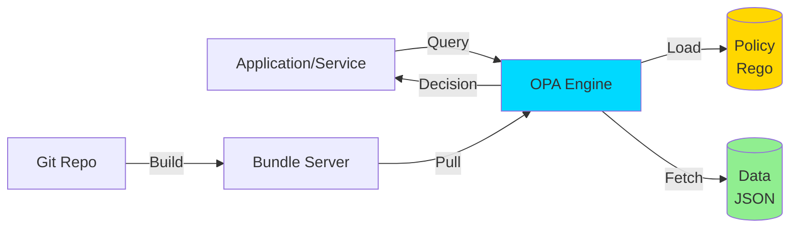

# Ch4. Policy Engine - Open Policy Agent (OPA)

## 📋 개요 및 학습 목표

**Open Policy Agent (OPA)**는 클라우드 네이티브 환경에서 정책을 코드로 관리하는 **Policy-as-Code** 접근법의 표준 도구입니다. CNCF (Cloud Native Computing Foundation) 프로젝트로, 2025년 현재 가장 널리 사용되는 정책 엔진입니다.

### 왜 중요한가?

기존의 하드코딩된 정책 로직은 다음과 같은 문제가 있습니다:

- ❌ 정책 변경 시 코드 수정 및 재배포 필요
- ❌ 서비스마다 다른 정책 구현 (일관성 부족)
- ❌ 정책 감사 및 컴플라이언스 추적 어려움
- ❌ 개발자가 비즈니스 정책까지 관리

**OPA의 해결책**:
- ✅ 정책을 코드와 분리 (Decoupling)
- ✅ Rego 언어로 선언적 정책 작성
- ✅ 다양한 환경에서 재사용 (Kubernetes, API Gateway, DB 등)
- ✅ Git으로 정책 버전 관리 및 CI/CD

### KakaoCloud에서의 활용 사례

- **Kubernetes Admission Control**: Pod 생성 시 보안 정책 검증 (privileged 금지, 리소스 제한 등)
- **API Gateway 인가**: RESTful API 요청에 대한 세밀한 권한 제어
- **Terraform Plan 검증**: IaC 코드가 보안 정책 준수하는지 사전 검증
- **Service Mesh Authorization**: Envoy/Istio에서 서비스 간 통신 제어

### 학습 후 얻을 수 있는 역량

- [x] Rego 언어로 정책 작성 및 테스트
- [x] OPA를 Kubernetes Gatekeeper로 배포
- [x] Go 서비스에 OPA SDK 통합
- [x] OPA Bundle을 OCI 이미지로 배포
- [x] Policy-as-Code CI/CD 파이프라인 구축

---

## 🔑 핵심 개념 및 이론

### 1. OPA 아키텍처



**핵심 구성 요소**:

1. **OPA Engine**: 정책 평가 엔진 (Go로 작성)
2. **Policy (Rego)**: 정책 로직 정의
3. **Data (JSON)**: 정책 평가에 필요한 데이터
4. **Query**: 애플리케이션의 의사결정 요청
5. **Decision**: 정책 평가 결과 (allow/deny, 값 반환 등)

#### OPA의 동작 방식

```
1. 애플리케이션 → OPA에 Query 전송
   예: "User alice가 /api/projects를 POST 할 수 있는가?"

2. OPA → Rego 정책 평가
   정책: package authz
         allow { input.method == "POST" && input.user.role == "admin" }

3. OPA → 결과 반환
   {"result": true} 또는 {"result": false}

4. 애플리케이션 → 결과에 따라 허용/거부
```

---

### 2. Rego 언어

**Rego**는 OPA의 정책 언어로, 선언적이고 쿼리 기반입니다.

#### Rego 기본 문법

**1. 패키지 선언**:
```rego
package authz

# 모든 정책은 패키지로 시작
```

**2. Rule 정의**:
```rego
# Boolean Rule
allow {
    input.method == "GET"
    input.user.role == "viewer"
}

# 여러 조건이 모두 참이면 allow = true
```

**3. 데이터 접근**:
```rego
# Input: 애플리케이션에서 전달한 데이터
input.user.name

# Data: OPA에 미리 로드된 데이터
data.roles["admin"]

# 외부 데이터 예시:
# {
#   "roles": {
#     "admin": ["read", "write", "delete"],
#     "developer": ["read", "write"]
#   }
# }
```

**4. Comprehensions (반복)**:
```rego
# 배열 생성
user_names = [name | some user in data.users; name := user.name]

# 조건부 필터링
admin_users = [user | some user in data.users; user.role == "admin"]
```

**5. Functions**:
```rego
# 커스텀 함수 정의
is_admin(user) {
    user.role == "admin"
}

# 함수 사용
allow {
    is_admin(input.user)
}
```

#### Rego 주요 연산자

| 연산자 | 설명 | 예시 |
|--------|------|------|
| `==` | 같음 | `input.method == "GET"` |
| `!=` | 다름 | `input.user != "guest"` |
| `>`, `<`, `>=`, `<=` | 비교 | `input.age >= 18` |
| `=` | 할당 (Unification) | `user := input.user` |
| `:=` | 로컬 변수 할당 | `result := count(users)` |
| `some` | 반복자 | `some i in array` |
| `not` | 부정 | `not input.guest_mode` |

#### 고급 Rego 패턴

**1. Default 값 설정**:
```rego
# allow가 정의되지 않으면 기본값 false
default allow = false

allow {
    input.user.role == "admin"
}
```

**2. 다중 Rule (OR 로직)**:
```rego
# 여러 rule 중 하나라도 참이면 allow = true
allow {
    input.user.role == "admin"
}

allow {
    input.user.id == input.resource.owner
}

allow {
    input.user.department == "Security"
}
```

**3. Partial Rules (객체 생성)**:
```rego
# 허용된 동작 목록 생성
allowed_actions[action] {
    some action in data.roles[input.user.role]
}

# 결과: {"allowed_actions": ["read", "write"]}
```

**4. 조건부 로직**:
```rego
allow {
    # 근무 시간 체크
    time.parse_rfc3339_ns("2025-01-02T09:00:00Z") <= time.now_ns()
    time.now_ns() <= time.parse_rfc3339_ns("2025-01-02T18:00:00Z")

    # 위치 체크
    input.location in ["Office", "VPN"]

    # 역할 체크
    input.user.role == "developer"
}
```

---

### 3. OPA vs Casbin 비교

| 항목 | OPA | Casbin |
|------|-----|--------|
| **언어** | Rego (선언적) | 모델 파일 + CSV/DB |
| **학습 곡선** | 중간~높음 | 낮음 |
| **표현력** | 매우 높음 (Turing-complete) | 중간 (모델 제약) |
| **성능** | 빠름 (밀리초) | 매우 빠름 (마이크로초) |
| **Kubernetes 통합** | Gatekeeper (네이티브) | 수동 통합 필요 |
| **Bundle 관리** | OCI 이미지 지원 | 파일/DB만 |
| **커뮤니티** | CNCF, 매우 활발 | 활발 |
| **사용 사례** | 복잡한 정책, K8s | 간단한 RBAC/ABAC |

**선택 기준**:
- **Casbin**: 간단한 RBAC/ABAC, Go 애플리케이션 내부 권한 관리
- **OPA**: Kubernetes 정책, 복잡한 비즈니스 로직, 여러 서비스 공통 정책

---

## 💻 실습 가이드 (Hands-on)

### Lab 1: OPA 기본 사용 (로컬 환경)

**목표**: Rego 정책 작성 및 OPA CLI로 평가

#### 1단계: OPA 설치

```bash
# macOS
brew install opa

# Linux
curl -L -o opa https://openpolicyagent.org/downloads/latest/opa_linux_amd64
chmod +x opa
sudo mv opa /usr/local/bin/

# 버전 확인
opa version
# Version: 0.60.0
# Build Commit: c77764e
# Build Timestamp: 2024-12-15T12:00:00Z
```

#### 2단계: 간단한 정책 작성

`policy.rego`:
```rego
package example

# 기본값: 모든 요청 거부
default allow = false

# Admin은 모든 동작 허용
allow {
    input.user.role == "admin"
}

# Developer는 자신의 리소스만 read/write 가능
allow {
    input.user.role == "developer"
    input.action in ["read", "write"]
    input.resource.owner == input.user.id
}

# Viewer는 모든 리소스 읽기 가능
allow {
    input.user.role == "viewer"
    input.action == "read"
}

# 거부 이유 반환
deny[reason] {
    not allow
    reason := sprintf("User %s with role %s cannot %s resource owned by %s",
        [input.user.name, input.user.role, input.action, input.resource.owner])
}
```

#### 3단계: 테스트 데이터 작성

`input1.json` (Admin 사용자):
```json
{
  "user": {
    "id": "user-001",
    "name": "Alice",
    "role": "admin"
  },
  "action": "delete",
  "resource": {
    "id": "res-123",
    "owner": "user-999"
  }
}
```

`input2.json` (Developer - 자신의 리소스):
```json
{
  "user": {
    "id": "user-002",
    "name": "Bob",
    "role": "developer"
  },
  "action": "write",
  "resource": {
    "id": "res-456",
    "owner": "user-002"
  }
}
```

`input3.json` (Developer - 타인의 리소스):
```json
{
  "user": {
    "id": "user-002",
    "name": "Bob",
    "role": "developer"
  },
  "action": "write",
  "resource": {
    "id": "res-789",
    "owner": "user-999"
  }
}
```

#### 4단계: 정책 평가

```bash
# Test 1: Admin - 허용되어야 함
opa eval -i input1.json -d policy.rego "data.example.allow"
# {
#   "result": [
#     {
#       "expressions": [
#         {
#           "value": true,
#           "text": "data.example.allow",
#           "location": {"row": 1, "col": 1}
#         }
#       ]
#     }
#   ]
# }

# Test 2: Developer (own resource) - 허용되어야 함
opa eval -i input2.json -d policy.rego "data.example.allow"
# result: true

# Test 3: Developer (others' resource) - 거부되어야 함
opa eval -i input3.json -d policy.rego "data.example.allow"
# result: false

# 거부 이유 확인
opa eval -i input3.json -d policy.rego "data.example.deny"
# {
#   "result": [
#     {
#       "expressions": [
#         {
#           "value": ["User Bob with role developer cannot write resource owned by user-999"],
#           "text": "data.example.deny"
#         }
#       ]
#     }
#   ]
# }
```

#### 5단계: 대화형 REPL 사용

```bash
opa run policy.rego

# REPL에서 직접 쿼리
> data.example.allow with input as {"user": {"role": "admin"}}
true

> data.example.allow with input as {"user": {"role": "viewer"}, "action": "read"}
true

> data.example.allow with input as {"user": {"role": "viewer"}, "action": "write"}
false
```

---

### Lab 2: OPA를 Go 애플리케이션에 통합 (SDK)

**목표**: Go RESTful API 서버에 OPA SDK 통합

#### 1단계: 의존성 설치

```bash
mkdir opa-api-server && cd opa-api-server
go mod init opa-api-server

go get github.com/open-policy-agent/opa/sdk
go get github.com/open-policy-agent/opa/rego
```

#### 2단계: 정책 작성

`policies/authz.rego`:
```rego
package authz

import future.keywords.if
import future.keywords.in

# 기본값: 거부
default allow := false

# Admin은 모든 것 허용
allow if {
    input.user.role == "admin"
}

# Developer는 자신의 프로젝트만 read/write
allow if {
    input.user.role == "developer"
    input.method in ["GET", "POST", "PUT"]
    input.path[1] == "projects"
    check_project_owner
}

# Viewer는 모든 프로젝트 읽기만 가능
allow if {
    input.user.role == "viewer"
    input.method == "GET"
    input.path[1] == "projects"
}

# 프로젝트 소유자 확인
check_project_owner if {
    input.method == "GET"  # 읽기는 소유자 체크 안 함
}

check_project_owner if {
    # 쓰기 작업은 소유자만
    input.method in ["POST", "PUT", "DELETE"]
    some project in data.projects
    project.id == input.path[2]
    project.owner == input.user.id
}

# 근무 시간 체크 (선택적)
working_hours if {
    hour := time.clock(time.now_ns())[0]
    hour >= 9
    hour < 18
}
```

#### 3단계: Go 서버 구현

```go
// main.go
package main

import (
    "context"
    "encoding/json"
    "fmt"
    "log"
    "net/http"
    "strings"

    "github.com/open-policy-agent/opa/sdk"
)

var opa *sdk.OPA

// OPA 입력 구조체
type AuthzInput struct {
    User   User     `json:"user"`
    Method string   `json:"method"`
    Path   []string `json:"path"`
}

type User struct {
    ID   string `json:"id"`
    Name string `json:"name"`
    Role string `json:"role"`
}

// OPA 초기화
func initOPA() error {
    ctx := context.Background()

    // OPA SDK 설정
    config := []byte(`{
        "services": {
            "local": {
                "url": "file:///policies"
            }
        },
        "bundles": {
            "authz": {
                "service": "local",
                "resource": "/"
            }
        },
        "decision_logs": {
            "console": true
        }
    }`)

    opaSDK, err := sdk.New(ctx, sdk.Options{
        Config: strings.NewReader(string(config)),
    })
    if err != nil {
        return fmt.Errorf("failed to create OPA SDK: %w", err)
    }

    opa = opaSDK
    return nil
}

// OPA 정책 검증 미들웨어
func authzMiddleware(next http.HandlerFunc) http.HandlerFunc {
    return func(w http.ResponseWriter, r *http.Request) {
        // 1. 사용자 정보 추출 (실제로는 JWT에서)
        userID := r.Header.Get("X-User-ID")
        userName := r.Header.Get("X-User-Name")
        userRole := r.Header.Get("X-User-Role")

        if userID == "" || userRole == "" {
            http.Error(w, "Unauthorized", http.StatusUnauthorized)
            return
        }

        // 2. OPA 입력 생성
        input := AuthzInput{
            User: User{
                ID:   userID,
                Name: userName,
                Role: userRole,
            },
            Method: r.Method,
            Path:   strings.Split(strings.Trim(r.URL.Path, "/"), "/"),
        }

        // 3. OPA 정책 평가
        ctx := context.Background()
        decision, err := opa.Decision(ctx, sdk.DecisionOptions{
            Path:  "authz/allow",
            Input: input,
        })

        if err != nil {
            log.Printf("OPA decision error: %v", err)
            http.Error(w, "Authorization error", http.StatusInternalServerError)
            return
        }

        // 4. 결과 확인
        allowed, ok := decision.Result.(bool)
        if !ok || !allowed {
            http.Error(w, fmt.Sprintf("Forbidden: %s cannot %s %s",
                userName, r.Method, r.URL.Path), http.StatusForbidden)
            return
        }

        // 5. 권한 통과 → 다음 핸들러
        next(w, r)
    }
}

// API 핸들러
func listProjects(w http.ResponseWriter, r *http.Request) {
    projects := []map[string]string{
        {"id": "proj-1", "name": "Project Alpha", "owner": "user-001"},
        {"id": "proj-2", "name": "Project Beta", "owner": "user-002"},
    }
    json.NewEncoder(w).Encode(map[string]interface{}{
        "projects": projects,
    })
}

func createProject(w http.ResponseWriter, r *http.Request) {
    w.WriteHeader(http.StatusCreated)
    json.NewEncoder(w).Encode(map[string]string{
        "message": "Project created successfully",
    })
}

func main() {
    // OPA 초기화
    if err := initOPA(); err != nil {
        log.Fatalf("Failed to initialize OPA: %v", err)
    }
    defer opa.Stop(context.Background())

    // 라우트 등록
    http.HandleFunc("/api/projects", authzMiddleware(listProjects))
    http.HandleFunc("/api/projects/", authzMiddleware(func(w http.ResponseWriter, r *http.Request) {
        if r.Method == http.MethodPost {
            createProject(w, r)
        } else {
            http.Error(w, "Method not allowed", http.StatusMethodNotAllowed)
        }
    }))

    log.Println("OPA-integrated API Server running on :8080")
    log.Println("Test with: curl -H 'X-User-ID: user-001' -H 'X-User-Role: admin' http://localhost:8080/api/projects")
    log.Fatal(http.ListenAndServe(":8080", nil))
}
```

#### 4단계: 테스트

```bash
# 서버 실행
go run main.go

# Admin: 성공
curl -H "X-User-ID: user-001" -H "X-User-Name: Alice" -H "X-User-Role: admin" \
  http://localhost:8080/api/projects
# → {"projects":[...]}

# Developer: GET 성공
curl -H "X-User-ID: user-002" -H "X-User-Name: Bob" -H "X-User-Role: developer" \
  http://localhost:8080/api/projects
# → {"projects":[...]}

# Viewer: POST 실패
curl -X POST -H "X-User-ID: user-003" -H "X-User-Name: Charlie" -H "X-User-Role: viewer" \
  http://localhost:8080/api/projects
# → Forbidden: Charlie cannot POST /api/projects
```

---

### Lab 3: Kubernetes Gatekeeper로 정책 적용

**목표**: OPA Gatekeeper를 Kubernetes 클러스터에 배포하여 Admission Control

#### 1단계: Gatekeeper 설치

```bash
# Helm으로 설치 (권장)
helm repo add gatekeeper https://open-policy-agent.github.io/gatekeeper/charts
helm install gatekeeper/gatekeeper --name-template=gatekeeper --namespace gatekeeper-system --create-namespace

# 또는 kubectl apply로 직접 설치
kubectl apply -f https://raw.githubusercontent.com/open-policy-agent/gatekeeper/master/deploy/gatekeeper.yaml

# 설치 확인
kubectl get pods -n gatekeeper-system
# NAME                                            READY   STATUS
# gatekeeper-audit-xxx                            1/1     Running
# gatekeeper-controller-manager-xxx               1/1     Running
```

#### 2단계: ConstraintTemplate 작성

**ConstraintTemplate**: 정책 템플릿 정의

`k8s-requiredlabels-template.yaml`:
```yaml
apiVersion: templates.gatekeeper.sh/v1
kind: ConstraintTemplate
metadata:
  name: k8srequiredlabels
spec:
  crd:
    spec:
      names:
        kind: K8sRequiredLabels
      validation:
        # 필수 레이블 목록
        openAPIV3Schema:
          type: object
          properties:
            labels:
              type: array
              items:
                type: string
  targets:
    - target: admission.k8s.gatekeeper.sh
      rego: |
        package k8srequiredlabels

        violation[{"msg": msg, "details": {"missing_labels": missing}}] {
          provided := {label | input.review.object.metadata.labels[label]}
          required := {label | label := input.parameters.labels[_]}
          missing := required - provided
          count(missing) > 0
          msg := sprintf("You must provide labels: %v", [missing])
        }
```

적용:
```bash
kubectl apply -f k8s-requiredlabels-template.yaml
```

#### 3단계: Constraint 작성

**Constraint**: 실제 정책 적용

`require-app-label.yaml`:
```yaml
apiVersion: constraints.gatekeeper.sh/v1beta1
kind: K8sRequiredLabels
metadata:
  name: require-app-label
spec:
  match:
    kinds:
      - apiGroups: [""]
        kinds: ["Pod"]
    namespaces:
      - "default"
      - "production"
  parameters:
    labels:
      - "app"
      - "env"
      - "owner"
```

적용:
```bash
kubectl apply -f require-app-label.yaml
```

#### 4단계: 테스트

**정책 위반 Pod** (`bad-pod.yaml`):
```yaml
apiVersion: v1
kind: Pod
metadata:
  name: nginx-bad
  labels:
    app: nginx  # env, owner 레이블 누락
spec:
  containers:
    - name: nginx
      image: nginx:1.21
```

```bash
kubectl apply -f bad-pod.yaml
# Error from server: admission webhook "validation.gatekeeper.sh" denied the request:
# [require-app-label] You must provide labels: {"env", "owner"}
```

**정책 준수 Pod** (`good-pod.yaml`):
```yaml
apiVersion: v1
kind: Pod
metadata:
  name: nginx-good
  labels:
    app: nginx
    env: production
    owner: platform-team
spec:
  containers:
    - name: nginx
      image: nginx:1.21
```

```bash
kubectl apply -f good-pod.yaml
# pod/nginx-good created  ✓
```

#### 5단계: 추가 정책 - 컨테이너 보안

`k8s-block-privileged-template.yaml`:
```yaml
apiVersion: templates.gatekeeper.sh/v1
kind: ConstraintTemplate
metadata:
  name: k8sblockprivileged
spec:
  crd:
    spec:
      names:
        kind: K8sBlockPrivileged
  targets:
    - target: admission.k8s.gatekeeper.sh
      rego: |
        package k8sblockprivileged

        violation[{"msg": msg}] {
          container := input.review.object.spec.containers[_]
          container.securityContext.privileged
          msg := sprintf("Privileged container is not allowed: %v", [container.name])
        }

        violation[{"msg": msg}] {
          container := input.review.object.spec.initContainers[_]
          container.securityContext.privileged
          msg := sprintf("Privileged init container is not allowed: %v", [container.name])
        }
```

`block-privileged.yaml`:
```yaml
apiVersion: constraints.gatekeeper.sh/v1beta1
kind: K8sBlockPrivileged
metadata:
  name: block-privileged-containers
spec:
  match:
    kinds:
      - apiGroups: [""]
        kinds: ["Pod"]
```

```bash
kubectl apply -f k8s-block-privileged-template.yaml
kubectl apply -f block-privileged.yaml

# 위반 테스트
kubectl run privileged-pod --image=nginx --restart=Never --overrides='{"spec":{"containers":[{"name":"nginx","image":"nginx","securityContext":{"privileged":true}}]}}'
# Error: [block-privileged-containers] Privileged container is not allowed: nginx
```

---

### Lab 4: OPA Bundle을 OCI 이미지로 배포

**목표**: 정책을 컨테이너 이미지처럼 관리 (Policy-as-Code CI/CD)

#### 1단계: OPA CLI 및 Policy CLI 설치

```bash
# OPA 설치 (이미 설치했으면 스킵)
brew install opa

# 정책 디렉토리 생성
mkdir -p opa-bundle/policies
cd opa-bundle
```

#### 2단계: 정책 작성

`policies/authz.rego`:
```rego
package authz

default allow := false

allow {
    input.user.role == "admin"
}

allow {
    input.user.role == "developer"
    input.action in ["read", "write"]
    input.resource.project == input.user.project
}
```

`policies/authz_test.rego`:
```rego
package authz

test_admin_allowed {
    allow with input as {
        "user": {"role": "admin"},
        "action": "delete",
        "resource": {"project": "any"}
    }
}

test_developer_own_project {
    allow with input as {
        "user": {"role": "developer", "project": "proj-A"},
        "action": "write",
        "resource": {"project": "proj-A"}
    }
}

test_developer_other_project {
    not allow with input as {
        "user": {"role": "developer", "project": "proj-A"},
        "action": "write",
        "resource": {"project": "proj-B"}
    }
}
```

#### 3단계: Bundle 빌드 및 테스트

```bash
# 정책 테스트
opa test policies/ -v
# PASS: 3/3

# Bundle 생성
opa build -b policies/ -o bundle.tar.gz
```

#### 4단계: OCI 이미지로 푸시 (Docker Registry)

```bash
# Docker로 간단한 방법
# Dockerfile
cat > Dockerfile <<'EOF'
FROM scratch
COPY bundle.tar.gz /bundle.tar.gz
EOF

docker build -t myregistry.example.com/opa-policies:v1.0.0 .
docker push myregistry.example.com/opa-policies:v1.0.0
```

또는 **OPCR (OPA Container Registry)** 사용:

```bash
# OPCR CLI 설치
go install github.com/opcr-io/policy/cmd/policy@latest

# OCI 레지스트리에 푸시
policy push myregistry.example.com/opa-policies:v1.0.0 bundle.tar.gz

# 다른 환경에서 pull
policy pull myregistry.example.com/opa-policies:v1.0.0
```

#### 5단계: OPA 서버에서 Bundle 사용

`config.yaml`:
```yaml
services:
  registry:
    url: https://myregistry.example.com
    credentials:
      bearer:
        token: "${REGISTRY_TOKEN}"

bundles:
  authz:
    service: registry
    resource: opa-policies:v1.0.0
    polling:
      min_delay_seconds: 60
      max_delay_seconds: 120

decision_logs:
  console: true
```

```bash
# OPA 서버 실행 (Bundle 자동 로드)
opa run --server --config-file=config.yaml

# 정책 쿼리
curl -X POST http://localhost:8181/v1/data/authz/allow \
  -H 'Content-Type: application/json' \
  -d '{
    "input": {
      "user": {"role": "admin"},
      "action": "delete"
    }
  }'
# {"result": true}
```

---

### Lab 5: OPA Decision Logs 및 성능 모니터링

**목표**: OPA의 의사결정 로그를 수집하여 감사 및 디버깅

#### 1단계: Decision Logs 설정

`config-with-logs.yaml`:
```yaml
services:
  remote_log:
    url: https://log-collector.example.com
    headers:
      Authorization: "Bearer ${LOG_TOKEN}"

decision_logs:
  service: remote_log
  reporting:
    min_delay_seconds: 10
    max_delay_seconds: 30
  resource: /v1/logs

# 로컬 파일로도 가능
# decision_logs:
#   plugin: local_file
#   local_file:
#     path: /var/log/opa-decisions.json
```

#### 2단계: Decision Log 형식

```json
{
  "labels": {
    "app": "my-api-server",
    "env": "production"
  },
  "decision_id": "uuid-12345",
  "input": {
    "user": {"role": "developer"},
    "action": "write",
    "resource": {"project": "proj-A"}
  },
  "result": true,
  "path": "authz/allow",
  "requested_by": "10.0.1.5:8080",
  "timestamp": "2025-01-02T14:30:00.123Z",
  "metrics": {
    "timer_rego_query_eval_ns": 1234567
  }
}
```

#### 3단계: Prometheus 메트릭 수집

```bash
# OPA 서버를 Prometheus 메트릭과 함께 실행
opa run --server --addr=:8181 --diagnostic-addr=:8282

# 메트릭 확인
curl http://localhost:8282/metrics

# 주요 메트릭:
# - http_request_duration_seconds: HTTP 요청 지연 시간
# - opa_rego_query_duration_seconds: Rego 쿼리 평가 시간
# - opa_http_requests_total: 총 HTTP 요청 수
```

**Prometheus 스크랩 설정**:
```yaml
scrape_configs:
  - job_name: 'opa'
    static_configs:
      - targets: ['opa-server:8282']
```

---

## 📚 참고 자료

### 공식 문서

**OPA 기본**:
- [Open Policy Agent Official Website](https://www.openpolicyagent.org/)
- [OPA Documentation](https://www.openpolicyagent.org/docs)
- [OPA GitHub Repository](https://github.com/open-policy-agent/opa)
- [OPA Go SDK Documentation](https://pkg.go.dev/github.com/open-policy-agent/opa)

**Kubernetes & Gatekeeper**:
- [OPA Kubernetes Integration](https://www.openpolicyagent.org/ecosystem/by-feature/kubernetes)
- [Kubernetes Admission Control Guide](https://www.openpolicyagent.org/docs/v0.12.2/kubernetes-admission-control)
- [OPA for Kubernetes Admission Control](https://www.openpolicyagent.org/docs/latest/kubernetes-introduction/)
- [OPA Gatekeeper - Kubernetes Blog](https://kubernetes.io/blog/2019/08/06/opa-gatekeeper-policy-and-governance-for-kubernetes/)
- [OPA Gatekeeper GitHub](https://github.com/open-policy-agent/gatekeeper)
- [OPA Gatekeeper Policy Library](https://github.com/open-policy-agent/gatekeeper-library)
- [Kubernetes with OPA & Gatekeeper - Spacelift](https://spacelift.io/blog/opa-kubernetes)
- [OPA with Kubernetes Tutorial - GitGuardian](https://blog.gitguardian.com/open-policy-agent-with-kubernetes-tutorial-pt-1/)
- [OPA and Gatekeeper in Kubernetes - Medium 2025](https://medium.com/@infra-weaver/exploring-open-policy-agent-opa-and-gatekeeper-in-kubernetes-mutating-and-validating-admission-f2d969bb8d45)

**Policy as Code & Bundle**:
- [Policy as Code with OPA Gatekeeper - Medium](https://medium.com/@tarikyegen35/policy-as-code-opa-gatekeeper-1142dd33d077)
- [OPA and Gatekeeper Complete Guide - Medium](https://thamizhelango.medium.com/open-policy-agent-opa-and-gatekeeper-a-complete-guide-with-real-world-implementation-4084f2f574a1)
- [Policy-as-Code for Docker and K8s - Aserto](https://www.aserto.com/blog/policy-as-code-for-docker-and-kubernetes-with-conftest-gatekeeper)
- [Enforcing Policy as Code with OPA - Elastisys](https://elastisys.com/enforcing-policy-as-code-using-opa-and-gatekeeper-in-kubernetes/)
- [GKE Pod Security Policies with Gatekeeper - Google Cloud](https://cloud.google.com/kubernetes-engine/docs/how-to/pod-security-policies-with-gatekeeper)

**Go Integration**:
- [OPA Integration Guide](https://www.openpolicyagent.org/docs/latest/integration/)
- [Example Go API with OPA - GitHub](https://github.com/open-policy-agent/example-api-authz-go)
- [HTTP API Authorization with OPA](https://www.openpolicyagent.org/docs/http-api-authorization)
- [OPA RESTful API Setup - GitHub](https://github.com/go-training/opa-restful)
- [OPA to Externalize Authorization in Go - Enlear Academy](https://enlear.academy/open-policy-agent-opa-to-externalize-authorization-decisions-in-rest-api-implemented-in-go-faee67d29053)

### 추천 튜토리얼

- [Rego Playground](https://play.openpolicyagent.org/) - 브라우저에서 Rego 실습
- [OPA by Example](https://www.openpolicyagent.org/docs/latest/#rego)
- [Styra Academy](https://academy.styra.com/) - OPA 무료 교육

### 학습 체크리스트

- [ ] Rego 언어 기본 문법 (rule, comprehension, function) 이해
- [ ] OPA CLI로 정책 평가 및 테스트
- [ ] Go 애플리케이션에 OPA SDK 통합
- [ ] Kubernetes Gatekeeper 설치 및 ConstraintTemplate 작성
- [ ] OPA Bundle을 OCI 이미지로 빌드 및 배포
- [ ] Decision Logs 수집 및 Prometheus 메트릭 모니터링
- [ ] 복잡한 비즈니스 로직을 Rego로 구현
- [ ] OPA와 Casbin 비교 및 적절한 도구 선택
- [ ] Policy-as-Code CI/CD 파이프라인 구축
- [ ] 성능 최적화 및 캐싱 전략 수립

---

## 🎯 다음 단계

Ch5에서는 **HashiCorp Vault**를 학습합니다. Vault는 시크릿 관리(Secrets Management) 분야의 표준 도구로, 동적 시크릿 생성, 암호화 서비스, PKI 등 다양한 기능을 제공합니다.

**Preview**:
- Vault 아키텍처 및 Secrets Engine
- 동적 시크릿 생성 (Database, AWS 등)
- Vault Agent를 통한 자동 시크릿 주입
- Kubernetes Vault Integration
- Encryption as a Service (Transit Engine)
