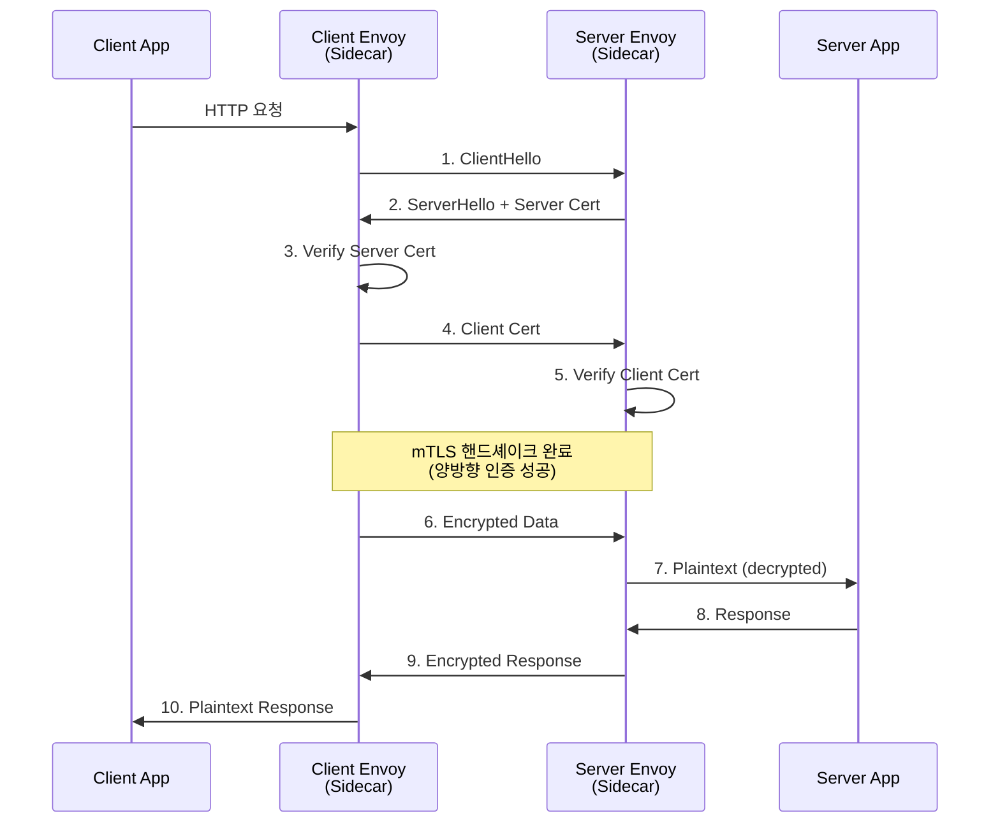
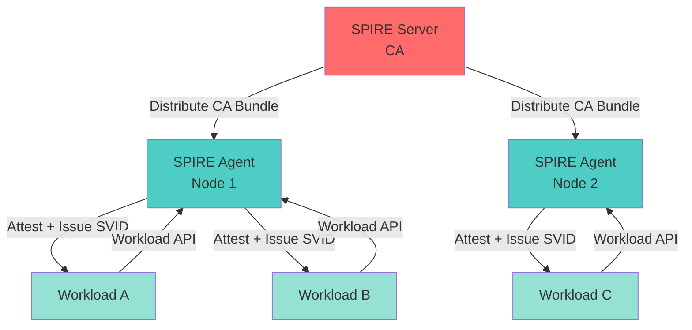
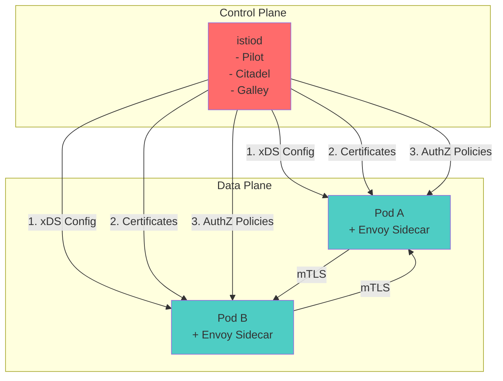

# Ch6. Service Mesh Security - mTLS, SPIFFE/SPIRE, Zero Trust

## 📋 개요 및 학습 목표

**Service Mesh**는 마이크로서비스 간의 통신을 중앙에서 관리하는 인프라 레이어입니다. 특히 **보안** 측면에서 mTLS 자동 적용, 서비스 신원 관리, Zero Trust 아키텍처 구현을 가능하게 합니다.

### 왜 중요한가?

전통적인 마이크로서비스 보안의 문제점:

- ❌ **평문 통신**: 서비스 간 HTTP 통신으로 네트워크 도청 가능
- ❌ **IP 기반 보안**: IP 주소가 변경되면 보안 규칙 무효화 (컨테이너 환경)
- ❌ **수동 인증서 관리**: TLS 인증서 발급/갱신을 수동으로 처리
- ❌ **암묵적 신뢰**: 내부 네트워크는 안전하다는 가정 (Zero Trust 위반)

**Service Mesh Security의 해결책**:
- ✅ **자동 mTLS**: 모든 서비스 간 통신을 자동으로 암호화 및 상호 인증
- ✅ **서비스 신원(Identity)**: IP 대신 SPIFFE ID로 서비스 식별
- ✅ **인증서 자동 회전**: 짧은 TTL (1시간) 인증서 자동 발급/갱신
- ✅ **Zero Trust**: "모든 것을 검증"하는 보안 모델
- ✅ **세밀한 접근 제어**: 서비스별/작업별 권한 정책

### KakaoCloud에서의 활용 사례

- **Istio Service Mesh**: 수백 개 마이크로서비스 간 mTLS 자동 적용
- **SPIFFE/SPIRE**: Kubernetes와 VM 환경 간 통합 신원 관리
- **Authorization Policies**: "payment 서비스는 order 서비스만 호출 가능" 같은 규칙
- **Envoy Proxy**: L7 트래픽 제어, 서킷 브레이커, 재시도 로직
- **Zero Trust 네트워크**: 모든 통신을 인증/암호화, 네트워크 세그먼트 신뢰 없음

### 학습 후 얻을 수 있는 역량

- [x] mTLS 작동 원리 및 Istio에서의 자동 구성
- [x] SPIFFE/SPIRE 아키텍처 및 Workload Identity 발급
- [x] Zero Trust 아키텍처 설계 및 구현
- [x] Envoy Proxy 설정 및 보안 필터 적용
- [x] Istio Authorization Policies 작성

---

## 🔑 핵심 개념 및 이론

### 1. mTLS (Mutual TLS)

**일반 TLS vs mTLS**:

| 항목 | TLS (일반) | mTLS (상호 인증) |
|------|-----------|-----------------|
| **인증 방향** | 서버만 클라이언트에게 인증서 제시 | 서버 ↔ 클라이언트 양방향 인증 |
| **사용 사례** | HTTPS (브라우저 → 웹사이트) | 서비스 간 통신 (마이크로서비스) |
| **클라이언트 인증서** | 불필요 | 필요 |
| **보안 수준** | 중간 (서버만 검증) | 높음 (양측 모두 검증) |

#### mTLS 핸드셰이크 흐름



**Istio에서의 자동 mTLS**:
- **Pilot**: 서비스 토폴로지 파악 및 Envoy 설정 배포
- **Citadel (istiod)**: 인증서 발급 (CA 역할)
- **Envoy Proxy**: mTLS 핸드셰이크 처리
- **자동 인증서 회전**: 기본 24시간 TTL, 자동 갱신

#### 2025 mTLS 개선사항

**Envoy QUIC 지원**:
- HTTP/3 over QUIC 프로토콜 지원
- **mTLS 재협상 40% 감소** (연결 유지 개선)
- TLS 1.3 0-RTT (Round Trip Time) 연결

**인증서 알고리즘 권장사항**:
- ✅ **ECDSA P-256** (권장): 작은 인증서 크기, 낮은 CPU 사용
- ⚠️ **RSA 2048**: 레거시 호환성 (더 큰 인증서, 높은 CPU)

---

### 2. SPIFFE/SPIRE

**SPIFFE (Secure Production Identity Framework for Everyone)**:
- 분산 시스템에서 워크로드 신원을 표현하는 표준
- **SPIFFE ID**: URI 형식 신원 (예: `spiffe://example.com/ns/default/sa/myapp`)

**SPIRE (SPIFFE Runtime Environment)**:
- SPIFFE 표준의 프로덕션 구현체
- 워크로드에 자동으로 인증서 발급 (X.509-SVID, JWT-SVID)

#### SPIFFE ID 구조

```
spiffe://trust-domain/workload-path
```

**예시**:
```
spiffe://kakaocloud.com/ns/production/sa/payment-service
        └─ Trust Domain
                        └─ Namespace
                                       └─ ServiceAccount
                                                  └─ Service Name
```

#### SPIRE 아키텍처



**구성 요소**:

1. **SPIRE Server**:
   - CA (Certificate Authority) 역할
   - Registration API: 워크로드 등록
   - 인증서 발급 정책 관리

2. **SPIRE Agent**:
   - 각 노드(VM/Pod)에 하나씩 실행
   - Workload API 제공 (Unix Domain Socket)
   - 워크로드 Attestation (증명)

3. **SVID (SPIFFE Verifiable Identity Document)**:
   - **X.509-SVID**: mTLS용 인증서 (TTL: 1시간)
   - **JWT-SVID**: OIDC용 토큰 (TTL: 5-10분 권장)

#### SPIRE Attestation (증명)

**Node Attestation** (노드가 진짜인지 증명):
- **Kubernetes**: ServiceAccount Token
- **AWS**: EC2 Instance Identity Document
- **Azure**: Managed Identity

**Workload Attestation** (워크로드가 진짜인지 증명):
- **Kubernetes**: Pod UID, Namespace, ServiceAccount
- **Unix**: Process UID, GID
- **Docker**: Container ID

---

### 3. Zero Trust Architecture

**전통적 보안 vs Zero Trust**:

| 항목 | 전통적 보안 | Zero Trust |
|------|------------|------------|
| **신뢰 모델** | 내부 네트워크 신뢰 | 모든 것 검증 |
| **인증** | 경계(VPN) 통과 후 신뢰 | 매 요청마다 인증 |
| **네트워크** | VLAN 세그멘테이션 | 마이크로 세그멘테이션 |
| **접근 제어** | IP 기반 | 신원 기반 |
| **암호화** | 경계에서만 | End-to-End |

**Zero Trust 원칙 (2025)**:

1. **Never Trust, Always Verify**: 모든 요청 검증
2. **Least Privilege**: 최소 권한 부여
3. **Assume Breach**: 침해 발생 가정 하에 설계
4. **Verify Explicitly**: 사용자 + 장치 + 위치 + 작업 모두 검증

#### Service Mesh에서의 Zero Trust 구현

**Istio 예시**:
```yaml
# 1. 기본 거부 (Deny All)
apiVersion: security.istio.io/v1beta1
kind: AuthorizationPolicy
metadata:
  name: deny-all
  namespace: default
spec:
  {} # 빈 spec = 모든 트래픽 거부

# 2. 선택적 허용 (Allow Specific)
apiVersion: security.istio.io/v1beta1
kind: AuthorizationPolicy
metadata:
  name: allow-frontend-to-backend
spec:
  selector:
    matchLabels:
      app: backend
  action: ALLOW
  rules:
    - from:
        - source:
            principals: ["cluster.local/ns/default/sa/frontend"]
      to:
        - operation:
            methods: ["GET", "POST"]
            paths: ["/api/*"]
```

**효과**:
- ✅ 모든 트래픽은 기본 차단
- ✅ `frontend` ServiceAccount만 `backend`에 접근 가능
- ✅ GET, POST 메서드만 허용
- ✅ `/api/*` 경로만 허용

---

### 4. Istio Security 아키텍처



**Istiod 역할**:
1. **Pilot**: 서비스 디스커버리, Envoy 설정 배포
2. **Citadel**: CA, 인증서 발급/갱신
3. **Galley**: 설정 검증 및 배포

---

## 💻 실습 가이드 (Hands-on)

### Lab 1: Istio 설치 및 mTLS 활성화

**목표**: Kubernetes 클러스터에 Istio 설치 및 자동 mTLS 설정

#### 1단계: Istio 설치

```bash
# Istio CLI 다운로드
curl -L https://istio.io/downloadIstio | sh -
cd istio-1.24.0  # 2025년 최신 버전
export PATH=$PWD/bin:$PATH

# 프로필로 설치 (demo: 개발용, default: 프로덕션용)
istioctl install --set profile=demo -y

# 확인
kubectl get pods -n istio-system
# NAME                                   READY   STATUS
# istiod-xxx                             1/1     Running
# istio-ingressgateway-xxx               1/1     Running
# istio-egressgateway-xxx                1/1     Running
```

#### 2단계: Sidecar 자동 주입 활성화

```bash
# default namespace에 자동 주입 라벨 추가
kubectl label namespace default istio-injection=enabled

# 확인
kubectl get namespace -L istio-injection
# NAME       STATUS   AGE   ISTIO-INJECTION
# default    Active   10d   enabled
```

#### 3단계: 샘플 애플리케이션 배포

```yaml
# httpbin.yaml
apiVersion: v1
kind: ServiceAccount
metadata:
  name: httpbin
---
apiVersion: v1
kind: Service
metadata:
  name: httpbin
  labels:
    app: httpbin
spec:
  ports:
    - name: http
      port: 8000
  selector:
    app: httpbin
---
apiVersion: apps/v1
kind: Deployment
metadata:
  name: httpbin
spec:
  replicas: 1
  selector:
    matchLabels:
      app: httpbin
  template:
    metadata:
      labels:
        app: httpbin
    spec:
      serviceAccountName: httpbin
      containers:
        - name: httpbin
          image: kennethreitz/httpbin
          ports:
            - containerPort: 80
```

```bash
kubectl apply -f httpbin.yaml

# Pod 확인 (2개 컨테이너: app + envoy)
kubectl get pods
# NAME                      READY   STATUS
# httpbin-xxx               2/2     Running
```

#### 4단계: mTLS 모드 확인

```bash
# Peer Authentication 확인
istioctl authn tls-check httpbin-xxx.default

# 출력:
# HOST:PORT                    STATUS     SERVER     CLIENT     AUTHN POLICY     DESTINATION RULE
# httpbin.default.svc.cluster  OK         STRICT     ISTIO      /default         -
```

**상태 설명**:
- **STRICT**: mTLS 필수 (평문 거부)
- **PERMISSIVE**: mTLS와 평문 모두 허용
- **DISABLE**: mTLS 비활성화

#### 5단계: 글로벌 Strict mTLS 설정 (2025 권장)

```yaml
# strict-mtls.yaml
apiVersion: security.istio.io/v1beta1
kind: PeerAuthentication
metadata:
  name: default
  namespace: istio-system
spec:
  mtls:
    mode: STRICT
```

```bash
kubectl apply -f strict-mtls.yaml

# 모든 서비스가 이제 mTLS 필수
```

---

### Lab 2: mTLS 트래픽 검증

**목표**: Wireshark로 mTLS 암호화 확인

#### 1단계: 테스트 클라이언트 배포

```yaml
# sleep.yaml
apiVersion: v1
kind: ServiceAccount
metadata:
  name: sleep
---
apiVersion: apps/v1
kind: Deployment
metadata:
  name: sleep
spec:
  replicas: 1
  selector:
    matchLabels:
      app: sleep
  template:
    metadata:
      labels:
        app: sleep
    spec:
      serviceAccountName: sleep
      containers:
        - name: sleep
          image: curlimages/curl
          command: ["/bin/sleep", "infinity"]
```

```bash
kubectl apply -f sleep.yaml
```

#### 2단계: 트래픽 생성 및 캡처

```bash
# sleep Pod에서 httpbin 호출
kubectl exec -it deploy/sleep -- curl http://httpbin:8000/get

# tcpdump로 패킷 캡처 (Envoy sidecar에서)
kubectl exec -it httpbin-xxx -c istio-proxy -- sudo tcpdump -i any -w /tmp/capture.pcap

# 다른 터미널에서 트래픽 생성
kubectl exec -it deploy/sleep -- curl http://httpbin:8000/headers

# 패킷 다운로드
kubectl cp httpbin-xxx:/tmp/capture.pcap ./capture.pcap -c istio-proxy
```

#### 3단계: Wireshark 분석

Wireshark에서 `capture.pcap` 열기:
```
Filter: tcp.port == 15001  (Envoy inbound)

→ TLSv1.3 Client Hello
→ TLSv1.3 Server Hello
→ TLSv1.3 Certificate (SPIFFE ID 포함!)
→ Application Data (암호화됨)
```

**SPIFFE ID 확인**:
- Certificate → Subject Alternative Name
- URI: `spiffe://cluster.local/ns/default/sa/sleep`

---

### Lab 3: SPIFFE/SPIRE 설치 및 Kubernetes 통합

**목표**: SPIRE를 Kubernetes에 배포하고 Workload Identity 발급

#### 1단계: SPIRE Server 설치

```bash
# SPIRE Helm repo 추가
helm repo add spiffe https://spiffe.github.io/helm-charts-hardened/
helm repo update

# SPIRE Server 설치
helm install spire-server spiffe/spire \
  --set global.spire.trustDomain="kakaocloud.com" \
  --create-namespace \
  --namespace spire

# 확인
kubectl get pods -n spire
# NAME                           READY   STATUS
# spire-server-0                 2/2     Running
# spire-agent-xxx                1/1     Running
```

#### 2단계: Workload 등록

```bash
# SPIRE Server Pod에 접속
kubectl exec -n spire spire-server-0 -c spire-server -- /bin/sh

# Workload 등록
/opt/spire/bin/spire-server entry create \
  -spiffeID spiffe://kakaocloud.com/ns/default/sa/httpbin \
  -parentID spiffe://kakaocloud.com/spire/agent/k8s_psat/default \
  -selector k8s:ns:default \
  -selector k8s:sa:httpbin

# Entry ID: xxx-yyyy-zzzz

# 등록 확인
/opt/spire/bin/spire-server entry show
```

#### 3단계: Workload에서 SVID 확인

```yaml
# test-svid.yaml
apiVersion: v1
kind: Pod
metadata:
  name: test-svid
  namespace: default
spec:
  serviceAccountName: httpbin
  containers:
    - name: workload
      image: ghcr.io/spiffe/spire-agent:1.9.0
      command:
        - /opt/spire/bin/spire-agent
        - api
        - fetch
        - x509
      volumeMounts:
        - name: spire-agent-socket
          mountPath: /run/spire/sockets
          readOnly: true
  volumes:
    - name: spire-agent-socket
      hostPath:
        path: /run/spire/sockets
        type: Directory
```

```bash
kubectl apply -f test-svid.yaml
kubectl logs test-svid

# 출력:
# SPIFFE ID: spiffe://kakaocloud.com/ns/default/sa/httpbin
# Subject: O=SPIRE, C=US
# Issuer: C=US, O=SPIFFE
# Valid from: 2025-01-02 10:00:00
# Valid to: 2025-01-02 11:00:00 (TTL: 1 hour)
```

#### 4단계: Go 애플리케이션에서 SPIRE 사용

```bash
go get github.com/spiffe/go-spiffe/v2/svid/x509svid
go get github.com/spiffe/go-spiffe/v2/workloadapi
```

```go
// spire-client.go
package main

import (
    "context"
    "fmt"
    "log"

    "github.com/spiffe/go-spiffe/v2/workloadapi"
)

func main() {
    ctx := context.Background()

    // Workload API에 연결 (Unix Domain Socket)
    source, err := workloadapi.NewX509Source(ctx)
    if err != nil {
        log.Fatalf("Unable to create X509Source: %v", err)
    }
    defer source.Close()

    // SVID 가져오기
    svid, err := source.GetX509SVID()
    if err != nil {
        log.Fatalf("Unable to fetch SVID: %v", err)
    }

    fmt.Printf("SPIFFE ID: %s\n", svid.ID)
    fmt.Printf("Certificate Expiry: %s\n", svid.Certificates[0].NotAfter)

    // mTLS 클라이언트 설정
    tlsConfig := source.GetX509BundleForTrustDomain(svid.ID.TrustDomain())
    fmt.Printf("Trust Bundle has %d certificates\n", len(tlsConfig.Certificates()))
}
```

**실행**:
```bash
# Pod 내에서 실행 (SPIRE Agent Socket 접근 필요)
kubectl exec -it test-pod -- /app/spire-client

# 출력:
# SPIFFE ID: spiffe://kakaocloud.com/ns/default/sa/myapp
# Certificate Expiry: 2025-01-02 11:00:00
# Trust Bundle has 1 certificates
```

---

### Lab 4: Istio Authorization Policies

**목표**: 서비스 간 세밀한 접근 제어

#### 1단계: 시나리오 설정

```
┌─────────┐      ┌─────────┐      ┌──────────┐
│Frontend │─────▶│Backend  │─────▶│Database  │
└─────────┘      └─────────┘      └──────────┘
    SA: frontend    SA: backend       SA: db
```

**요구사항**:
- Frontend → Backend: 허용
- Frontend → Database: **거부**
- Backend → Database: 허용

#### 2단계: 서비스 배포

```yaml
# services.yaml
apiVersion: v1
kind: ServiceAccount
metadata:
  name: frontend
---
apiVersion: v1
kind: ServiceAccount
metadata:
  name: backend
---
apiVersion: v1
kind: ServiceAccount
metadata:
  name: db
---
apiVersion: apps/v1
kind: Deployment
metadata:
  name: frontend
spec:
  replicas: 1
  selector:
    matchLabels:
      app: frontend
  template:
    metadata:
      labels:
        app: frontend
    spec:
      serviceAccountName: frontend
      containers:
        - name: app
          image: curlimages/curl
          command: ["/bin/sleep", "infinity"]
---
apiVersion: apps/v1
kind: Deployment
metadata:
  name: backend
spec:
  replicas: 1
  selector:
    matchLabels:
      app: backend
  template:
    metadata:
      labels:
        app: backend
    spec:
      serviceAccountName: backend
      containers:
        - name: app
          image: kennethreitz/httpbin
---
apiVersion: apps/v1
kind: Deployment
metadata:
  name: db
spec:
  replicas: 1
  selector:
    matchLabels:
      app: db
  template:
    metadata:
      labels:
        app: db
    spec:
      serviceAccountName: db
      containers:
        - name: app
          image: postgres:15
---
apiVersion: v1
kind: Service
metadata:
  name: backend
spec:
  selector:
    app: backend
  ports:
    - port: 8000
---
apiVersion: v1
kind: Service
metadata:
  name: db
spec:
  selector:
    app: db
  ports:
    - port: 5432
```

```bash
kubectl apply -f services.yaml
```

#### 3단계: Authorization Policies 작성

```yaml
# authz-policies.yaml
# 1. Backend: frontend만 접근 허용
apiVersion: security.istio.io/v1beta1
kind: AuthorizationPolicy
metadata:
  name: backend-policy
spec:
  selector:
    matchLabels:
      app: backend
  action: ALLOW
  rules:
    - from:
        - source:
            principals: ["cluster.local/ns/default/sa/frontend"]
      to:
        - operation:
            methods: ["GET", "POST"]
---
# 2. Database: backend만 접근 허용
apiVersion: security.istio.io/v1beta1
kind: AuthorizationPolicy
metadata:
  name: db-policy
spec:
  selector:
    matchLabels:
      app: db
  action: ALLOW
  rules:
    - from:
        - source:
            principals: ["cluster.local/ns/default/sa/backend"]
      to:
        - operation:
            ports: ["5432"]
```

```bash
kubectl apply -f authz-policies.yaml
```

#### 4단계: 테스트

```bash
# Test 1: Frontend → Backend (허용)
kubectl exec deploy/frontend -- curl -s http://backend:8000/get
# ✓ 성공

# Test 2: Frontend → Database (거부)
kubectl exec deploy/frontend -- curl -s telnet://db:5432
# ✗ RBAC: access denied (Authorization Policy에 의해 차단)

# Test 3: Backend → Database (허용)
kubectl exec deploy/backend -- nc -zv db 5432
# ✓ 성공
```

#### 5단계: 조건부 정책 (ABAC)

```yaml
# conditional-authz.yaml
apiVersion: security.istio.io/v1beta1
kind: AuthorizationPolicy
metadata:
  name: backend-conditional
spec:
  selector:
    matchLabels:
      app: backend
  action: ALLOW
  rules:
    - from:
        - source:
            principals: ["cluster.local/ns/default/sa/frontend"]
      when:
        - key: request.headers[x-user-role]
          values: ["admin", "developer"]
        - key: request.time
          values: ["09:00:00", "18:00:00"]  # 근무 시간
```

**테스트**:
```bash
# 성공 (admin 역할)
kubectl exec deploy/frontend -- curl -H "x-user-role: admin" http://backend:8000/get

# 실패 (guest 역할)
kubectl exec deploy/frontend -- curl -H "x-user-role: guest" http://backend:8000/get
# RBAC: access denied
```

---

### Lab 5: Envoy Filter로 고급 보안 설정

**목표**: Envoy Filter로 JWT 검증 추가

```yaml
# jwt-filter.yaml
apiVersion: networking.istio.io/v1alpha3
kind: EnvoyFilter
metadata:
  name: jwt-authn
spec:
  workloadSelector:
    labels:
      app: backend
  configPatches:
    - applyTo: HTTP_FILTER
      match:
        context: SIDECAR_INBOUND
        listener:
          filterChain:
            filter:
              name: envoy.filters.network.http_connection_manager
              subFilter:
                name: envoy.filters.http.router
      patch:
        operation: INSERT_BEFORE
        value:
          name: envoy.filters.http.jwt_authn
          typed_config:
            "@type": type.googleapis.com/envoy.extensions.filters.http.jwt_authn.v3.JwtAuthentication
            providers:
              kakaocloud:
                issuer: "https://auth.kakaocloud.com"
                audiences:
                  - "api.kakaocloud.com"
                remote_jwks:
                  http_uri:
                    uri: "https://auth.kakaocloud.com/.well-known/jwks.json"
                    cluster: outbound|443||auth.kakaocloud.com
                    timeout: 5s
            rules:
              - match:
                  prefix: /
                requires:
                  provider_name: kakaocloud
```

```bash
kubectl apply -f jwt-filter.yaml

# JWT 없이 요청 → 거부
curl http://backend:8000/get
# Jwt is missing

# 유효한 JWT로 요청 → 성공
curl -H "Authorization: Bearer eyJhbGc..." http://backend:8000/get
# ✓ 성공
```

---

## 📚 참고 자료

### 공식 문서

**Istio & mTLS**:
- [Istio Security Overview](https://istio.io/latest/docs/concepts/security/)
- [Istio Authentication Policy](https://istio.io/latest/docs/tasks/security/authentication/authn-policy/)
- [Enabling mTLS in AWS App Mesh with SPIFFE/SPIRE](https://aws.amazon.com/blogs/containers/enabling-mtls-in-aws-app-mesh-using-spiffe-spire-in-a-multi-account-amazon-eks-environment/)
- [Using mTLS with SPIFFE/SPIRE in AWS App Mesh](https://aws.amazon.com/blogs/containers/using-mtls-with-spiffe-spire-in-app-mesh-on-eks/)
- [Mutual TLS OAuth Client Credentials - Curity](https://curity.io/resources/learn/service-mesh-mtls-client-credentials/)
- [Cilium Mutual Authentication](https://docs.cilium.io/en/latest/network/servicemesh/mutual-authentication/mutual-authentication/)
- [Implementing mTLS Across Infrastructure - Tetrate](https://tetrate.io/learn/how-can-i-implement-mtls-across-my-entire-infrastructure-including-between-kubernetes-and-vms)

**2025 Innovations**:
- [Zero Trust Python Proxies: Envoy mTLS 2025](https://johal.in/zero-trust-python-proxies-envoy-envoyfilter-for-mtls-mutual-authentication-2025/)
- [Cloud-Native Identity Management: SPIFFE/SPIRE & Istio - Medium](https://medium.com/@noah_h/cloud-native-identity-management-exploring-spiffe-spire-istio-89253cdb046a)

**SPIFFE/SPIRE**:
- [SPIFFE Official Website](https://spiffe.io/)
- [SPIRE Concepts](https://spiffe.io/docs/latest/spire-about/spire-concepts/)
- [Working with SVIDs](https://spiffe.io/docs/latest/deploying/svids/)
- [Registering Workloads](https://spiffe.io/docs/latest/deploying/registering/)
- [SPIRE Go Package](https://pkg.go.dev/github.com/spiffe/spire)
- [Introduction to SPIFFE - GoCodeo](https://www.gocodeo.com/post/introduction-to-spiffe-secure-identity-for-distributed-systems)
- [Zero to Trusted: SPIFFE Demystified 2025](https://www.spletzer.com/2025/03/zero-to-trusted-spiffe-and-spire-demystified/)
- [Goodbye Service API Keys: SPIFFE/SPIRE 2025](https://debugg.ai/resources/goodbye-service-api-keys-spiffe-spire-workload-identity-zero-trust-mtls-kubernetes-multi-cloud-2025)
- [SPIFFE/SPIRE and Keylime - Red Hat](https://next.redhat.com/2025/01/24/spiffe-spire-and-keylime-software-identity-based-on-secure-machine-state/)

**Zero Trust**:
- [Service Mesh Zero Trust - Solo.io](https://www.solo.io/blog/service-mesh-zero-trust)
- [Zero Trust Kubernetes with Linkerd - Buoyant](https://www.buoyant.io/zero-trust-in-kubernetes-with-linkerd)
- [Zero Trust Security for Kubernetes - HashiCorp](https://www.hashicorp.com/en/blog/zero-trust-security-for-kubernetes-with-a-service-mesh)
- [Zero Trust mTLS Explained - Buoyant](https://www.buoyant.io/blog/zero-trust-mtls-and-the-service-mesh-explained)
- [Istio Revolutionizes Microservices 2025](https://blog.alphabravo.io/navigating-the-mesh-how-istio-revolutionizes-microservices-architecture-in-2025/)
- [Service Mesh and Identity Securing - Avatier](https://www.avatier.com/blog/service-mesh-and-identity-securing/)

### 학습 체크리스트

- [ ] mTLS 핸드셰이크 과정 이해 및 Wireshark 분석
- [ ] Istio 설치 및 자동 mTLS 설정
- [ ] SPIFFE ID 구조 및 SVID 발급 원리 이해
- [ ] SPIRE Server/Agent 배포 및 Workload 등록
- [ ] Go 애플리케이션에서 go-spiffe/v2 사용
- [ ] Zero Trust 원칙 및 Service Mesh 적용
- [ ] Istio Authorization Policies 작성 (RBAC, ABAC)
- [ ] Envoy Filter로 JWT 검증 구현
- [ ] ECDSA P-256 vs RSA 2048 인증서 비교
- [ ] Kubernetes와 VM 간 SPIRE 통합 설계

---

## 🎯 다음 단계

Ch7부터는 **Storage** 파트가 시작됩니다. OpenStack Swift, S3/MinIO, Ceph 등 분산 스토리지 시스템을 다룹니다.

**Preview**:
- OpenStack Swift 아키텍처 (Proxy, Account, Container, Object)
- Swift Ring과 Consistent Hashing
- S3 API 호환성 및 MinIO 배포
- Ceph RADOS, CRUSH 알고리즘
- 대용량 오브젝트 스토리지 성능 최적화
