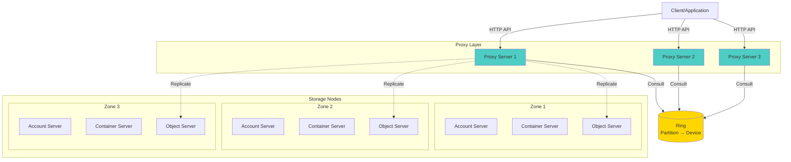
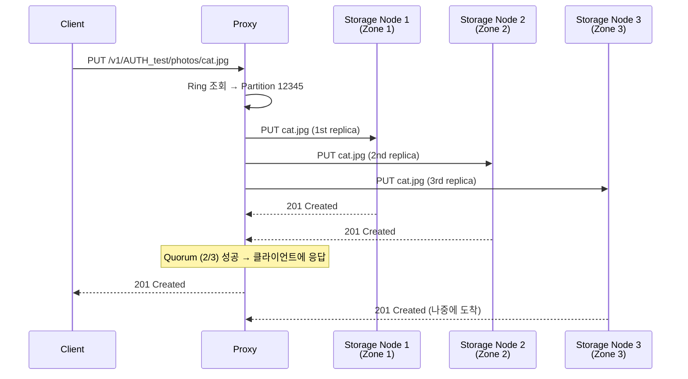

# Ch7. OpenStack Swift - Object Storage

## 📋 개요 및 학습 목표

**OpenStack Swift**는 대규모 비정형 데이터를 저장하는 분산 오브젝트 스토리지 시스템입니다. S3와 유사한 RESTful API를 제공하며, Petabyte 규모의 데이터를 저장할 수 있습니다.

### 왜 중요한가?

전통적인 파일 시스템의 한계:

- ❌ **확장성 부족**: 단일 서버의 용량 제한
- ❌ **메타데이터 병목**: 수십억 개 파일 관리 어려움
- ❌ **단일 장애점**: RAID도 디스크 동시 장애에 취약
- ❌ **성능 저하**: 파일 수 증가 시 성능 급격히 하락

**Swift의 해결책**:
- ✅ **수평 확장**: 노드 추가로 무한 확장 가능
- ✅ **분산 저장**: Consistent Hashing Ring으로 데이터 분산
- ✅ **고가용성**: 3개 이상 복제본, 다중 Zone 배치
- ✅ **Eventually Consistent**: CAP 정리의 AP 선택 (가용성 + 파티션 내성)
- ✅ **자동 복구**: 손상된 복제본 자동 감지 및 복구

### KakaoCloud에서의 활용 사례

- **사용자 업로드 파일**: 프로필 이미지, 첨부 파일 (수백 TB)
- **백업 스토리지**: VM 스냅샷, 데이터베이스 백업 (장기 보관)
- **로그 아카이빙**: 애플리케이션 로그, 감사 로그 (수년치 보관)
- **CDN Origin**: 정적 콘텐츠 원본 스토리지
- **대용량 객체**: 동영상, 이미지 원본 파일 (5GB+ SLO 사용)

### 학습 후 얻을 수 있는 역량

- [x] Swift 아키텍처 (Proxy, Account, Container, Object 서버) 이해
- [x] Consistent Hashing Ring 동작 원리
- [x] Replication 메커니즘 및 데이터 내구성
- [x] Large Object (SLO/DLO) 처리
- [x] Swift API 사용 및 성능 최적화

---

## 🔑 핵심 개념 및 이론

### 1. Swift 아키텍처



#### 핵심 구성 요소

**1. Proxy Server**:
- 클라이언트의 API 요청 처리
- Ring을 조회하여 데이터 위치 결정
- 복제본 쓰기/읽기 조정
- 로드 밸런싱 (여러 Proxy 서버 배치 가능)

**2. Account Server**:
- 계정(Account) 메타데이터 관리
- 계정 내 컨테이너 목록 저장
- SQLite DB로 저장 (경량)

**3. Container Server**:
- 컨테이너 메타데이터 관리
- 컨테이너 내 객체 목록 저장
- SQLite DB로 저장

**4. Object Server**:
- 실제 객체 데이터 저장
- 파일 시스템에 직접 저장 (`/srv/node/{device}/objects/`)
- 객체 메타데이터는 Extended Attributes (xattr)에 저장

**계층 구조**:
```
Account (계정)
  └── Container (컨테이너, S3의 Bucket)
       └── Object (객체, 실제 파일)
```

---

### 2. Consistent Hashing Ring

Swift는 **Consistent Hashing Ring**을 사용하여 데이터를 분산 저장합니다.

#### Ring 구조

```
1. Partition 수 결정 (예: 2^18 = 262,144개)
2. 각 Partition을 MD5 해싱으로 Ring에 배치
3. 각 Device(디스크)에 Partition 할당
```

**Ring 빌드 과정**:
```bash
# 1. Ring Builder 생성 (18 = 2^18 partitions, 3 = replicas, 1 = min_part_hours)
swift-ring-builder account.builder create 18 3 1

# 2. Device 추가
swift-ring-builder account.builder add \
  --region 1 --zone 1 --ip 10.0.0.1 --port 6202 --device sda1 --weight 100

swift-ring-builder account.builder add \
  --region 1 --zone 2 --ip 10.0.0.2 --port 6202 --device sda1 --weight 100

swift-ring-builder account.builder add \
  --region 1 --zone 3 --ip 10.0.0.3 --port 6202 --device sda1 --weight 100

# 3. Ring 재조정
swift-ring-builder account.builder rebalance

# 4. Ring 파일 생성 (account.ring.gz)
# → 모든 Proxy 및 Storage 노드에 배포
```

#### 객체 위치 결정

```python
# 객체 경로: /v1/account/container/object
path = "/v1/AUTH_test/photos/cat.jpg"

# 1. MD5 해시 계산
hash = md5(path).hexdigest()
# hash = "a1b2c3d4e5f6..."

# 2. Partition 계산
partition = int(hash[:4], 16) % (2 ** 18)
# partition = 12345

# 3. Ring에서 해당 Partition의 Device 조회
devices = ring.get_part_nodes(partition)
# devices = [
#   {ip: 10.0.0.1, device: sda1, zone: 1},
#   {ip: 10.0.0.2, device: sda1, zone: 2},
#   {ip: 10.0.0.3, device: sda1, zone: 3}
# ]
```

**장점**:
- ✅ 노드 추가/제거 시 일부 데이터만 이동 (O(K/N))
- ✅ 균등 분산 (각 노드에 비슷한 부하)
- ✅ Zone Awareness (복제본을 다른 Zone에 배치)

---

### 3. Replication (복제)

Swift는 데이터 내구성을 위해 **복제본(Replica)**을 여러 노드에 저장합니다.

#### Replication 메커니즘



**Quorum Write** (기본 설정):
- 복제본 3개 중 **과반수(2개)** 성공 시 응답
- 빠른 응답 시간 보장
- 나머지 1개는 백그라운드에서 완료

#### Replicator 프로세스

각 Storage 노드에서 실행되는 데몬:

```python
# object-replicator 동작 (간소화된 의사 코드)
while True:
    for partition in local_partitions:
        local_hash = compute_hash(partition)

        # 복제본이 있어야 할 다른 노드들과 비교
        for replica_node in ring.get_part_nodes(partition):
            remote_hash = get_remote_hash(replica_node, partition)

            if local_hash != remote_hash:
                # 차이 발견 → rsync로 동기화
                rsync(partition, replica_node)

    sleep(30)  # 30초 후 재실행
```

**Replication 특징**:
- **비동기**: 백그라운드에서 실행
- **Eventually Consistent**: 결국 모든 복제본이 동일해짐
- **자동 복구**: 디스크 장애 시 자동으로 새 노드에 복제
- **낮은 우선순위**: I/O가 적을 때 실행 (사용자 요청 우선)

---

### 4. 데이터 내구성 및 가용성

#### 내구성 계산

**복제본 3개, Zone 3개 분산** 시:

```
전제: 각 Zone의 연간 장애율 = 1%

1개 Zone 장애 확률: 1% = 0.01
2개 Zone 동시 장애 확률: 0.01 × 0.01 = 0.0001 (0.01%)
3개 Zone 동시 장애 확률: 0.01 × 0.01 × 0.01 = 0.000001 (0.0001%)

데이터 내구성: 1 - 0.000001 = 99.9999% (Six 9s)
```

**복제본 수 선택**:
- **3개 (기본)**: 99.9999% 내구성, 비용 효율적
- **2개**: 99.99% 내구성, 비용 절감 (권장 안 함)
- **4개+**: 99.99999% 내구성, 규제 준수용 (의료, 금융)

---

### 5. Large Object Support

Swift는 기본적으로 **5GB 단일 객체 제한**이 있습니다. 더 큰 파일은 **세그먼트**로 분할하여 업로드합니다.

#### SLO (Static Large Object)

**특징**:
- ✅ 병렬 업로드 (세그먼트를 동시에 업로드)
- ✅ 빠른 다운로드 (Manifest가 직접 세그먼트 위치 지정)
- ✅ 중첩 가능 (SLO가 다른 SLO 참조 가능)
- ⚠️ Manifest 파일 필요 (JSON)

**Manifest 예시**:
```json
[
  {
    "path": "/segments/video_part1",
    "etag": "abc123...",
    "size_bytes": 5368709120
  },
  {
    "path": "/segments/video_part2",
    "etag": "def456...",
    "size_bytes": 5368709120
  },
  {
    "path": "/segments/video_part3",
    "etag": "ghi789...",
    "size_bytes": 2147483648
  }
]
```

**최대 크기**:
- 1개 SLO: 1,000 세그먼트 × 5GB = **5TB**
- 중첩 SLO: 1,000 SLO × 1,000 세그먼트 × 5GB = **5PB** (이론상)

#### DLO (Dynamic Large Object)

**특징**:
- ✅ Manifest 파일 불필요
- ✅ prefix 기반 자동 조합
- ⚠️ Eventually Consistent (컨테이너 목록 의존)
- ⚠️ 병렬 다운로드 불가

**사용 예시**:
```bash
# 세그먼트 업로드 (prefix: video/segments/)
swift upload segments video/segments/001
swift upload segments video/segments/002
swift upload segments video/segments/003

# DLO Manifest 생성
curl -X PUT \
  -H "X-Object-Manifest: segments/video/segments/" \
  http://swift.example.com/v1/AUTH_test/videos/large_video.mp4
```

**SLO vs DLO 비교**:

| 항목 | SLO | DLO |
|------|-----|-----|
| **Manifest** | JSON 파일 필요 | prefix만 지정 |
| **일관성** | Strong | Eventually |
| **병렬 업로드** | 가능 | 가능 |
| **병렬 다운로드** | 가능 | 불가능 |
| **중첩** | 가능 | 불가능 |
| **권장 사용** | 대용량 파일 (>100GB) | 간단한 파일 분할 |

---

## 💻 실습 가이드 (Hands-on)

### Lab 1: Swift 클러스터 설치 (DevStack)

**목표**: 개발 환경에서 Swift 클러스터 구성

#### 1단계: DevStack 설치

```bash
# Ubuntu 22.04 LTS 가정
sudo apt update && sudo apt install -y git

# stack 사용자 생성
sudo useradd -s /bin/bash -d /opt/stack -m stack
echo "stack ALL=(ALL) NOPASSWD: ALL" | sudo tee /etc/sudoers.d/stack
sudo su - stack

# DevStack 클론
git clone https://opendev.org/openstack/devstack
cd devstack
```

#### 2단계: local.conf 설정

```bash
cat > local.conf <<'EOF'
[[local|localrc]]
ADMIN_PASSWORD=secret
DATABASE_PASSWORD=$ADMIN_PASSWORD
RABBIT_PASSWORD=$ADMIN_PASSWORD
SERVICE_PASSWORD=$ADMIN_PASSWORD

# Swift 활성화
enable_service s-proxy s-object s-container s-account

# Swift 설정
SWIFT_REPLICAS=3
SWIFT_HASH=swift_hash_unique_string
SWIFT_DATA_DIR=$DEST/data/swift

# 가상 디스크 생성 (1GB × 4개)
SWIFT_LOOPBACK_DISK_SIZE=1G
EOF
```

#### 3단계: 설치 실행

```bash
./stack.sh
# 15-20분 소요
```

#### 4단계: 확인

```bash
# 환경변수 로드
source openrc admin admin

# Swift 상태 확인
swift stat

# 출력:
# Account: AUTH_...
# Containers: 0
# Objects: 0
# Bytes: 0

# Ring 정보 확인
swift-ring-builder /etc/swift/account.builder
swift-ring-builder /etc/swift/container.builder
swift-ring-builder /etc/swift/object.builder
```

---

### Lab 2: Swift API 사용 (Python)

**목표**: Swift API로 객체 업로드/다운로드

#### 1단계: 의존성 설치

```bash
pip install python-swiftclient python-keystoneclient
```

#### 2단계: 환경변수 설정

```bash
# openrc 파일에서 로드 또는 수동 설정
export OS_AUTH_URL=http://localhost/identity
export OS_PROJECT_NAME=admin
export OS_USERNAME=admin
export OS_PASSWORD=secret
export OS_USER_DOMAIN_NAME=Default
export OS_PROJECT_DOMAIN_NAME=Default
export OS_IDENTITY_API_VERSION=3
```

#### 3단계: CLI 사용

```bash
# 컨테이너 생성
swift post photos

# 객체 업로드
echo "Hello Swift!" > test.txt
swift upload photos test.txt

# 객체 목록
swift list photos
# test.txt

# 객체 다운로드
swift download photos test.txt

# 객체 메타데이터 확인
swift stat photos test.txt
# Account: AUTH_...
# Container: photos
# Object: test.txt
# Content Type: text/plain
# Content Length: 13
# Last Modified: ...
# ETag: 8b1a9953c4611296a827abf8c47804d7

# 객체 삭제
swift delete photos test.txt

# 컨테이너 삭제
swift delete photos
```

---

### Lab 3: Go로 Swift 클라이언트 구현

**목표**: Go 애플리케이션에서 Swift API 사용

#### 1단계: 의존성 설치

```bash
mkdir swift-go-client && cd swift-go-client
go mod init swift-go-client

go get github.com/ncw/swift/v2
```

#### 2단계: Go 코드 작성

```go
// main.go
package main

import (
    "bytes"
    "fmt"
    "io"
    "log"
    "os"

    "github.com/ncw/swift/v2"
)

func main() {
    // Swift 연결 생성
    c := swift.Connection{
        UserName: os.Getenv("OS_USERNAME"),
        ApiKey:   os.Getenv("OS_PASSWORD"),
        AuthUrl:  os.Getenv("OS_AUTH_URL"),
        Tenant:   os.Getenv("OS_PROJECT_NAME"),
        Domain:   os.Getenv("OS_USER_DOMAIN_NAME"),
    }

    // 인증
    err := c.Authenticate()
    if err != nil {
        log.Fatalf("Authentication failed: %v", err)
    }
    fmt.Println("✓ Authenticated successfully")

    // 컨테이너 생성
    containerName := "go-demo"
    err = c.ContainerCreate(containerName, nil)
    if err != nil {
        log.Fatalf("Container creation failed: %v", err)
    }
    fmt.Printf("✓ Container '%s' created\n", containerName)

    // 객체 업로드
    objectName := "hello.txt"
    content := []byte("Hello from Go!")
    err = c.ObjectPutBytes(containerName, objectName, content, "text/plain")
    if err != nil {
        log.Fatalf("Object upload failed: %v", err)
    }
    fmt.Printf("✓ Object '%s' uploaded (%d bytes)\n", objectName, len(content))

    // 객체 다운로드
    data, err := c.ObjectGetBytes(containerName, objectName)
    if err != nil {
        log.Fatalf("Object download failed: %v", err)
    }
    fmt.Printf("✓ Object '%s' downloaded: %s\n", objectName, string(data))

    // 객체 메타데이터 조회
    info, _, err := c.Object(containerName, objectName)
    if err != nil {
        log.Fatalf("Object info failed: %v", err)
    }
    fmt.Printf("  - Content Type: %s\n", info.ContentType)
    fmt.Printf("  - Content Length: %d\n", info.Bytes)
    fmt.Printf("  - ETag: %s\n", info.Hash)
    fmt.Printf("  - Last Modified: %s\n", info.LastModified)

    // 컨테이너 내 모든 객체 목록
    objects, err := c.ObjectsAll(containerName, nil)
    if err != nil {
        log.Fatalf("Object listing failed: %v", err)
    }
    fmt.Printf("✓ Objects in '%s' container:\n", containerName)
    for _, obj := range objects {
        fmt.Printf("  - %s (%d bytes)\n", obj.Name, obj.Bytes)
    }

    // 객체 삭제
    err = c.ObjectDelete(containerName, objectName)
    if err != nil {
        log.Fatalf("Object deletion failed: %v", err)
    }
    fmt.Printf("✓ Object '%s' deleted\n", objectName)

    // 컨테이너 삭제
    err = c.ContainerDelete(containerName)
    if err != nil {
        log.Fatalf("Container deletion failed: %v", err)
    }
    fmt.Printf("✓ Container '%s' deleted\n", containerName)
}
```

**실행**:
```bash
# 환경변수 설정 (openrc 파일 source)
source ~/devstack/openrc admin admin

go run main.go

# 출력:
# ✓ Authenticated successfully
# ✓ Container 'go-demo' created
# ✓ Object 'hello.txt' uploaded (14 bytes)
# ✓ Object 'hello.txt' downloaded: Hello from Go!
#   - Content Type: text/plain
#   - Content Length: 14
#   - ETag: 8c7dd922ad47494fc02c388e12c00eac
#   - Last Modified: 2025-01-02 10:30:00
# ✓ Objects in 'go-demo' container:
#   - hello.txt (14 bytes)
# ✓ Object 'hello.txt' deleted
# ✓ Container 'go-demo' deleted
```

---

### Lab 4: Large Object (SLO) 업로드

**목표**: 10GB 파일을 SLO로 분할 업로드

#### 1단계: 대용량 파일 생성

```bash
# 10GB 더미 파일 생성
dd if=/dev/zero of=large_file.bin bs=1M count=10240
# 10GB = 10,240 MB

# 1GB 단위로 분할
split -b 1G large_file.bin segment_
# segment_aa, segment_ab, ..., segment_aj (10개)
```

#### 2단계: 세그먼트 업로드

```bash
# segments 컨테이너 생성
swift post segments

# 세그먼트 병렬 업로드
for seg in segment_*; do
    swift upload segments "$seg" &
done
wait

# 확인
swift list segments
# segment_aa
# segment_ab
# ...
# segment_aj
```

#### 3단계: Manifest 생성

```bash
# Go 코드로 Manifest 생성
```

```go
// slo_manifest.go
package main

import (
    "encoding/json"
    "fmt"
    "log"
    "os"

    "github.com/ncw/swift/v2"
)

type Segment struct {
    Path      string `json:"path"`
    Etag      string `json:"etag"`
    SizeBytes int64  `json:"size_bytes"`
}

func main() {
    c := swift.Connection{
        UserName: os.Getenv("OS_USERNAME"),
        ApiKey:   os.Getenv("OS_PASSWORD"),
        AuthUrl:  os.Getenv("OS_AUTH_URL"),
        Tenant:   os.Getenv("OS_PROJECT_NAME"),
        Domain:   os.Getenv("OS_USER_DOMAIN_NAME"),
    }
    c.Authenticate()

    // segments 컨테이너의 객체 목록
    objects, _ := c.ObjectsAll("segments", nil)

    // Manifest 생성
    manifest := make([]Segment, 0, len(objects))
    for _, obj := range objects {
        manifest = append(manifest, Segment{
            Path:      "/segments/" + obj.Name,
            Etag:      obj.Hash,
            SizeBytes: obj.Bytes,
        })
    }

    manifestJSON, _ := json.MarshalIndent(manifest, "", "  ")
    fmt.Println(string(manifestJSON))

    // SLO Manifest 업로드
    headers := swift.Headers{
        "Content-Type": "application/json",
    }
    _, err := c.ObjectPut("files", "large_file.bin",
        bytes.NewReader(manifestJSON), true, "",
        "application/octet-stream", headers)

    if err != nil {
        log.Fatalf("SLO manifest upload failed: %v", err)
    }

    fmt.Println("✓ SLO Manifest uploaded")
}
```

#### 4단계: SLO 다운로드 (자동 조합)

```bash
# Swift가 자동으로 세그먼트를 조합하여 다운로드
swift download files large_file.bin

# 확인
ls -lh large_file.bin
# -rw-r--r-- 1 user user 10G Jan  2 10:30 large_file.bin
```

---

### Lab 5: Container ACL 및 Temp URL

**목표**: 공개 컨테이너 설정 및 임시 URL 생성

#### 1단계: 컨테이너 ACL 설정

```bash
# public 컨테이너 생성
swift post public-files

# 읽기 권한 부여 (전체 공개)
swift post public-files --read-acl ".r:*"

# 쓰기 권한 부여 (특정 사용자만)
swift post public-files --write-acl "user1,user2"

# 확인
swift stat public-files
# Read ACL: .r:*
# Write ACL: user1,user2
```

#### 2단계: Temp URL 생성

```bash
# Temp URL Key 설정 (계정에 한번만)
swift post -m "Temp-URL-Key:my-secret-key"

# 임시 URL 생성 (1시간 유효)
swift tempurl GET 3600 /v1/AUTH_test/public-files/photo.jpg my-secret-key

# 출력:
# /v1/AUTH_test/public-files/photo.jpg?temp_url_sig=abc123...&temp_url_expires=1735776000

# 완전한 URL
echo "http://localhost:8080$(swift tempurl GET 3600 /v1/AUTH_test/public-files/photo.jpg my-secret-key)"

# 브라우저에서 접속 가능 (인증 없이)
curl "http://localhost:8080/v1/AUTH_test/public-files/photo.jpg?temp_url_sig=abc123...&temp_url_expires=1735776000"
```

---

## 📚 참고 자료

### 공식 문서

**OpenStack Swift**:
- [Swift Official Documentation 2025.1](https://docs.openstack.org/swift/2025.1/)
- [Swift Official Documentation 2025.2](https://docs.openstack.org/swift/2025.2/install/get_started.html)
- [Swift Architectural Overview](https://docs.openstack.org/swift/latest/overview_architecture.html)
- [Building a Consistent Hashing Ring](https://docs.openstack.org/swift/latest/ring_background.html)
- [Partitioned Consistent Hash Ring](https://docs.openstack.org/swift/latest/ring.html)

**Large Objects**:
- [Large Object Support](https://docs.openstack.org/swift/latest/overview_large_objects.html)
- [Static Large Object Support](https://docs.openstack.org/icehouse/config-reference/content/object-storage-slo.html)
- [swiftlygo - Go Library for SLO/DLO](https://github.com/ibmjstart/swiftlygo)

**Replication**:
- [Swift Improved Object Replicator](https://wiki.openstack.org/wiki/Swift-Improved-Object-Replicator)

### Go 클라이언트 라이브러리

- [ncw/swift v2 - Go Swift Client](https://pkg.go.dev/github.com/ncw/swift/v2)

### 학습 체크리스트

- [ ] Swift 4계층 아키텍처 (Proxy, Account, Container, Object) 이해
- [ ] Consistent Hashing Ring 동작 원리 및 Ring 빌드
- [ ] Replication 메커니즘 및 Quorum Write
- [ ] Eventually Consistent 모델 이해
- [ ] Zone을 활용한 고가용성 설계
- [ ] SLO vs DLO 차이점 및 사용 시나리오
- [ ] Large Object (>5GB) 처리 방법
- [ ] Swift CLI 사용 (upload, download, stat, delete)
- [ ] Go 애플리케이션에 Swift 통합
- [ ] Container ACL 및 Temp URL 활용
- [ ] 성능 최적화 (병렬 업로드, 세그먼트 크기 조정)

---

## 🎯 다음 단계

Ch8에서는 **S3 API & MinIO**를 학습합니다. S3 호환 API, MinIO 배포, Bucket Policy, Lifecycle 관리, Go SDK 사용법을 다룹니다.

**Preview**:
- S3 API 표준 및 호환성
- MinIO 아키텍처 및 배포
- Bucket Versioning 및 Lifecycle
- Presigned URL 생성
- minio-go v7 SDK
