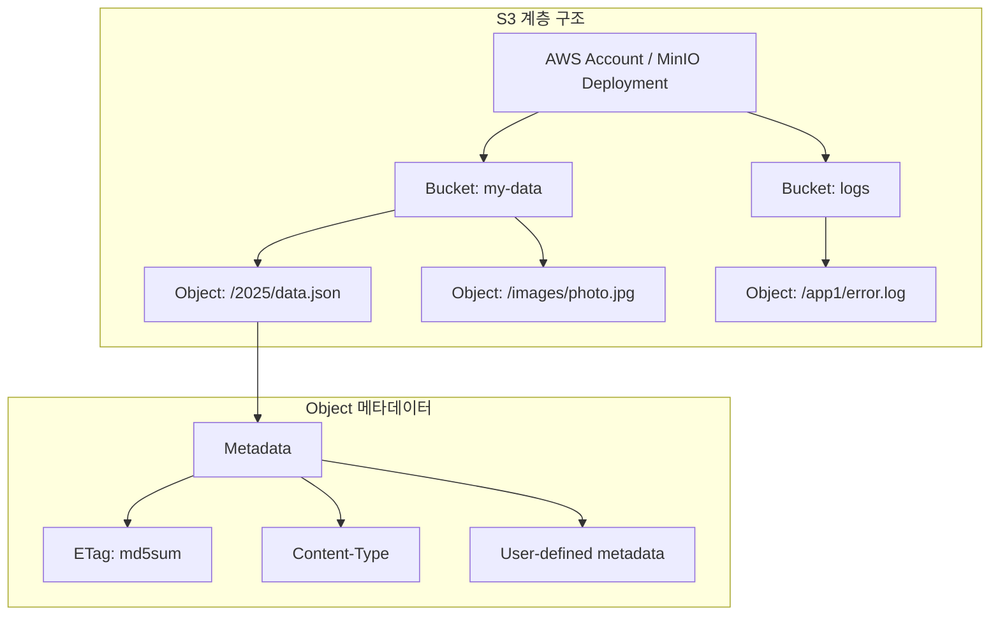
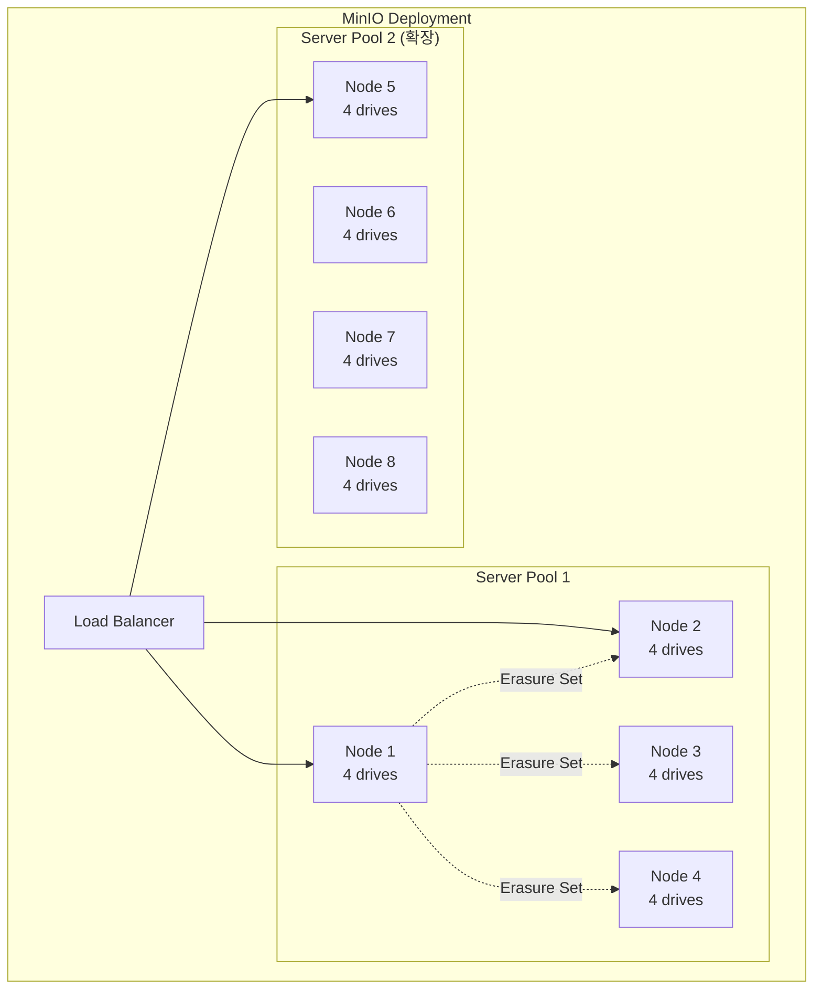
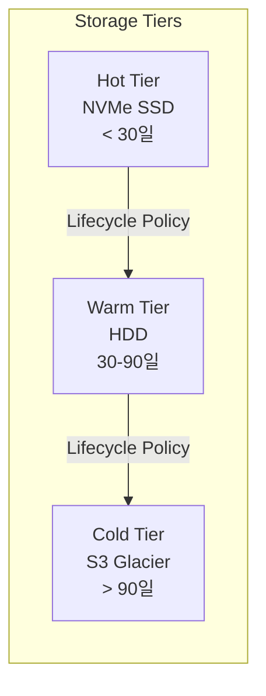
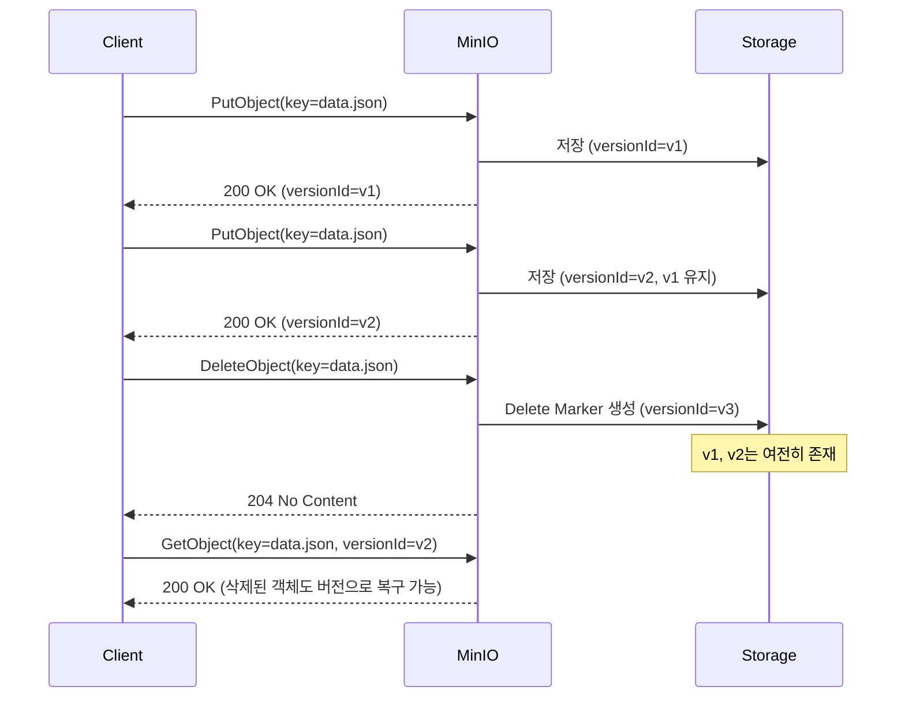
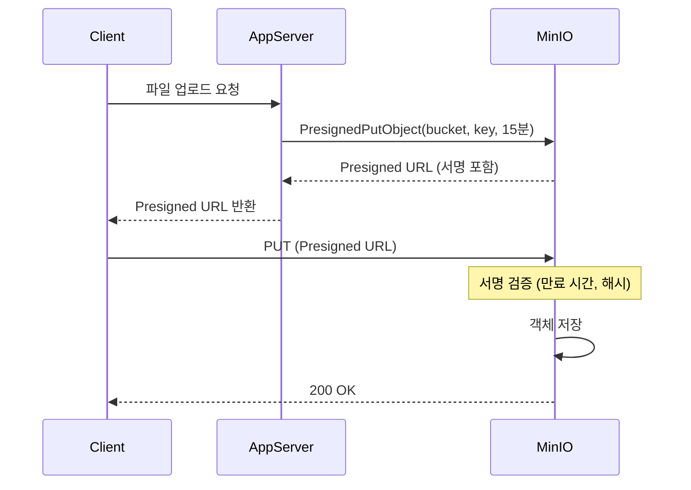
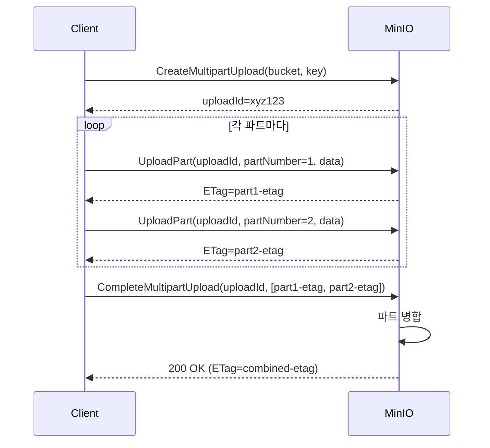

# Ch8. Object Storage & S3 API

## 📋 개요 및 학습 목표

### 개요

**Amazon S3 API**는 사실상의 표준(de facto standard) 객체 스토리지 API로, 클라우드 네이티브 애플리케이션에서 비정형 데이터를 저장하고 관리하는 핵심 인터페이스입니다. **MinIO**는 S3 호환 API를 제공하는 고성능 오픈소스 객체 스토리지로, Kubernetes 환경에서 AI/ML 워크로드, 데이터 레이크, 백업/아카이브 등 다양한 용도로 활용됩니다.

2025년 현재, MinIO AIStor는 **엑사바이트 규모의 확장성**, **sub-10ms 레이턴시**, **Kubernetes 네이티브 멀티테넌시**를 제공하며, 하이브리드/멀티클라우드 환경에서 일관된 객체 스토리지 경험을 제공합니다.

### 학습 목표

이 챕터를 완료하면 다음을 할 수 있습니다:

1. **S3 API 표준 이해**: Bucket, Object, Key, Versioning, Lifecycle 등 핵심 개념 설명
2. **MinIO 아키텍처 분석**: Erasure Set, Server Pool, 분산 토폴로지 동작 원리 이해
3. **Go SDK 활용**: minio-go v7을 사용한 객체 CRUD, Presigned URL, Multipart Upload 구현
4. **Kubernetes 배포**: MinIO Operator를 통한 멀티테넌트 클러스터 구축
5. **고급 기능 구현**: Bucket Versioning, Lifecycle Policy, Storage Tiering 설정

---

## 🔑 핵심 개념 및 이론

### 1. S3 API 핵심 개념

#### 1.1 기본 구조



**핵심 용어**:

- **Bucket**: 객체를 담는 최상위 컨테이너 (글로벌 네임스페이스에서 유일해야 함)
- **Object**: 실제 데이터 + 메타데이터 (최대 5TB/객체)
- **Key**: 객체의 고유 식별자 (예: `logs/2025/12/19/app.log`)
- **ETag**: 객체 무결성 검증용 해시값 (MD5 또는 멀티파트 업로드 시 복합 해시)

#### 1.2 S3 API 주요 연산

| 카테고리 | API 연산 | 설명 |
|---------|---------|------|
| **Bucket 관리** | CreateBucket, DeleteBucket | 버킷 생성/삭제 |
| | ListBuckets | 모든 버킷 조회 |
| **Object 관리** | PutObject, GetObject | 객체 업로드/다운로드 |
| | DeleteObject, ListObjects | 객체 삭제/목록 조회 |
| **멀티파트** | CreateMultipartUpload | 대용량 객체 업로드 시작 |
| | UploadPart, CompleteMultipartUpload | 파트 업로드 및 완료 |
| **Versioning** | PutBucketVersioning | 버전 관리 활성화 |
| | GetObject?versionId=... | 특정 버전 조회 |
| **Lifecycle** | PutBucketLifecycleConfiguration | 수명 주기 정책 설정 |

### 2. MinIO 아키텍처 (2025)

#### 2.1 분산 아키텍처

MinIO는 **서버 풀(Server Pool)** 단위로 확장되며, 각 풀은 최소 4개의 노드로 구성됩니다:



**특징**:

- **Erasure Set**: 데이터를 N개 데이터 샤드 + M개 패리티 샤드로 분할 (예: EC:4+2, 최대 2개 노드 장애 허용)
- **Server Pool**: 독립적인 erasure set 그룹, 풀 단위로 확장 (단일 네임스페이스 유지)
- **분산 토폴로지**: 각 노드가 전체 클러스터 토폴로지를 알고 있어 클라이언트는 임의 노드에 요청 가능

#### 2.2 MinIO AIStor (2025)

2025년 MinIO는 AI/ML 워크로드를 위한 **AIStor** 플랫폼을 제공합니다:

- **성능**: Sub-10ms 레이턴시, NVMe 드라이브 IOPS 완전 활용
- **확장성**: 단일 네임스페이스로 엑사바이트 규모 지원
- **Kubernetes 네이티브**: Operator 기반 멀티테넌트 배포
- **Storage Tiering**: NVMe → HDD → Public Cloud 자동 계층화



### 3. Bucket Versioning

#### 3.1 버전 관리 메커니즘

버킷에 버전 관리를 활성화하면 **모든 객체 변경이 새로운 버전으로 저장**됩니다:



**Delete Marker**: 삭제 작업은 실제 객체를 제거하지 않고 "삭제 마커"를 생성합니다. 이전 버전은 versionId로 여전히 접근 가능합니다.

**중요**: 버전 관리를 활성화하면 **비활성화(disable)는 불가능하며**, **일시 중단(suspend)만 가능**합니다.

#### 3.2 버전 관리 상태

| 상태 | 설명 | PutObject 동작 |
|------|------|---------------|
| **Unversioned** | 기본 상태 (비활성화) | 객체 덮어쓰기 (이전 버전 삭제) |
| **Enabled** | 버전 관리 활성화 | 새 버전 생성 (이전 버전 유지) |
| **Suspended** | 일시 중단 | versionId=null로 덮어쓰기 |

### 4. Lifecycle Management

#### 4.1 수명 주기 규칙

Lifecycle 정책은 **객체의 나이에 따라 자동으로 삭제 또는 계층 이동**을 수행합니다:

```xml
<LifecycleConfiguration>
  <Rule>
    <ID>archive-old-logs</ID>
    <Status>Enabled</Status>
    <Filter>
      <Prefix>logs/</Prefix>
    </Filter>
    <Expiration>
      <Days>90</Days>
    </Expiration>
    <NoncurrentVersionExpiration>
      <NoncurrentDays>30</NoncurrentDays>
    </NoncurrentVersionExpiration>
  </Rule>
  <Rule>
    <ID>transition-to-cold-storage</ID>
    <Status>Enabled</Status>
    <Filter>
      <Prefix>archives/</Prefix>
    </Filter>
    <Transition>
      <Days>30</Days>
      <StorageClass>COLD</StorageClass>
    </Transition>
  </Rule>
</LifecycleConfiguration>
```

**규칙 구성 요소**:

- **Filter**: Prefix 또는 Tag 기반 필터링
- **Expiration**: 객체 삭제 (현재 버전)
- **NoncurrentVersionExpiration**: 이전 버전 삭제
- **Transition**: 다른 스토리지 클래스로 이동

### 5. Presigned URL

#### 5.1 동작 원리

Presigned URL은 **임시 자격 증명을 URL에 포함**하여 인증 없이 객체 접근을 허용합니다:



**특징**:

- **만료 시간**: 최소 1초 ~ 최대 7일
- **서명 파라미터**: `X-Amz-Algorithm`, `X-Amz-Credential`, `X-Amz-Date`, `X-Amz-Expires`, `X-Amz-Signature`
- **용도**: 직접 업로드/다운로드 (애플리케이션 서버 부하 감소)

#### 5.2 Presigned URL 제약 사항

- **단일 객체 크기 제한**: PresignedPutObject는 **최대 5GB**
- **멀티파트 권장**: 5GB 초과 시 멀티파트 업로드 + 각 파트별 presigned URL 생성

### 6. Multipart Upload

#### 6.1 멀티파트 업로드 워크플로

대용량 객체(>5MB 권장, >5GB 필수)는 멀티파트 업로드를 사용합니다:



**minio-go v7 자동 처리**:

- **< 16MB**: 단일 PUT 요청
- **>= 16MB**: 자동 멀티파트 업로드 (파트당 5MB ~ 5GB)
- **최대 객체 크기**: 5TB

#### 6.2 Presigned Multipart Upload

5GB 초과 객체를 presigned URL로 업로드하려면 **수동 멀티파트 처리**가 필요합니다:

```go
// 1. 멀티파트 업로드 시작
initReq, _ := http.NewRequest("POST", fmt.Sprintf("%s/%s/%s?uploads", endpoint, bucket, key), nil)
client.Presign(initReq, 15*time.Minute)

// 2. 각 파트별 presigned URL 생성
for partNumber := 1; partNumber <= totalParts; partNumber++ {
    partReq, _ := http.NewRequest("PUT",
        fmt.Sprintf("%s/%s/%s?partNumber=%d&uploadId=%s", endpoint, bucket, key, partNumber, uploadId),
        nil)
    client.Presign(partReq, 15*time.Minute)
}

// 3. CompleteMultipartUpload presigned URL
completeReq, _ := http.NewRequest("POST", fmt.Sprintf("%s/%s/%s?uploadId=%s", endpoint, bucket, key, uploadId), body)
client.Presign(completeReq, 15*time.Minute)
```

### 7. MinIO Kubernetes Operator (2025)

#### 7.1 멀티테넌시 아키텍처

MinIO Operator는 **Tenant CRD**를 통해 Kubernetes에서 격리된 MinIO 인스턴스를 관리합니다:

```yaml
apiVersion: minio.min.io/v2
kind: Tenant
metadata:
  name: minio-tenant-1
  namespace: minio-tenant-1
spec:
  pools:
    - name: pool-0
      servers: 4
      volumesPerServer: 4
      volumeClaimTemplate:
        spec:
          accessModes:
            - ReadWriteOnce
          resources:
            requests:
              storage: 1Ti
          storageClassName: local-nvme  # CSI 드라이버 권장
  requestAutoCert: false
  certConfig:
    commonName: "*.minio-tenant-1.svc.cluster.local"
```

**주요 특징**:

- **Namespace 격리**: 각 Tenant는 별도 Namespace에서 실행
- **Storage Class 요구사항**: `volumeBindingMode: WaitForFirstConsumer` (로컬 PV 성능 보장)
- **CSI 드라이버 권장**: 최고의 성능을 위해 로컬 스토리지용 CSI 드라이버 사용
- **Spread Zones**: Pod를 여러 failure domain에 분산 배치 (HA)

#### 7.2 스토리지 계층화 (2025)

MinIO Operator는 **여러 StorageClass 간 자동 티어링**을 지원합니다:

```yaml
# Lifecycle policy로 티어 전환
lifecycle:
  - id: tier-to-hdd
    status: Enabled
    filter:
      prefix: "cold-data/"
    transition:
      days: 30
      storage_class: WARM  # HDD backend
  - id: tier-to-s3
    status: Enabled
    filter:
      prefix: "archive/"
    transition:
      days: 90
      storage_class: COLD  # S3 Glacier
```

**비용 최적화**:

- **Hot (NVMe)**: 자주 접근하는 데이터 (< 30일)
- **Warm (HDD)**: 가끔 접근 (30-90일)
- **Cold (S3)**: 아카이브 (> 90일)

---

## 💻 실습 가이드 (Hands-on)

### Lab 1: MinIO Kubernetes Operator 설치

**목표**: Kubernetes에 MinIO Operator를 설치하고 Tenant 배포

**단계**:

1. **Operator 설치**:

```bash
# MinIO Operator 설치 (kubectl krew plugin)
kubectl krew install minio

# Operator 초기화
kubectl minio init

# Operator 상태 확인
kubectl get pods -n minio-operator
# NAME                              READY   STATUS    RESTARTS   AGE
# console-7d8f5d5b8d-abcde          1/1     Running   0          2m
# minio-operator-6f8d5c8b7d-xyz12   1/1     Running   0          2m
```

2. **Tenant 생성**:

```bash
# Tenant 생성 (4 노드, 각 4개 드라이브, 1TB)
kubectl minio tenant create minio-tenant-1 \
  --servers 4 \
  --volumes 16 \
  --capacity 4Ti \
  --storage-class local-path \  # 또는 local-nvme
  --namespace minio-tenant-1

# Tenant 상태 확인
kubectl get tenant -n minio-tenant-1
kubectl get pods -n minio-tenant-1
```

3. **접속 정보 확인**:

```bash
# Tenant 접속 정보
kubectl minio tenant info minio-tenant-1 -n minio-tenant-1

# MinIO Console 접속 (포트 포워딩)
kubectl port-forward svc/minio-tenant-1-console -n minio-tenant-1 9443:9443

# 브라우저: https://localhost:9443
# 초기 자격증명은 Kubernetes Secret에 저장
kubectl get secret minio-tenant-1-user-1 -n minio-tenant-1 -o jsonpath='{.data.CONSOLE_ACCESS_KEY}' | base64 -d
kubectl get secret minio-tenant-1-user-1 -n minio-tenant-1 -o jsonpath='{.data.CONSOLE_SECRET_KEY}' | base64 -d
```

### Lab 2: S3 API 기본 사용 (MinIO Client)

**목표**: MinIO 클라이언트(mc)로 버킷/객체 관리

**단계**:

1. **mc 설치 및 설정**:

```bash
# mc 설치 (Linux)
wget https://dl.min.io/client/mc/release/linux-amd64/mc
chmod +x mc
sudo mv mc /usr/local/bin/

# MinIO 서버 등록
mc alias set myminio https://minio.example.com ACCESS_KEY SECRET_KEY

# 버킷 생성
mc mb myminio/my-bucket

# 버킷 목록
mc ls myminio
```

2. **객체 업로드/다운로드**:

```bash
# 파일 업로드
echo "Hello MinIO" > test.txt
mc cp test.txt myminio/my-bucket/

# 디렉토리 업로드
mc cp --recursive /path/to/data/ myminio/my-bucket/data/

# 파일 다운로드
mc cp myminio/my-bucket/test.txt downloaded.txt

# 객체 메타데이터 확인
mc stat myminio/my-bucket/test.txt
```

3. **버전 관리 활성화**:

```bash
# 버전 관리 활성화
mc version enable myminio/my-bucket

# 버전 확인
mc version info myminio/my-bucket

# 같은 파일 여러 번 업로드
echo "Version 1" > test.txt
mc cp test.txt myminio/my-bucket/
echo "Version 2" > test.txt
mc cp test.txt myminio/my-bucket/

# 모든 버전 조회
mc ls --versions myminio/my-bucket/test.txt
```

### Lab 3: minio-go v7 SDK 사용

**목표**: Go 애플리케이션에서 MinIO 객체 CRUD 구현

**코드**:

```go
package main

import (
    "context"
    "fmt"
    "log"
    "os"
    "strings"

    "github.com/minio/minio-go/v7"
    "github.com/minio/minio-go/v7/pkg/credentials"
)

func main() {
    // MinIO 클라이언트 초기화
    endpoint := os.Getenv("MINIO_ENDPOINT")      // "minio.example.com:9000"
    accessKey := os.Getenv("MINIO_ACCESS_KEY")
    secretKey := os.Getenv("MINIO_SECRET_KEY")
    useSSL := true

    minioClient, err := minio.New(endpoint, &minio.Options{
        Creds:  credentials.NewStaticV4(accessKey, secretKey, ""),
        Secure: useSSL,
    })
    if err != nil {
        log.Fatalf("MinIO 클라이언트 초기화 실패: %v", err)
    }

    ctx := context.Background()
    bucketName := "my-app-bucket"

    // 1. 버킷 생성
    err = minioClient.MakeBucket(ctx, bucketName, minio.MakeBucketOptions{})
    if err != nil {
        // 이미 존재하는지 확인
        exists, errBucketExists := minioClient.BucketExists(ctx, bucketName)
        if errBucketExists == nil && exists {
            fmt.Printf("버킷 %s 이미 존재\n", bucketName)
        } else {
            log.Fatalf("버킷 생성 실패: %v", err)
        }
    } else {
        fmt.Printf("버킷 %s 생성 완료\n", bucketName)
    }

    // 2. 객체 업로드
    objectName := "data/sample.txt"
    content := strings.NewReader("Hello MinIO from Go!")
    contentType := "text/plain"

    info, err := minioClient.PutObject(
        ctx,
        bucketName,
        objectName,
        content,
        int64(content.Len()),
        minio.PutObjectOptions{ContentType: contentType},
    )
    if err != nil {
        log.Fatalf("객체 업로드 실패: %v", err)
    }
    fmt.Printf("객체 업로드 완료: %s (크기: %d, ETag: %s)\n", objectName, info.Size, info.ETag)

    // 3. 객체 다운로드
    object, err := minioClient.GetObject(ctx, bucketName, objectName, minio.GetObjectOptions{})
    if err != nil {
        log.Fatalf("객체 다운로드 실패: %v", err)
    }
    defer object.Close()

    stat, err := object.Stat()
    if err != nil {
        log.Fatalf("객체 정보 조회 실패: %v", err)
    }
    fmt.Printf("객체 정보: 크기=%d, ContentType=%s, LastModified=%s\n",
        stat.Size, stat.ContentType, stat.LastModified)

    // 4. 객체 목록 조회
    fmt.Println("\n=== 버킷 내 객체 목록 ===")
    objectCh := minioClient.ListObjects(ctx, bucketName, minio.ListObjectsOptions{
        Prefix:    "data/",
        Recursive: true,
    })
    for object := range objectCh {
        if object.Err != nil {
            log.Fatalf("목록 조회 실패: %v", object.Err)
        }
        fmt.Printf("- %s (크기: %d, 수정: %s)\n", object.Key, object.Size, object.LastModified)
    }

    // 5. 객체 삭제
    err = minioClient.RemoveObject(ctx, bucketName, objectName, minio.RemoveObjectOptions{})
    if err != nil {
        log.Fatalf("객체 삭제 실패: %v", err)
    }
    fmt.Printf("객체 삭제 완료: %s\n", objectName)
}
```

**실행**:

```bash
export MINIO_ENDPOINT="minio.example.com:9000"
export MINIO_ACCESS_KEY="minioadmin"
export MINIO_SECRET_KEY="minioadmin"

go mod init minio-demo
go get github.com/minio/minio-go/v7

go run main.go
```

**출력 예시**:

```
버킷 my-app-bucket 생성 완료
객체 업로드 완료: data/sample.txt (크기: 21, ETag: "5eb63bbbe01eeed093cb22bb8f5acdc3")
객체 정보: 크기=21, ContentType=text/plain, LastModified=2025-12-19 10:30:45 +0000 UTC

=== 버킷 내 객체 목록 ===
- data/sample.txt (크기: 21, 수정: 2025-12-19 10:30:45 +0000 UTC)
객체 삭제 완료: data/sample.txt
```

### Lab 4: Bucket Versioning & Lifecycle

**목표**: 버전 관리 및 수명 주기 정책 구현

**코드**:

```go
package main

import (
    "context"
    "fmt"
    "log"
    "os"
    "strings"
    "time"

    "github.com/minio/minio-go/v7"
    "github.com/minio/minio-go/v7/pkg/credentials"
    "github.com/minio/minio-go/v7/pkg/lifecycle"
)

func main() {
    minioClient, err := minio.New(os.Getenv("MINIO_ENDPOINT"), &minio.Options{
        Creds:  credentials.NewStaticV4(os.Getenv("MINIO_ACCESS_KEY"), os.Getenv("MINIO_SECRET_KEY"), ""),
        Secure: true,
    })
    if err != nil {
        log.Fatal(err)
    }

    ctx := context.Background()
    bucketName := "versioned-bucket"

    // 1. 버킷 생성
    err = minioClient.MakeBucket(ctx, bucketName, minio.MakeBucketOptions{})
    if err != nil {
        if !strings.Contains(err.Error(), "already") {
            log.Fatal(err)
        }
    }

    // 2. 버전 관리 활성화
    err = minioClient.EnableVersioning(ctx, bucketName)
    if err != nil {
        log.Fatalf("버전 관리 활성화 실패: %v", err)
    }
    fmt.Printf("버킷 %s: 버전 관리 활성화 완료\n", bucketName)

    // 버전 관리 상태 확인
    versionConfig, err := minioClient.GetBucketVersioning(ctx, bucketName)
    if err != nil {
        log.Fatal(err)
    }
    fmt.Printf("버전 관리 상태: %s\n", versionConfig.Status)

    // 3. 같은 키로 여러 버전 생성
    objectName := "versioned-file.txt"
    for i := 1; i <= 3; i++ {
        content := fmt.Sprintf("Version %d content", i)
        info, err := minioClient.PutObject(
            ctx,
            bucketName,
            objectName,
            strings.NewReader(content),
            int64(len(content)),
            minio.PutObjectOptions{},
        )
        if err != nil {
            log.Fatal(err)
        }
        fmt.Printf("버전 %d 업로드: versionId=%s\n", i, info.VersionID)
        time.Sleep(1 * time.Second)  // 타임스탬프 차이 확보
    }

    // 4. 모든 버전 조회
    fmt.Println("\n=== 모든 버전 목록 ===")
    objectsCh := minioClient.ListObjects(ctx, bucketName, minio.ListObjectsOptions{
        WithVersions: true,
        Prefix:       objectName,
    })
    for obj := range objectsCh {
        if obj.Err != nil {
            log.Fatal(obj.Err)
        }
        fmt.Printf("- VersionID: %s, Size: %d, LastModified: %s, IsLatest: %t\n",
            obj.VersionID, obj.Size, obj.LastModified, obj.IsLatest)
    }

    // 5. 특정 버전 다운로드 (첫 번째 버전)
    // 실제로는 ListObjects에서 얻은 versionId 사용
    // 여기서는 예시로 생략

    // 6. Lifecycle 정책 설정
    config := lifecycle.NewConfiguration()
    config.Rules = []lifecycle.Rule{
        {
            ID:     "expire-old-versions",
            Status: "Enabled",
            NoncurrentVersionExpiration: lifecycle.NoncurrentVersionExpiration{
                NoncurrentDays: lifecycle.ExpirationDays(30),
            },
        },
        {
            ID:     "delete-old-objects",
            Status: "Enabled",
            Expiration: lifecycle.Expiration{
                Days: lifecycle.ExpirationDays(90),
            },
        },
    }

    err = minioClient.SetBucketLifecycle(ctx, bucketName, config)
    if err != nil {
        log.Fatalf("Lifecycle 정책 설정 실패: %v", err)
    }
    fmt.Println("\n=== Lifecycle 정책 설정 완료 ===")
    fmt.Println("- 현재 버전: 90일 후 삭제")
    fmt.Println("- 이전 버전: 30일 후 삭제")

    // Lifecycle 정책 조회
    lifecycleConfig, err := minioClient.GetBucketLifecycle(ctx, bucketName)
    if err != nil {
        log.Fatal(err)
    }
    fmt.Printf("\n현재 설정된 규칙 수: %d\n", len(lifecycleConfig.Rules))
    for _, rule := range lifecycleConfig.Rules {
        fmt.Printf("- Rule ID: %s, Status: %s\n", rule.ID, rule.Status)
    }
}
```

**실행 결과**:

```
버킷 versioned-bucket: 버전 관리 활성화 완료
버전 관리 상태: Enabled
버전 1 업로드: versionId=abc123
버전 2 업로드: versionId=def456
버전 3 업로드: versionId=ghi789

=== 모든 버전 목록 ===
- VersionID: ghi789, Size: 19, LastModified: 2025-12-19 10:35:47 +0000 UTC, IsLatest: true
- VersionID: def456, Size: 19, LastModified: 2025-12-19 10:35:46 +0000 UTC, IsLatest: false
- VersionID: abc123, Size: 19, LastModified: 2025-12-19 10:35:45 +0000 UTC, IsLatest: false

=== Lifecycle 정책 설정 완료 ===
- 현재 버전: 90일 후 삭제
- 이전 버전: 30일 후 삭제

현재 설정된 규칙 수: 2
- Rule ID: expire-old-versions, Status: Enabled
- Rule ID: delete-old-objects, Status: Enabled
```

### Lab 5: Presigned URL & Multipart Upload

**목표**: Presigned URL 생성 및 멀티파트 업로드 구현

**코드**:

```go
package main

import (
    "context"
    "fmt"
    "io"
    "log"
    "net/url"
    "os"
    "time"

    "github.com/minio/minio-go/v7"
    "github.com/minio/minio-go/v7/pkg/credentials"
)

func main() {
    minioClient, err := minio.New(os.Getenv("MINIO_ENDPOINT"), &minio.Options{
        Creds:  credentials.NewStaticV4(os.Getenv("MINIO_ACCESS_KEY"), os.Getenv("MINIO_SECRET_KEY"), ""),
        Secure: true,
    })
    if err != nil {
        log.Fatal(err)
    }

    ctx := context.Background()
    bucketName := "presigned-bucket"

    // 버킷 생성
    err = minioClient.MakeBucket(ctx, bucketName, minio.MakeBucketOptions{})
    if err != nil {
        exists, _ := minioClient.BucketExists(ctx, bucketName)
        if !exists {
            log.Fatal(err)
        }
    }

    // === Part 1: Presigned PUT URL (업로드용) ===
    objectName := "upload-via-presigned.txt"
    expiry := 15 * time.Minute

    presignedURL, err := minioClient.PresignedPutObject(ctx, bucketName, objectName, expiry)
    if err != nil {
        log.Fatalf("Presigned PUT URL 생성 실패: %v", err)
    }

    fmt.Println("=== Presigned PUT URL (업로드) ===")
    fmt.Printf("URL: %s\n", presignedURL.String())
    fmt.Printf("만료 시간: %s\n", expiry)
    fmt.Println("\n클라이언트는 이 URL로 직접 업로드 가능 (인증 불필요):")
    fmt.Printf("curl -X PUT -T myfile.txt '%s'\n", presignedURL.String())

    // === Part 2: Presigned GET URL (다운로드용) ===
    // 먼저 테스트 객체 업로드
    testContent := "This is a test file for presigned download"
    _, err = minioClient.PutObject(
        ctx,
        bucketName,
        "test-download.txt",
        io.NopCloser(bytes.NewReader([]byte(testContent))),
        int64(len(testContent)),
        minio.PutObjectOptions{},
    )
    if err != nil {
        log.Fatal(err)
    }

    presignedGetURL, err := minioClient.PresignedGetObject(ctx, bucketName, "test-download.txt", expiry, url.Values{})
    if err != nil {
        log.Fatal(err)
    }

    fmt.Println("\n=== Presigned GET URL (다운로드) ===")
    fmt.Printf("URL: %s\n", presignedGetURL.String())
    fmt.Println("\n브라우저에서 이 URL을 열면 파일 다운로드:")
    fmt.Printf("curl '%s'\n", presignedGetURL.String())

    // === Part 3: Multipart Upload (자동) ===
    largeObjectName := "large-file.bin"
    fileSize := int64(20 * 1024 * 1024)  // 20MB (자동 멀티파트 트리거)

    fmt.Println("\n=== Multipart Upload (자동) ===")
    fmt.Printf("파일 크기: %d MB (>16MB이므로 자동 멀티파트)\n", fileSize/1024/1024)

    // 임시 대용량 파일 생성
    tmpFile, err := os.CreateTemp("", "large-*.bin")
    if err != nil {
        log.Fatal(err)
    }
    defer os.Remove(tmpFile.Name())

    // 랜덤 데이터 쓰기
    data := make([]byte, fileSize)
    _, err = tmpFile.Write(data)
    if err != nil {
        log.Fatal(err)
    }
    tmpFile.Close()

    // FPutObject는 자동으로 멀티파트 처리
    start := time.Now()
    info, err := minioClient.FPutObject(
        ctx,
        bucketName,
        largeObjectName,
        tmpFile.Name(),
        minio.PutObjectOptions{
            ContentType: "application/octet-stream",
        },
    )
    if err != nil {
        log.Fatal(err)
    }
    elapsed := time.Since(start)

    fmt.Printf("업로드 완료: %s\n", largeObjectName)
    fmt.Printf("- 크기: %d MB\n", info.Size/1024/1024)
    fmt.Printf("- ETag: %s (멀티파트의 경우 복합 해시)\n", info.ETag)
    fmt.Printf("- 소요 시간: %s\n", elapsed)

    // === Part 4: 수동 Multipart Upload (저수준 API) ===
    fmt.Println("\n=== 수동 Multipart Upload (저수준 API) ===")

    manualObjectName := "manual-multipart.bin"
    partSize := int64(5 * 1024 * 1024)  // 5MB per part
    totalParts := 3

    // 1. 멀티파트 업로드 시작
    uploadID := ""
    // minio-go v7에서는 수동 multipart를 위한 Core API 사용
    core := &minio.Core{Client: minioClient}
    uploadID, err = core.NewMultipartUpload(ctx, bucketName, manualObjectName, minio.PutObjectOptions{})
    if err != nil {
        log.Fatal(err)
    }
    fmt.Printf("멀티파트 업로드 시작: uploadID=%s\n", uploadID)

    // 2. 각 파트 업로드
    var completeParts []minio.CompletePart
    for partNumber := 1; partNumber <= totalParts; partNumber++ {
        partData := make([]byte, partSize)
        reader := bytes.NewReader(partData)

        part, err := core.PutObjectPart(
            ctx,
            bucketName,
            manualObjectName,
            uploadID,
            partNumber,
            reader,
            partSize,
            minio.PutObjectPartOptions{},
        )
        if err != nil {
            log.Fatal(err)
        }

        completeParts = append(completeParts, minio.CompletePart{
            PartNumber: partNumber,
            ETag:       part.ETag,
        })

        fmt.Printf("파트 %d 업로드 완료: ETag=%s\n", partNumber, part.ETag)
    }

    // 3. 멀티파트 업로드 완료
    _, err = core.CompleteMultipartUpload(ctx, bucketName, manualObjectName, uploadID, completeParts, minio.PutObjectOptions{})
    if err != nil {
        log.Fatal(err)
    }
    fmt.Printf("멀티파트 업로드 완료: %s (%d 파트)\n", manualObjectName, totalParts)
}
```

**실행 결과**:

```
=== Presigned PUT URL (업로드) ===
URL: https://minio.example.com:9000/presigned-bucket/upload-via-presigned.txt?X-Amz-Algorithm=AWS4-HMAC-SHA256&X-Amz-Credential=...&X-Amz-Expires=900
만료 시간: 15m0s

클라이언트는 이 URL로 직접 업로드 가능 (인증 불필요):
curl -X PUT -T myfile.txt 'https://minio.example.com:9000/...'

=== Presigned GET URL (다운로드) ===
URL: https://minio.example.com:9000/presigned-bucket/test-download.txt?X-Amz-Algorithm=AWS4-HMAC-SHA256&...

브라우저에서 이 URL을 열면 파일 다운로드:
curl 'https://minio.example.com:9000/...'

=== Multipart Upload (자동) ===
파일 크기: 20 MB (>16MB이므로 자동 멀티파트)
업로드 완료: large-file.bin
- 크기: 20 MB
- ETag: "d41d8cd98f00b204e9800998ecf8427e-4" (멀티파트의 경우 복합 해시)
- 소요 시간: 1.234s

=== 수동 Multipart Upload (저수준 API) ===
멀티파트 업로드 시작: uploadID=abc123xyz
파트 1 업로드 완료: ETag="5d41402abc4b2a76b9719d911017c592"
파트 2 업로드 완료: ETag="7d793037a0760186574b0282f2f435e7"
파트 3 업로드 완료: ETag="6c1e671f1f6f4f3b2f5d5f7f8f9f0f1f"
멀티파트 업로드 완료: manual-multipart.bin (3 파트)
```

**주요 포인트**:

1. **Presigned PUT URL**: 클라이언트가 서버 인증 없이 직접 업로드 (모바일 앱, 브라우저에서 유용)
2. **Presigned GET URL**: 임시 다운로드 링크 (공유 링크, 다운로드 토큰)
3. **자동 멀티파트**: 16MB 초과 시 minio-go가 자동으로 처리
4. **수동 멀티파트**: Core API로 세밀한 제어 (진행률 표시, 재시도 로직 등)

---

## 📚 참고 자료

### 공식 문서

- **MinIO 공식 사이트**: [https://www.min.io/](https://www.min.io/)
- **MinIO Kubernetes**: [https://www.min.io/product/aistor/kubernetes](https://www.min.io/product/aistor/kubernetes)
- **MinIO Deployment Architecture**: [https://min.io/docs/minio/kubernetes/upstream/operations/concepts/architecture.html](https://min.io/docs/minio/kubernetes/upstream/operations/concepts/architecture.html)
- **minio-go v7 SDK**: [https://pkg.go.dev/github.com/minio/minio-go/v7](https://pkg.go.dev/github.com/minio/minio-go/v7)
- **MinIO Operator GitHub**: [https://github.com/minio/operator](https://github.com/minio/operator)
- **MinIO Bucket Versioning**: [https://min.io/product/object-versioning-bucket-versioning](https://min.io/product/object-versioning-bucket-versioning)

### AWS S3 API 문서

- **S3 API Reference**: https://docs.aws.amazon.com/AmazonS3/latest/API/Welcome.html
- **S3 Versioning**: https://docs.aws.amazon.com/AmazonS3/latest/userguide/Versioning.html
- **S3 Lifecycle**: https://docs.aws.amazon.com/AmazonS3/latest/userguide/object-lifecycle-mgmt.html
- **Multipart Upload**: https://docs.aws.amazon.com/AmazonS3/latest/userguide/mpuoverview.html

### 아티클 & 튜토리얼

- **How MinIO Brings Object Storage Service to Kubernetes**: [https://thenewstack.io/how-minio-brings-object-storage-service-to-kubernetes/](https://thenewstack.io/how-minio-brings-object-storage-service-to-kubernetes/)
- **Best Practices for Kubernetes Object Storage**: [https://blog.min.io/best-practices-for-kubernetes-object-storage/](https://blog.min.io/best-practices-for-kubernetes-object-storage/)
- **Pre-signed MultiPart Uploads with Minio**: [https://vsoch.github.io/2020/s3-minio-multipart-presigned-upload/](https://vsoch.github.io/2020/s3-minio-multipart-presigned-upload/)
- **Object Storage in Kubernetes using MinIO** (Medium): [https://medium.com/@martin.hodges/object-storage-in-your-kubernetes-cluster-using-minio-ad838decd9ce](https://medium.com/@martin.hodges/object-storage-in-your-kubernetes-cluster-using-minio-ad838decd9ce)

### GitHub 리포지토리

- **MinIO Server**: [https://github.com/minio/minio](https://github.com/minio/minio)
- **MinIO Go SDK**: [https://github.com/minio/minio-go](https://github.com/minio/minio-go)
- **MinIO Releases**: [https://github.com/minio/minio/releases](https://github.com/minio/minio/releases)

### 학습 체크리스트

완료한 항목에 체크하세요:

- [ ] S3 API의 Bucket, Object, Key 개념을 이해하고 설명할 수 있다
- [ ] MinIO의 Erasure Set과 Server Pool 아키텍처를 설명할 수 있다
- [ ] Bucket Versioning과 Delete Marker의 동작 원리를 이해했다
- [ ] Lifecycle 정책을 사용하여 스토리지 비용을 최적화할 수 있다
- [ ] Presigned URL의 보안 메커니즘과 용도를 설명할 수 있다
- [ ] Multipart Upload의 필요성과 구현 방법을 이해했다
- [ ] minio-go v7 SDK로 객체 CRUD를 구현할 수 있다
- [ ] MinIO Kubernetes Operator로 멀티테넌트 클러스터를 배포할 수 있다
- [ ] Storage Tiering을 통한 비용 최적화 전략을 수립할 수 있다
- [ ] S3 호환 스토리지의 성능 튜닝 포인트를 파악했다

---

**다음 챕터**: [Ch9. Ceph 아키텍처](./Ch9.Ceph_아키텍처.md)에서 RADOS, CRUSH 알고리즘, Ceph 컴포넌트를 학습합니다.
