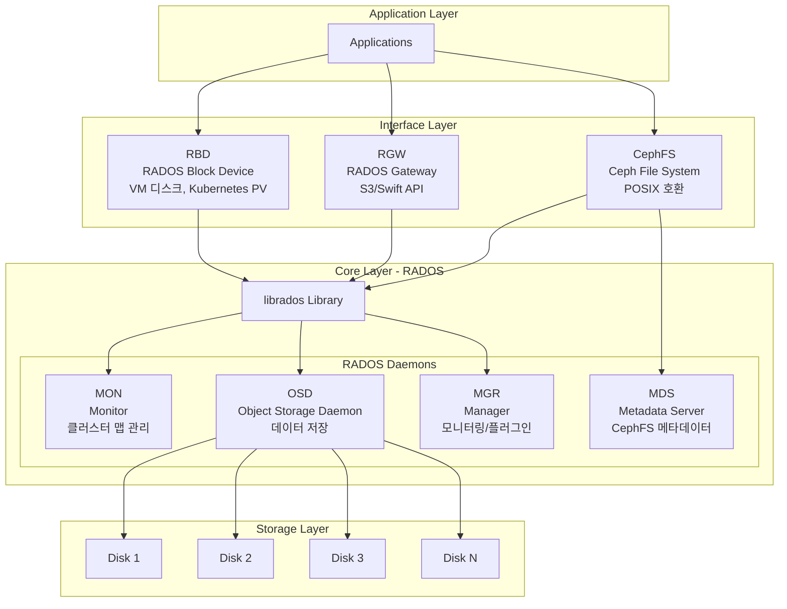
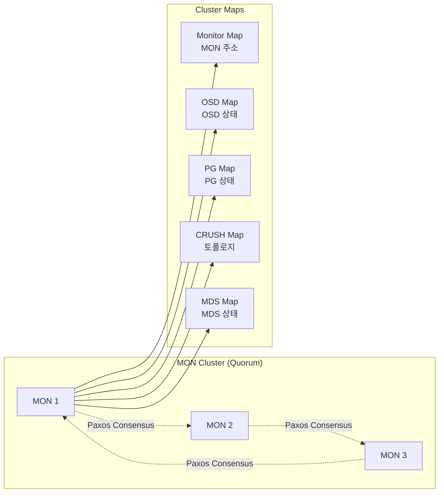
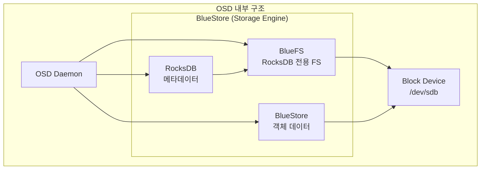
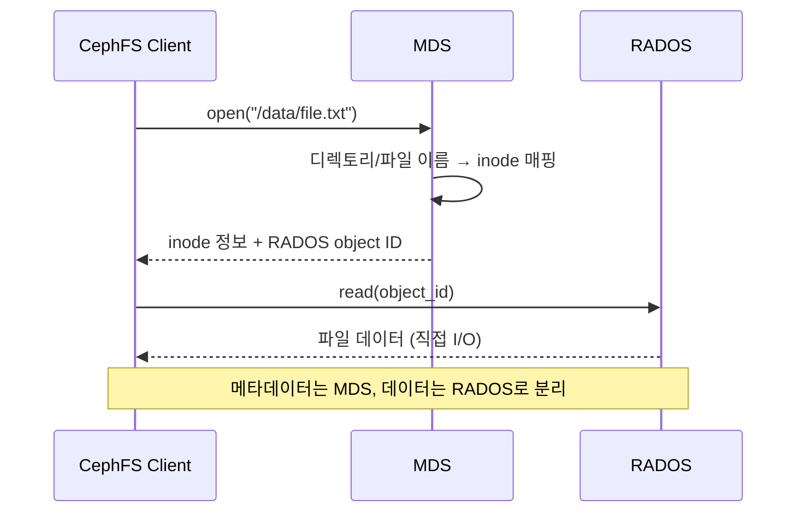
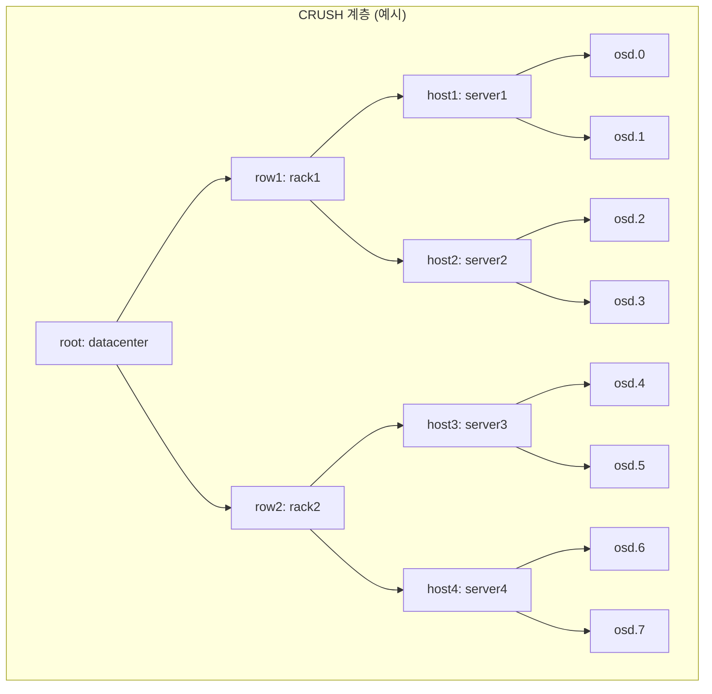
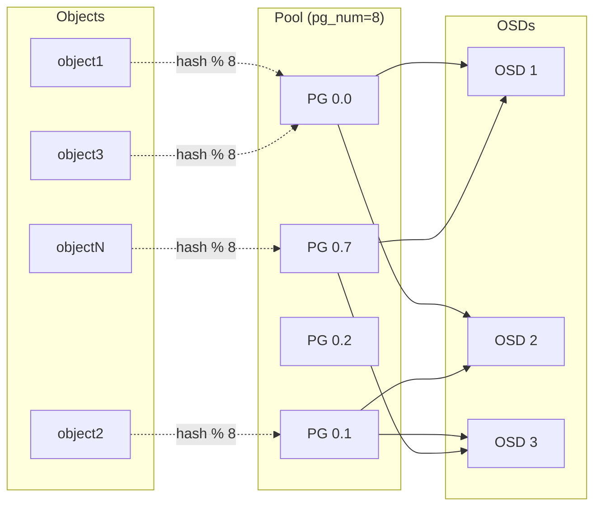
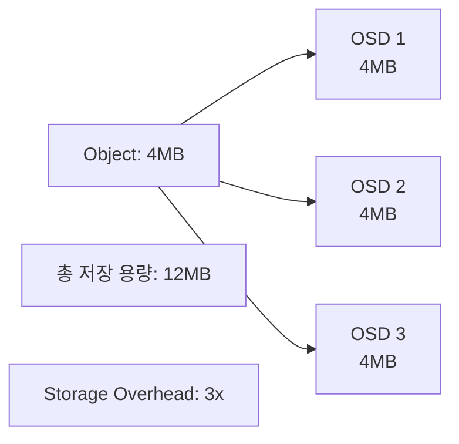
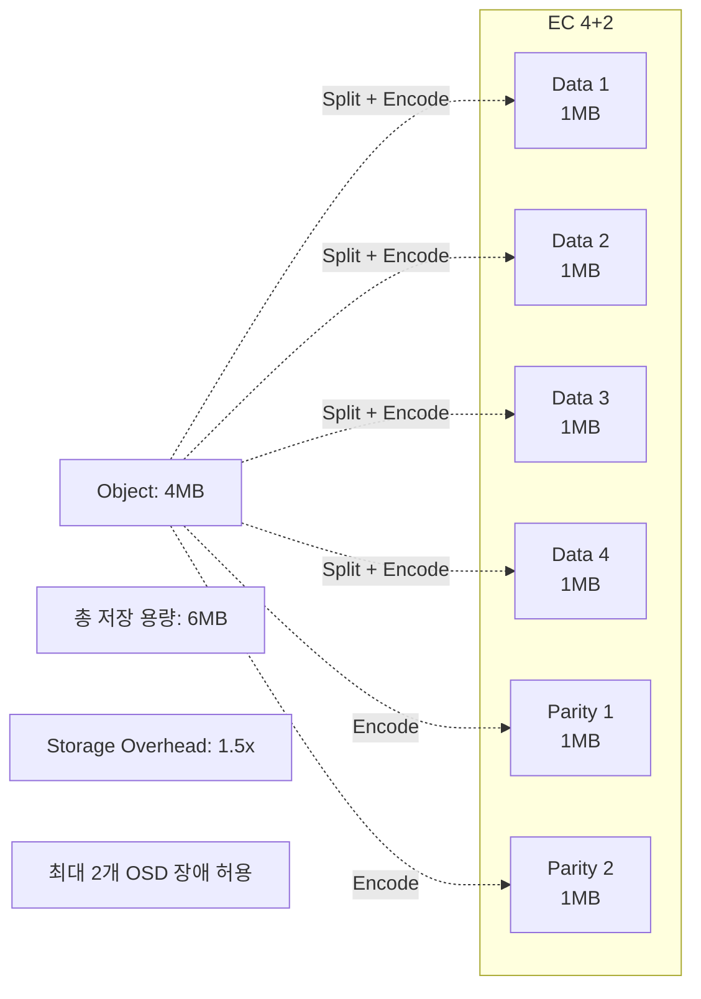
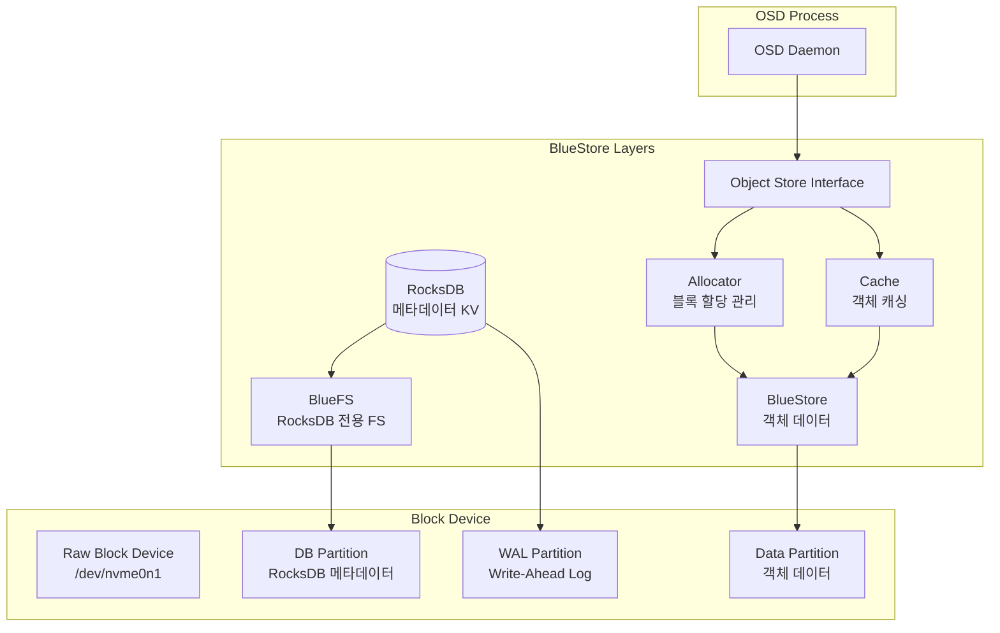
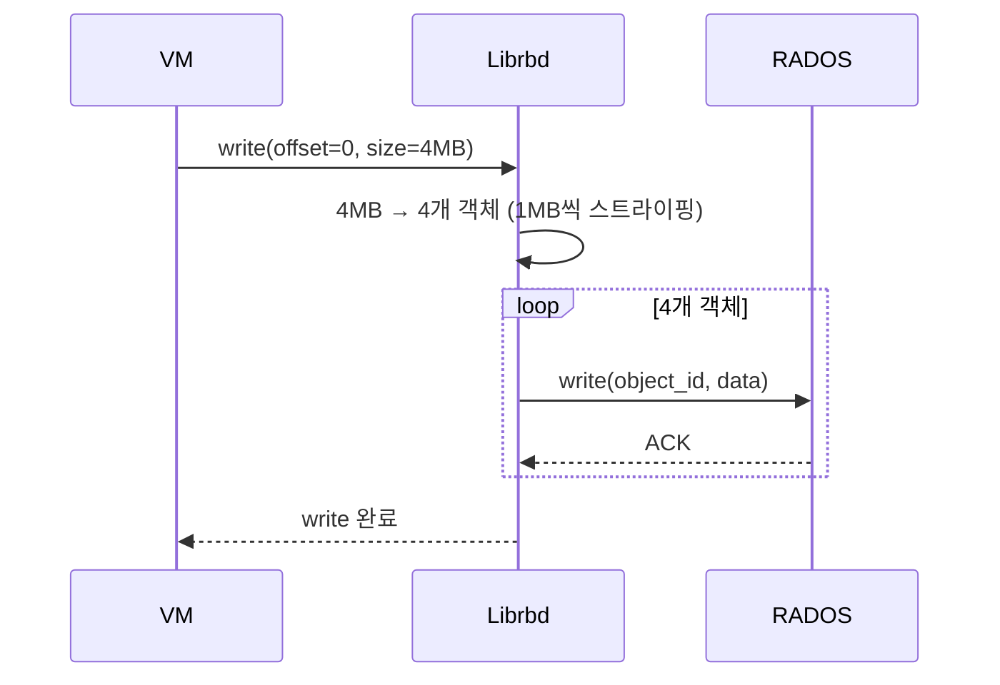

# Ch9. Ceph 아키텍처

## 📋 개요 및 학습 목표

### 개요

**Ceph**는 통합 소프트웨어 정의 스토리지(Software-Defined Storage) 플랫폼으로, **객체 스토리지(Object)**, **블록 스토리지(Block)**, **파일 스토리지(File)**를 단일 클러스터에서 제공하는 오픈소스 분산 스토리지 시스템입니다. Ceph는 **RADOS**(Reliable Autonomic Distributed Object Store)를 핵심 레이어로 두고, 그 위에 **RBD**(RADOS Block Device), **RGW**(RADOS Gateway), **CephFS**(Ceph File System)를 계층화하여 다양한 스토리지 인터페이스를 제공합니다.

2025년 현재, Ceph **Squid** 릴리스는 **BlueStore V3** 스토리지 엔진을 통해 **25% IOPS 향상**, **RocksDB 메타데이터 최적화**로 **10-20% 성능 개선**, **ARM 아키텍처 지원** 등 엔터프라이즈 환경에서 요구하는 고성능·고가용성·확장성을 제공합니다.

### 학습 목표

이 챕터를 완료하면 다음을 할 수 있습니다:

1. **Ceph 아키텍처 이해**: RADOS, CRUSH, 컴포넌트(MON, OSD, MGR, MDS, RGW) 역할 설명
2. **CRUSH 알고리즘 분석**: 데이터 배치, 복제, 장애 도메인 설정 원리 이해
3. **Pool & PG 설계**: Placement Group 계산, Erasure Coding vs Replication 선택
4. **BlueStore 엔진 이해**: RocksDB 메타데이터, 성능 특성, V3 개선사항 파악
5. **Ceph 서비스 활용**: RBD, RGW, CephFS의 동작 원리 및 사용 시나리오 이해

---

## 🔑 핵심 개념 및 이론

### 1. Ceph 전체 아키텍처

#### 1.1 계층 구조

Ceph는 **RADOS**를 핵심으로 3계층 아키텍처를 가집니다:



**핵심 원칙**:

- **No Single Point of Failure**: 모든 컴포넌트가 다중화
- **확장성**: 엑사바이트 규모까지 선형 확장
- **자율성**: CRUSH 알고리즘으로 중앙 메타데이터 서버 불필요

#### 1.2 RADOS (Reliable Autonomic Distributed Object Store)

**RADOS**는 Ceph의 핵심 스토리지 레이어로, 다음 기능을 제공합니다:

- **자동 복제(Auto-replication)**: 데이터를 여러 OSD에 자동 복제
- **자가 치유(Self-healing)**: OSD 장애 시 자동 복구
- **데이터 무결성**: Scrubbing을 통한 데이터 검증
- **분산 객체 저장소**: 가변 크기 객체를 확장 가능하게 저장

### 2. Ceph 핵심 컴포넌트

#### 2.1 MON (Monitor)

**역할**: 클러스터 상태 맵(Cluster Map)의 마스터 복사본 유지



**특징**:

- **Quorum**: 홀수 개(보통 3개 또는 5개)로 구성하여 과반수 합의로 결정
- **Paxos 알고리즘**: 분산 합의 프로토콜로 클러스터 맵 업데이트
- **경량 프로세스**: 디스크 I/O가 적어 낮은 사양 서버에서도 실행 가능

#### 2.2 OSD (Object Storage Daemon)

**역할**: 실제 데이터 저장, 읽기/쓰기/복제 작업 수행



**주요 기능**:

- **데이터 저장**: BlueStore 엔진으로 객체를 블록 디바이스에 직접 저장
- **메타데이터 관리**: RocksDB에 객체 메타데이터 저장
- **복제**: Primary OSD가 데이터를 Replica OSD로 복제
- **Recovery**: OSD 장애 시 다른 OSD에서 데이터 복구
- **Scrubbing**: 주기적으로 객체 무결성 검증 (Light Scrub 매일, Deep Scrub 주 1회)

**BlueStore vs FileStore (Legacy)**:

| 특성 | BlueStore (기본) | FileStore (Legacy) |
|------|------------------|-------------------|
| **아키텍처** | 블록 디바이스 직접 사용 | XFS/ext4 파일시스템 위 |
| **메타데이터** | RocksDB | LevelDB + XAttr |
| **성능** | ~18% IOPS 증가, 15% 레이턴시 감소 | 기준 |
| **Double-write** | 없음 (single-write) | 있음 (저널 + FS) |
| **상태** | 기본값 (Luminous 이후) | Deprecated |

#### 2.3 MGR (Manager)

**역할**: 모니터링 엔드포인트, 오케스트레이션, 플러그인 모듈 제공

**주요 모듈** (2025):

- **Dashboard**: 웹 기반 클러스터 관리 UI
- **Prometheus**: 메트릭 exporter
- **Telemetry**: 사용 통계 수집 (옵트인)
- **Balancer**: PG 자동 밸런싱
- **Orchestrator**: cephadm/Rook 통합 (클러스터 배포/관리 자동화)

**필수 여부**: Luminous (12.x) 이후 **필수 데몬** (MGR 없이는 클러스터 정상 동작 불가)

#### 2.4 MDS (Metadata Server)

**역할**: CephFS의 POSIX 메타데이터 관리



**특징**:

- **Active-Standby**: 여러 MDS 중 1개만 Active (장애 시 Standby가 승격)
- **메타데이터만 처리**: 실제 파일 데이터는 클라이언트가 RADOS에 직접 I/O
- **캐싱**: 최근 접근한 메타데이터를 메모리에 캐싱

#### 2.5 RGW (RADOS Gateway)

**역할**: S3/Swift 호환 객체 스토리지 API 제공

**아키텍처**:

```
HTTP Request (S3 API)
    ↓
RGW (Apache/nginx + FastCGI)
    ↓
librados
    ↓
RADOS (객체 저장)
```

**주요 기능**:

- **S3 API**: AWS S3 호환 (버킷, 객체, ACL, 버전 관리)
- **Swift API**: OpenStack Swift 호환
- **멀티테넌시**: User, Tenant, Bucket 분리
- **멀티사이트 복제**: 여러 Ceph 클러스터 간 복제 (Active-Active)

### 3. CRUSH 알고리즘

#### 3.1 CRUSH (Controlled Replication Under Scalable Hashing)

CRUSH는 **중앙 집중식 메타데이터 서버 없이** 데이터 위치를 계산하는 알고리즘입니다:



**CRUSH Map 구성 요소**:

1. **Bucket Hierarchy**: root → row → rack → host → osd (사용자 정의 가능)
2. **Bucket Types**: root, datacenter, room, row, pod, pdu, rack, chassis, host, osd
3. **Failure Domain**: 복제본을 배치할 장애 도메인 (예: host, rack)
4. **Device Class**: HDD, SSD, NVMe 등 디바이스 클래스 (룰에서 필터링 가능)

#### 3.2 CRUSH Rule

Pool마다 CRUSH Rule을 지정하여 **데이터 배치 정책**을 정의합니다:

```bash
# CRUSH Rule 예시 (replicated pool, failure-domain=host)
rule replicated_rule {
    id 0
    type replicated
    step take default class ssd      # SSD 클래스 디바이스만 사용
    step chooseleaf firstn 0 type host  # 서로 다른 호스트에 배치
    step emit
}

# Erasure-coded pool 룰
rule erasure_rule {
    id 1
    type erasure
    step set_chooseleaf_tries 5
    step set_choose_tries 100
    step take default
    step chooseleaf indep 0 type rack   # 서로 다른 랙에 배치
    step emit
}
```

**Rule 파라미터**:

- **type**: `replicated` (복제) 또는 `erasure` (EC)
- **step take**: 시작 bucket 선택 (+ device class 필터)
- **step chooseleaf**: N개의 하위 bucket 선택
  - `firstn`: replicated pool용 (순차 선택)
  - `indep`: erasure-coded pool용 (독립 선택, 재매핑 시 최소화)
- **failure domain**: `host`, `rack`, `row` 등 장애 격리 단위

#### 3.3 데이터 배치 과정

1. **Object → PG 매핑**:
   ```
   PG ID = hash(object_name) % pg_num
   ```

2. **PG → OSD 매핑** (CRUSH 알고리즘):
   ```
   OSD_list = CRUSH(PG_ID, CRUSH_Map, CRUSH_Rule, num_replicas)
   ```

3. **클라이언트 직접 계산**:
   - 클라이언트는 CRUSH Map을 가지고 있어 OSD 위치를 직접 계산
   - 중앙 메타데이터 서버 불필요 → 병목 없음

### 4. Placement Groups (PG)

#### 4.1 PG의 역할

**Placement Group**은 **여러 객체를 하나의 논리 그룹**으로 묶어 관리 오버헤드를 줄입니다:



**PG 수 결정**:

- **기본 가이드**: Pool당 **50-100 PG** 권장
- **공식** (2025):
  ```
  PG 수 = (Total_OSDs × mon_target_pg_per_osd) / pool_size
  ```
- **mon_target_pg_per_osd**: 기본값 100, **BlueStore 환경에서는 200-250 권장**

**예시 계산**:

```
클러스터: OSD 30개
Pool: size=3 (3-way replication)
mon_target_pg_per_osd = 200

PG 수 = (30 × 200) / 3 = 2000

→ pg_num = 2048 (2의 거듭제곱으로 반올림)
```

#### 4.2 PG States

| 상태 | 설명 |
|------|------|
| **active** | PG가 정상 동작 중 |
| **clean** | 모든 객체가 올바른 복제본 수를 가짐 |
| **peering** | OSD 간 PG 상태 동기화 중 |
| **degraded** | 일부 객체가 복제본 수 미달 (OSD 장애 등) |
| **recovering** | 객체 복구 진행 중 |
| **backfilling** | 새 OSD에 PG 데이터 이동 중 |
| **remapped** | PG가 새로운 OSD 세트로 재매핑됨 |
| **stale** | MON이 PG 상태 업데이트를 받지 못함 (OSD 장애) |

### 5. Pool 타입

#### 5.1 Replicated Pool

**동작**: 객체를 N개의 OSD에 **완전 복사**



**특징**:

- **size**: 복제본 수 (기본값 3)
- **min_size**: 최소 복제본 수 (I/O 허용 임계값, 기본값 2)
- **장점**: 읽기 성능 우수 (여러 OSD에서 병렬 읽기 가능)
- **단점**: 스토리지 오버헤드 높음 (3배)

#### 5.2 Erasure-Coded Pool

**동작**: 객체를 **K개 데이터 청크 + M개 패리티 청크**로 분할



**프로파일 파라미터**:

- **K**: 데이터 청크 수 (예: 4)
- **M**: 패리티 청크 수 (예: 2)
- **crush-failure-domain**: 청크 배치 장애 도메인 (host, rack 등)

**Storage Overhead 계산**:

```
Overhead = (K + M) / K
```

| Profile | K | M | Overhead | 장애 허용 |
|---------|---|---|----------|----------|
| 2+1 | 2 | 1 | 1.5x | 1 OSD |
| 4+2 | 4 | 2 | 1.5x | 2 OSD |
| 8+3 | 8 | 3 | 1.375x | 3 OSD |

**사용 시나리오**:

- **Replicated**: 높은 성능 요구 (VM 디스크, DB)
- **Erasure-Coded**: 대용량 콜드 데이터 (백업, 아카이브, 로그)

### 6. BlueStore Storage Engine (2025)

#### 6.1 BlueStore 아키텍처

BlueStore는 Ceph의 **기본 스토리지 엔진**으로, 파일시스템 없이 **블록 디바이스에 직접 객체를 저장**합니다:



**주요 구성 요소**:

1. **RocksDB**: 객체 메타데이터 KV 저장
   - Object 속성 (크기, 타임스탬프, 체크섬)
   - Deferred 쓰기 로그
   - OSD 내부 상태 (Allocator state)

2. **BlueFS**: RocksDB 전용 최소 파일시스템
   - RocksDB SST 파일, WAL 저장
   - 블록 디바이스 직접 사용

3. **Allocator**: 블록 할당 관리
   - BlueStore V3: 할당 정보를 RocksDB에서 제거 → umount 시 한 번에 저장
   - **25% IOPS 증가**, 레이턴시 감소

4. **Cache**: 객체 데이터 캐싱
   - 읽기/쓰기 캐시 (LRU)

#### 6.2 BlueStore V3 개선사항 (2025)

**핵심 변경**: Allocation 정보를 RocksDB에서 제거

**이전 (V2)**:
```
객체 쓰기 → BlueStore 블록 할당 → RocksDB 메타데이터 업데이트 (할당 정보 포함)
                                   ↑
                               병목 지점
```

**V3**:
```
객체 쓰기 → BlueStore 블록 할당 → 메모리에만 기록
OSD umount 시 → 전체 Allocator 상태 한 번에 저장
```

**성능 개선**:

- **IOPS**: +25% (소형 랜덤 쓰기)
- **레이턴시**: RocksDB KV sync 병목 제거로 10-20% 감소
- **적용**: Pacific 이후 릴리스

#### 6.3 RocksDB Column Families (Pacific+)

**최적화**: Key-value 데이터를 여러 Column Family로 분리

```
Column Family 1: Object Metadata (key: object_id)
Column Family 2: Deferred Writes
Column Family 3: OSD State
```

**효과**:

- **캐싱 효율**: 유사한 키끼리 그룹화
- **Compaction 정밀도**: CF별 독립적인 compaction

### 7. Ceph Services (RBD, RGW, CephFS)

#### 7.1 RBD (RADOS Block Device)

**용도**: 가상 디스크 이미지를 RADOS 객체로 저장



**특징**:

- **Thin Provisioning**: 실제 사용한 만큼만 저장 (10GB 디스크 생성해도 0MB 사용)
- **Snapshot**: 읽기 전용 스냅샷 (CoW)
- **Clone**: 스냅샷에서 쓰기 가능한 클론 생성 (VM 템플릿에서 빠른 VM 생성)
- **Striping**: 대형 블록을 여러 객체로 분할하여 성능 향상

#### 7.2 RGW (RADOS Gateway)

**아키텍처**:

```
S3/Swift Client
    ↓
HTTPS (443)
    ↓
RGW (Civetweb / Apache)
    ↓
librados
    ↓
RADOS (metadata pool + data pool)
```

**Pool 구성**:

- **`.rgw.root`**: Gateway 설정
- **`.rgw.buckets.index`**: Bucket 인덱스 (객체 목록)
- **`.rgw.buckets.data`**: 실제 객체 데이터

**멀티사이트 복제**:

```
Region 1 (Master)          Region 2 (Replica)
    RGW                           RGW
     ↓                             ↓
  RADOS 1  ←--- 메타데이터 동기화 --→  RADOS 2
```

#### 7.3 CephFS (Ceph File System)

**아키텍처**:

```
Linux Client (kernel cephfs / ceph-fuse)
    ↓
MDS (메타데이터: /path/to/file → inode)
    ↓
librados
    ↓
RADOS (metadata pool + data pool)
```

**주요 기능**:

- **POSIX 호환**: 표준 파일시스템 인터페이스 (mkdir, open, read, write)
- **Snapshot**: 디렉토리별 스냅샷
- **Quota**: 디렉토리별 용량 제한
- **Multi-active MDS** (Pacific+): 여러 MDS가 동시에 Active (네임스페이스 파티셔닝)

---

## 💻 실습 가이드 (Hands-on)

### Lab 1: Ceph 클러스터 설치 (cephadm)

**목표**: cephadm을 사용하여 3-노드 Ceph 클러스터 구축

**환경**:

- 노드: ceph1, ceph2, ceph3 (각 2개 디스크: OS용 /dev/sda, Ceph OSD용 /dev/sdb)
- OS: Ubuntu 22.04 또는 Rocky Linux 9

**단계**:

1. **Bootstrap 클러스터 (ceph1)**:

```bash
# cephadm 설치
sudo apt install -y cephadm  # Ubuntu
# sudo dnf install -y cephadm  # Rocky Linux

# Ceph 클러스터 bootstrap
sudo cephadm bootstrap --mon-ip 192.168.1.10 --ssh-user root

# 출력 예시:
# Ceph Dashboard is now available at:
#     URL: https://192.168.1.10:8443/
#     User: admin
#     Password: abc123xyz
```

2. **추가 노드 등록 (ceph1에서 실행)**:

```bash
# SSH key 복사
ssh-copy-id root@ceph2
ssh-copy-id root@ceph3

# 노드 추가
sudo ceph orch host add ceph2 192.168.1.11
sudo ceph orch host add ceph3 192.168.1.12

# 호스트 목록 확인
sudo ceph orch host ls
```

3. **OSD 추가**:

```bash
# 사용 가능한 디바이스 확인
sudo ceph orch device ls

# 모든 사용 가능한 디바이스를 OSD로 추가
sudo ceph orch apply osd --all-available-devices

# 또는 특정 디바이스 지정
sudo ceph orch daemon add osd ceph1:/dev/sdb
sudo ceph orch daemon add osd ceph2:/dev/sdb
sudo ceph orch daemon add osd ceph3:/dev/sdb

# OSD 상태 확인
sudo ceph osd tree
```

4. **MON/MGR 배포**:

```bash
# MON을 3개 노드에 배포
sudo ceph orch apply mon 3

# MGR을 2개 노드에 배포
sudo ceph orch apply mgr 2

# 클러스터 상태 확인
sudo ceph -s
```

**출력 예시**:

```
  cluster:
    id:     a1b2c3d4-e5f6-1234-5678-abcdef123456
    health: HEALTH_OK

  services:
    mon: 3 daemons, quorum ceph1,ceph2,ceph3 (age 5m)
    mgr: ceph1(active, since 4m), standbys: ceph2
    osd: 3 osds: 3 up (since 3m), 3 in (since 3m)

  data:
    pools:   1 pools, 1 pgs
    objects: 0 objects, 0 B
    usage:   3.0 GiB used, 297 GiB / 300 GiB avail
    pgs:     1 active+clean
```

### Lab 2: Pool 생성 (Replicated vs Erasure-Coded)

**목표**: Replicated Pool과 Erasure-Coded Pool 생성 및 비교

**코드**:

```bash
# === Replicated Pool ===
# Pool 생성 (size=3, pg_num=128)
sudo ceph osd pool create my-replicated-pool 128 replicated

# Pool 속성 설정
sudo ceph osd pool set my-replicated-pool size 3
sudo ceph osd pool set my-replicated-pool min_size 2

# Pool 정보 확인
sudo ceph osd pool get my-replicated-pool all

# === Erasure-Coded Pool ===
# EC 프로파일 생성 (k=4, m=2)
sudo ceph osd erasure-code-profile set my-ec-profile \
    k=4 \
    m=2 \
    crush-failure-domain=host

# EC Pool 생성
sudo ceph osd pool create my-ec-pool 128 erasure my-ec-profile

# EC Pool 정보 확인
sudo ceph osd pool get my-ec-pool erasure_code_profile

# === Pool 목록 조회 ===
sudo ceph osd pool ls detail
```

**테스트 객체 쓰기**:

```bash
# rados CLI로 객체 업로드
echo "Test data for replicated pool" > test.txt
sudo rados -p my-replicated-pool put test-object test.txt

# 객체 확인
sudo rados -p my-replicated-pool ls
sudo rados -p my-replicated-pool stat test-object

# Storage 사용량 확인
sudo ceph df
```

**출력 예시**:

```
GLOBAL:
    SIZE        AVAIL       RAW USED     %RAW USED
    300 GiB     297 GiB     3.0 GiB          1.00
POOLS:
    POOL                   ID     STORED      OBJECTS     USED        %USED     MAX AVAIL
    my-replicated-pool     1      35 B        1           105 B       0         99 GiB
    my-ec-pool             2      0 B         0           0 B         0         132 GiB
```

### Lab 3: CRUSH Map 조작

**목표**: CRUSH Map을 수정하여 SSD 전용 Pool 생성

**단계**:

1. **Device Class 확인**:

```bash
# 모든 OSD의 device class 조회
sudo ceph osd tree

# 출력 예시:
# ID  CLASS  WEIGHT   TYPE NAME         STATUS  REWEIGHT  PRI-AFF
# -1         0.29279  root default
# -3         0.09760      host ceph1
#  0    ssd  0.09760          osd.0         up   1.00000  1.00000
# -5         0.09760      host ceph2
#  1    hdd  0.09760          osd.1         up   1.00000  1.00000
# -7         0.09760      host ceph3
#  2    hdd  0.09760          osd.2         up   1.00000  1.00000
```

2. **SSD 전용 CRUSH Rule 생성**:

```bash
# SSD 전용 룰 생성
sudo ceph osd crush rule create-replicated ssd-rule default host ssd

# Rule 확인
sudo ceph osd crush rule ls
sudo ceph osd crush rule dump ssd-rule
```

3. **SSD Pool 생성**:

```bash
# SSD 전용 Pool 생성
sudo ceph osd pool create ssd-pool 64 replicated

# SSD Rule 적용
sudo ceph osd pool set ssd-pool crush_rule ssd-rule

# Pool 정보 확인
sudo ceph osd pool get ssd-pool crush_rule
```

4. **검증**:

```bash
# Pool에 객체 쓰기
echo "SSD data" > ssd-test.txt
sudo rados -p ssd-pool put ssd-test-obj ssd-test.txt

# PG → OSD 매핑 확인 (SSD OSD만 사용하는지 검증)
sudo ceph pg dump pgs | grep ssd-pool
```

### Lab 4: RBD Block Device 사용

**목표**: RBD 이미지 생성, 마운트, 스냅샷

**코드**:

```bash
# === RBD Pool 생성 ===
sudo ceph osd pool create rbd 128 replicated
sudo ceph osd pool application enable rbd rbd

# === RBD 이미지 생성 ===
sudo rbd create --size 10G rbd/my-disk

# 이미지 목록 확인
sudo rbd ls rbd
sudo rbd info rbd/my-disk

# === RBD 이미지 맵핑 (Block Device로 마운트) ===
sudo rbd map rbd/my-disk

# 맵핑된 디바이스 확인
sudo rbd showmapped
# id  pool  namespace  image     snap  device
# 0   rbd              my-disk   -     /dev/rbd0

# === 파일시스템 생성 & 마운트 ===
sudo mkfs.ext4 /dev/rbd0
sudo mkdir /mnt/rbd-disk
sudo mount /dev/rbd0 /mnt/rbd-disk

# 파일 쓰기
echo "Hello from RBD" | sudo tee /mnt/rbd-disk/test.txt

# === Snapshot 생성 ===
# (마운트 해제 필요)
sudo umount /mnt/rbd-disk
sudo rbd unmap /dev/rbd0

# 스냅샷 생성
sudo rbd snap create rbd/my-disk@snap1

# 스냅샷 목록
sudo rbd snap ls rbd/my-disk

# === Clone 생성 (스냅샷에서 새 이미지) ===
sudo rbd snap protect rbd/my-disk@snap1
sudo rbd clone rbd/my-disk@snap1 rbd/my-disk-clone

# Clone 정보
sudo rbd info rbd/my-disk-clone
```

### Lab 5: CephFS File System Mount

**목표**: CephFS 파일시스템 생성 및 클라이언트 마운트

**코드**:

1. **CephFS 생성**:

```bash
# Metadata Pool 생성
sudo ceph osd pool create cephfs_metadata 64 replicated

# Data Pool 생성
sudo ceph osd pool create cephfs_data 128 replicated

# CephFS 생성
sudo ceph fs new my-cephfs cephfs_metadata cephfs_data

# CephFS 상태 확인
sudo ceph fs ls
sudo ceph fs status my-cephfs
```

2. **MDS 배포**:

```bash
# MDS 데몬 배포 (Active 1, Standby 1)
sudo ceph orch apply mds my-cephfs --placement="2 ceph1 ceph2"

# MDS 상태 확인
sudo ceph mds stat
```

3. **클라이언트 마운트 (Kernel Driver)**:

```bash
# 인증 키 확인
sudo ceph auth get client.admin

# /etc/ceph/ceph.client.admin.keyring 파일에 키 저장

# 마운트
sudo mount -t ceph ceph1:6789:/ /mnt/cephfs -o name=admin,secret=AQD...==

# 또는 keyring 파일 사용
sudo mount -t ceph ceph1:6789:/ /mnt/cephfs -o name=admin,secretfile=/etc/ceph/admin.secret

# 마운트 확인
df -h /mnt/cephfs
```

4. **CephFS 사용**:

```bash
# 파일 생성
echo "Hello CephFS" | sudo tee /mnt/cephfs/test.txt

# 디렉토리 스냅샷
sudo mkdir /mnt/cephfs/.snap/snap1

# 스냅샷 확인
ls /mnt/cephfs/.snap/

# Quota 설정 (디렉토리별)
sudo setfattr -n ceph.quota.max_bytes -v 1000000000 /mnt/cephfs/data  # 1GB
```

---

## 📚 참고 자료

### 공식 문서

- **Ceph 공식 사이트**: [https://ceph.io/](https://ceph.io/)
- **Ceph Technology**: [https://ceph.io/en/discover/technology/](https://ceph.io/en/discover/technology/)
- **Ceph Architecture**: [https://docs.ceph.com/en/reef/architecture/](https://docs.ceph.com/en/reef/architecture/)
- **CRUSH Maps**: [https://docs.ceph.com/en/latest/rados/operations/crush-map/](https://docs.ceph.com/en/latest/rados/operations/crush-map/)
- **Placement Groups**: [https://docs.ceph.com/en/reef/rados/operations/placement-groups/](https://docs.ceph.com/en/reef/rados/operations/placement-groups/)
- **BlueStore Configuration**: [https://docs.ceph.com/en/reef/rados/configuration/bluestore-config-ref/](https://docs.ceph.com/en/reef/rados/configuration/bluestore-config-ref/)
- **Erasure Code**: [https://docs.ceph.com/en/reef/rados/operations/erasure-code/](https://docs.ceph.com/en/reef/rados/operations/erasure-code/)
- **Ceph Glossary**: [https://docs.ceph.com/en/latest/glossary/](https://docs.ceph.com/en/latest/glossary/)

### 릴리스 노트

- **Squid Release**: [https://docs.ceph.com/en/latest/releases/squid/](https://docs.ceph.com/en/latest/releases/squid/)

### 하드웨어 가이드

- **Hardware Recommendations**: [https://docs.ceph.com/en/latest/start/hardware-recommendations/](https://docs.ceph.com/en/latest/start/hardware-recommendations/)
- **IBM Storage Ceph Concepts**: [https://www.redbooks.ibm.com/redpieces/pdfs/redp5721.pdf](https://www.redbooks.ibm.com/redpieces/pdfs/redp5721.pdf)

### Red Hat Ceph Storage 문서

- **Red Hat Storage Strategies Guide**: [https://access.redhat.com/documentation/en-us/red_hat_ceph_storage/5/html-single/storage_strategies_guide/index](https://access.redhat.com/documentation/en-us/red_hat_ceph_storage/5/html-single/storage_strategies_guide/index)
- **Red Hat Placement Groups**: [https://docs.redhat.com/en/documentation/red_hat_ceph_storage/5/html/storage_strategies_guide/placement_groups_pgs](https://docs.redhat.com/en/documentation/red_hat_ceph_storage/5/html/storage_strategies_guide/placement_groups_pgs)

### 블로그 & 아티클

- **From RADOS to Ceph Services (RBD, RGW, CephFS)**: [https://dev.to/seno21/from-rados-to-ceph-services-rbd-rgw-and-cephfs-6ho](https://dev.to/seno21/from-rados-to-ceph-services-rbd-rgw-and-cephfs-6ho)
- **Ceph RocksDB Tuning Deep-Dive**: [https://ceph.io/en/news/blog/2022/rocksdb-tuning-deep-dive/](https://ceph.io/en/news/blog/2022/rocksdb-tuning-deep-dive/)
- **Comparing Ceph BlueStore and FileStore**: [https://www.micron.com/about/blog/storage/ssd/comparing-ceph-bluestore-filestore-block](https://www.micron.com/about/blog/storage/ssd/comparing-ceph-bluestore-filestore-block)

### 교육 자료

- **Ceph Storage Fundamentals - Level 1**: [https://ecintelligence.ma/en/sessions/ceph-storage-fundamentals-level-1-20250804/](https://ecintelligence.ma/en/sessions/ceph-storage-fundamentals-level-1-20250804/)

### Wikipedia

- **Ceph (software)**: [https://en.wikipedia.org/wiki/Ceph_(software)](https://en.wikipedia.org/wiki/Ceph_(software))

### 학습 체크리스트

완료한 항목에 체크하세요:

- [ ] RADOS, CRUSH 알고리즘의 핵심 원리를 이해하고 설명할 수 있다
- [ ] Ceph 컴포넌트(MON, OSD, MGR, MDS, RGW)의 역할을 설명할 수 있다
- [ ] CRUSH Map과 CRUSH Rule을 편집하여 데이터 배치 정책을 설정할 수 있다
- [ ] PG 수 계산 공식을 이해하고 적절한 PG 수를 산출할 수 있다
- [ ] Replicated Pool과 Erasure-Coded Pool의 차이를 이해하고 용도에 맞게 선택할 수 있다
- [ ] BlueStore V3의 성능 개선 메커니즘(Allocator state 관리)을 설명할 수 있다
- [ ] RBD 이미지 생성, 스냅샷, 클론 작업을 수행할 수 있다
- [ ] CephFS를 마운트하고 POSIX 파일시스템으로 사용할 수 있다
- [ ] RGW를 통해 S3 호환 객체 스토리지를 제공할 수 있다
- [ ] Ceph 클러스터의 상태를 모니터링하고 문제를 진단할 수 있다

---

**다음 챕터**: [Ch10. Ceph 운영 & 성능](./Ch10.Ceph_운영_성능.md)에서 클러스터 배포, 모니터링, 성능 최적화, 트러블슈팅을 학습합니다.
